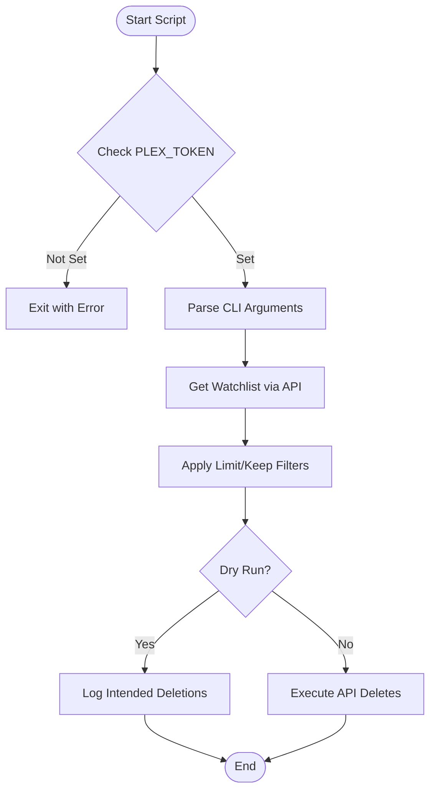
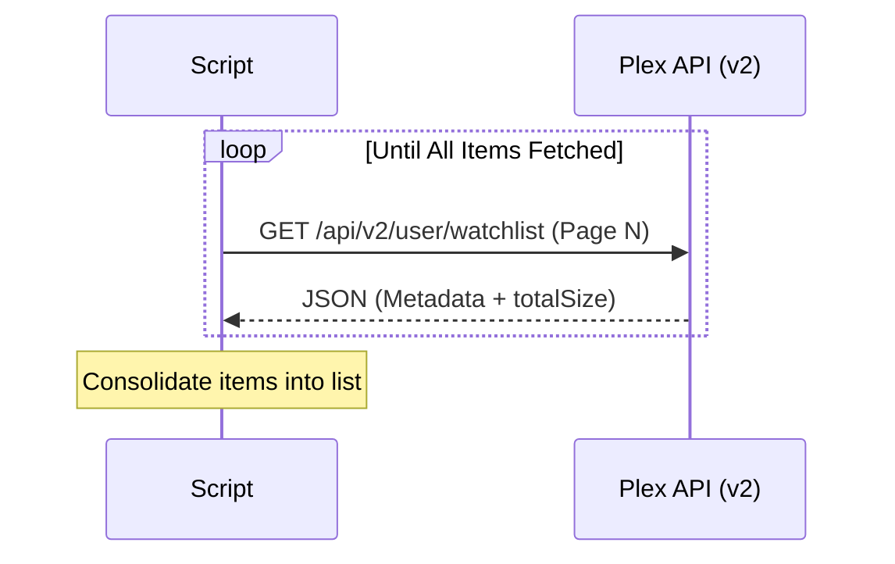

Relevant source files

The following files were used as context for generating this wiki page:

- [plex\_clear\_watchlist.py](plex_clear_watchlist.py)
- [README.md](README.md)
- [AGENTS.md](AGENTS.md)
- [CLAUDE.md](CLAUDE.md)
- [docker-compose.yml](docker-compose.yml)
- [requirements.txt](requirements.txt)
- [SECURITY.md](SECURITY.md)

# Script Architecture

The `plex_clear_watchlist` project is designed as a single-purpose, one-shot utility to manage and clear items from a user's Plex Watchlist via the official Plex API. Its architecture prioritizes simplicity, portability through Docker, and safe execution via dry-run capabilities.

Sources: [AGENTS.md:3-5](AGENTS.md#L3-L5), [CLAUDE.md:3-5](CLAUDE.md#L3-L5), [README.md:15-17](README.md#L15-L17)

## Core Components and Workflow

The application is structured around a central Python script that interacts with the Plex API v2. It follows a linear execution path: configuration validation, watchlist retrieval with pagination, list filtering based on user constraints, and item deletion.

### System Flow
The following diagram illustrates the high-level execution flow from initialization to completion.

Sources: [plex\_clear\_watchlist.py:10-18](plex\_clear\_watchlist.py#L10-L18), [plex\_clear\_watchlist.py:84-148](plex\_clear\_watchlist.py#L84-L148)

## API Interaction and Data Handling

The script interacts with the Plex API using the `requests` library. It specifically targets the `https://plex.tv/api/v2/user/watchlist` endpoint for both fetching and deleting items.

### Watchlist Retrieval
The `get_watchlist()` function implements a paginated fetch mechanism to ensure all items are retrieved regardless of list size. It uses a default page size of 100 items and sorts by the addition date in ascending order (`addedAt:asc`).

Sources: [plex\_clear\_watchlist.py:27-56](plex\_clear\_watchlist.py#L27-L56)

### Data Processing Logic
Before any deletion occurs, the script processes the retrieved list based on three primary command-line arguments:

| Argument | Type | Logic |
| :--- | :--- | :--- |
| `--dry-run` | Boolean | If true, skips actual deletion and Sentry initialization. |
| `--limit N` | Integer | Truncates the list to process at most N items. |
| `--keep N` | Integer | Removes the N most recently added items from the deletion list. |

Sources: [plex\_clear\_watchlist.py:86-90](plex\_clear\_watchlist.py#L86-L90), [plex\_clear\_watchlist.py:118-124](plex\_clear\_watchlist.py#L118-L124)

## Configuration and Environment

The script is configured primarily through environment variables, which is a core security practice for the project.

- **`PLEX_TOKEN`**: Required. Authenticates requests to the Plex API via the `X-Plex-Token` header.
- **`SENTRY_DSN`**: Optional. Enables error tracking and exception reporting via Sentry.

Sources: [plex\_clear\_watchlist.py:10-18](plex\_clear\_watchlist.py#L10-L18), [SECURITY.md:18-20](SECURITY.md#L18-L20), [docker-compose.yml:6-8](docker-compose.yml#L6-L8)

### Security and Maintenance
The architecture integrates automated dependency management and security best practices:
- **Renovate Bot**: Used to keep dependencies updated automatically.
- **Sentry Integration**: Initialized only when `--dry-run` is disabled to capture runtime exceptions and deletion failures.
- **Dockerized Execution**: Encapsulates the Python 3.14 environment and requirements.

Sources: [renovate.json:1-6](renovate.json#L1-L6), [plex\_clear\_watchlist.py:92-99](plex\_clear\_watchlist.py#L92-L99), [AGENTS.md:7-11](AGENTS.md#L7-L11), [requirements.txt:1-2](requirements.txt#L1-L2)

## Error Handling

The script implements robust error handling for API interactions:
1. **Paginating 404s**: If a 404 occurs after some items have already been fetched, the script raises an error to prevent accidental partial deletions caused by API inconsistencies.
2. **Deletion Failures**: Individual item deletion failures are logged to `stderr` and reported to Sentry if a DSN is provided.
3. **Environment Validation**: Immediate termination occurs if the mandatory `PLEX_TOKEN` is missing.

Sources: [plex\_clear\_watchlist.py:35-46](plex\_clear\_watchlist.py#L35-L46), [plex\_clear\_watchlist.py:141-150](plex\_clear\_watchlist.py#L141-L150), [plex\_clear\_watchlist.py:11-15](plex\_clear\_watchlist.py#L11-L15)

## Conclusion
The script architecture provides a safe, filtered approach to automated watchlist maintenance. By separating the retrieval, filtering, and execution phases, and providing a mandatory environment-based configuration, it ensures that users can predictably manage their Plex data with minimal risk of accidental loss.
