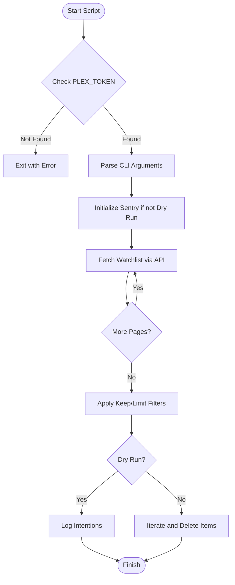
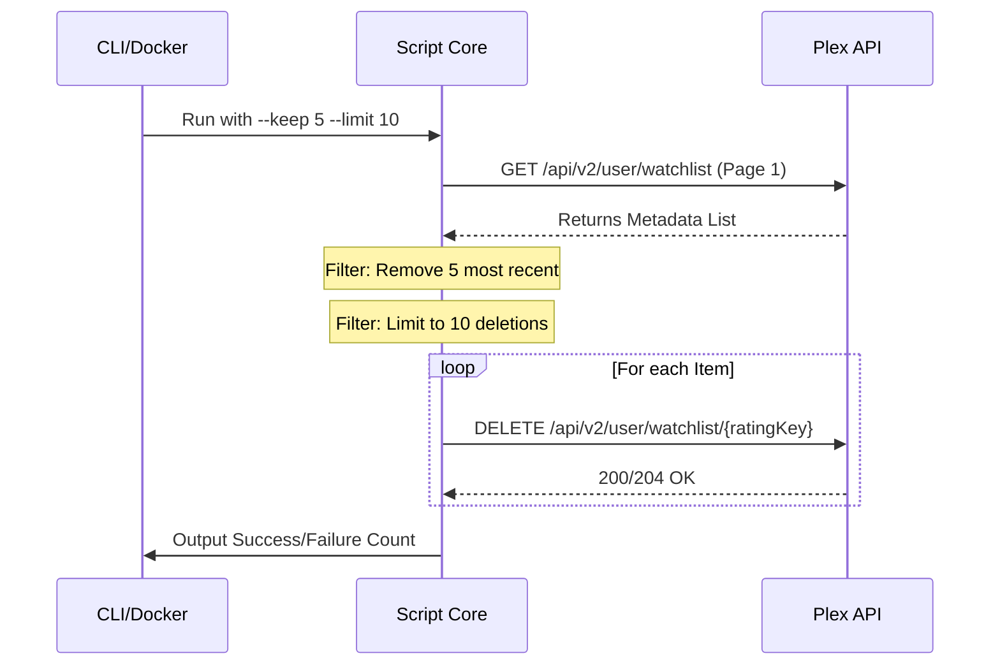

<details>
<summary>Relevant source files</summary>

The following files were used as context for generating this wiki page:

- [plex\_clear\_watchlist.py](plex_clear_watchlist.py)
- [AGENTS.md](AGENTS.md)
- [README.md](README.md)
- [docker-compose.yml](docker-compose.yml)
- [SECURITY.md](SECURITY.md)
- [requirements.txt](requirements.txt)
- [CLAUDE.md](CLAUDE.md)
</details>

# Script Architecture

The `plex_clear_watchlist` project is a specialized utility designed to interact with the Plex API to programmatically remove items from a user's Watchlist. It is architected as a lightweight, single-purpose Python script intended to be executed as a "one-shot" task, often within a Docker container.

Sources: [AGENTS.md:5-7](AGENTS.md#L5-L7), [plex_clear_watchlist.py:1-5](plex_clear_watchlist.py#L1-L5)

The architecture follows a procedural execution flow: it authenticates via an environment-provided token, fetches the current state of the watchlist using paginated requests, applies user-defined filters (limit/keep), and executes deletions.

Sources: [plex_clear_watchlist.py:64-150](plex_clear_watchlist.py#L64-L150)

## System Components and Data Flow

The script architecture is composed of a CLI entry point, a configuration layer based on environment variables, and a networking layer that communicates with the Plex V2 API.

### Execution Flow
The following diagram illustrates the logical flow of the script from initialization to completion:



The script uses `argparse` to handle user configurations and `requests` for synchronous HTTP communication with Plex.
Sources: [plex_clear_watchlist.py:9-30](plex_clear_watchlist.py#L9-L30), [plex_clear_watchlist.py:97-154](plex_clear_watchlist.py#L97-L154)

### Data Models and Constants
The script interacts with specific data structures returned by the Plex API, primarily the `MediaContainer` and its nested `Metadata` items.

| Constant/Variable | Source | Description |
| :--- | :--- | :--- |
| `BASE_URL` | `plex_clear_watchlist.py:18` | Root URL for Plex services (`https://plex.tv`) |
| `WATCHLIST_URL` | `plex_clear_watchlist.py:19` | Endpoint for watchlist operations (`/api/v2/user/watchlist`) |
| `HEADERS` | `plex_clear_watchlist.py:20` | Contains `X-Plex-Token` and `Accept: application/json` |
| `REQUEST_TIMEOUT` | `plex_clear_watchlist.py:24` | 30-second timeout for all network requests |

Sources: [plex_clear_watchlist.py:18-24](plex_clear_watchlist.py#L18-L24)

## Core Functional Modules

### 1. Watchlist Retrieval (Pagination Logic)
The `get_watchlist()` function manages paginated API requests. It defaults to a page size of 100 items and sorts by `addedAt:asc`. It includes specific error handling for 404 status codes during pagination to prevent partial deletions if the API returns an inconsistent state.

Sources: [plex_clear_watchlist.py:27-58](plex_clear_watchlist.py#L27-L58)

### 2. Item Deletion
The `delete_from_watchlist(rating_key, title)` function performs the `DELETE` HTTP operation. It uses the `ratingKey` as the unique identifier for items within the Plex ecosystem.

Sources: [plex_clear_watchlist.py:60-72](plex_clear_watchlist.py#L60-L72)

### 3. Error Tracking and Security
The script integrates `sentry_sdk` for error reporting, which is automatically initialized unless `--dry-run` is active. Security is maintained by strictly requiring `PLEX_TOKEN` via environment variables, ensuring secrets are never hardcoded or committed to version control.

Sources: [plex_clear_watchlist.py:105-112](plex_clear_watchlist.py#L105-L112), [SECURITY.md:14-16](SECURITY.md#L14-L16)

## Configuration and CLI Interface

The script's behavior is modified through command-line arguments, which determine the scope of the deletion.



Sources: [plex_clear_watchlist.py:97-154](plex_clear_watchlist.py#L97-L154), [README.md:46-51](README.md#L46-L51)

### CLI Arguments Reference
| Flag | Type | Default | Description |
| :--- | :--- | :--- | :--- |
| `--dry-run` | Boolean | `False` | Logs items that would be deleted without performing the action. |
| `--limit` | Integer | `0` | Maximum number of items to delete (0 = all). |
| `--keep` | Integer | `0` | Number of most recently added items to preserve. |

Sources: [plex_clear_watchlist.py:99-102](plex_clear_watchlist.py#L99-L102), [README.md:46-51](README.md#L46-L51)

## Deployment Architecture

The script is designed to run in a containerized environment using Docker. The `docker-compose.yml` file defines a single service that maps environment variables from the host (or a `.env` file) into the container.

```yaml
services:
  plex-clear-watchlist:
    image: ghcr.io/blixten85/plex-clear-watchlist:latest
    build: .
    environment:
      - PLEX_TOKEN=${PLEX_TOKEN}
      - SENTRY_DSN=${SENTRY_DSN:-}
```

Sources: [docker-compose.yml:1-7](docker-compose.yml#L1-L7), [AGENTS.md:9-11](AGENTS.md#L9-L11)

## Summary
The architecture of `plex_clear_watchlist` emphasizes simplicity and safety. By utilizing environment variables for secrets, implementing a dry-run mode for testing, and using standard HTTP methods for API interaction, the script provides a robust way to manage Plex Watchlist state. The inclusion of Sentry for error tracking and Docker for deployment ensures it can be operated reliably as a standalone utility or a scheduled task.

Sources: [plex_clear_watchlist.py:105-154](plex_clear_watchlist.py#L105-L154), [AGENTS.md:21-23](AGENTS.md#L21-L23)
