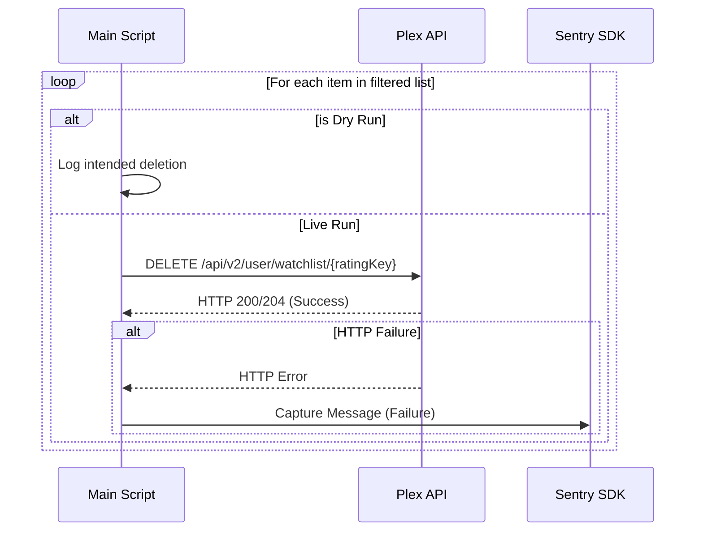

<details>
<summary>Relevant source files</summary>

The following files were used as context for generating this wiki page:

- [plex_clear_watchlist.py](plex_clear_watchlist.py)
- [README.md](README.md)
- [AGENTS.md](AGENTS.md)
- [CLAUDE.md](CLAUDE.md)
- [docker-compose.yml](docker-compose.yml)
- [requirements.txt](requirements.txt)
</details>

# Plex API Integration

The Plex API Integration within this project is designed to manage and clear a user's Plex Watchlist. It serves as a specialized interface to the Plex TV v2 API, facilitating authenticated requests to retrieve, filter, and delete watchlist items. The system is architected as a one-shot Python utility that can be executed directly or within a Docker container.

The integration focuses on a single-purpose workflow: fetching a complete, paginated list of media items associated with a user's account and performing destructive delete operations based on user-defined constraints like limits or retention counts.
Sources: [plex_clear_watchlist.py:1-15](plex_clear_watchlist.py#L1-L15), [AGENTS.md:1-5](AGENTS.md#L1-L5), [README.md:1-10](README.md#L1-L10)

## Authentication and Configuration

The integration requires a `PLEX_TOKEN` provided via environment variables. This token is used in the `X-Plex-Token` HTTP header for every request made to the Plex infrastructure.

| Parameter | Source | Description |
|---|---|---|
| `PLEX_TOKEN` | Environment Variable | Required. User authentication token from plex.tv |
| `SENTRY_DSN` | Environment Variable | Optional. Data Source Name for Sentry error tracking |
| `BASE_URL` | Hardcoded | `https://plex.tv` |
| `WATCHLIST_URL` | Derived | `https://plex.tv/api/v2/user/watchlist` |

Sources: [plex_clear_watchlist.py:10-25](plex_clear_watchlist.py#L10-L25), [docker-compose.yml:7-9](docker-compose.yml#L7-L9), [README.md:12-15](README.md#L12-L15)

## Watchlist Retrieval and Paging

The script implements a robust paginated retrieval system to ensure the entire watchlist is captured, even for accounts with a large number of items. It uses a default page size of 100 items and sorts them by `addedAt:asc` to facilitate consistent processing.

### Retrieval Logic Flow

```mermaid
flowchart TD
    Start[Start Retrieval] --> SetParams[Set Page=1, Size=100]
    SetParams --> Req[GET /api/v2/user/watchlist]
    Req --> Check404{HTTP 404?}
    Check404 -- Yes & Page 1 --> Empty[Return Empty List]
    Check404 -- Yes & Page > 1 --> Error[Raise HTTPError - Partial Data]
    Check404 -- No --> Parse[Parse JSON Response]
    Parse --> Extract[Add Metadata to Item List]
    Extract --> CheckTotal{Items >= totalSize?}
    CheckTotal -- No --> NextPage[Increment Page]
    NextPage --> Req
    CheckTotal -- Yes --> Return[Return Full List]
</mermaid>
```

The retrieval logic includes a specific safeguard against 404 errors during pagination to prevent accidental partial deletions.
Sources: [plex_clear_watchlist.py:28-63](plex_clear_watchlist.py#L28-L63)

## Filtering and Deletion Logic

Once the watchlist is retrieved, the integration applies filters based on user arguments before initiating the deletion process.

### Filtering Operations
- **Retention (--keep):** The script preserves the $N$ most recently added items by slicing the list (`items[:-args.keep]`).
- **Limitation (--limit):** The script restricts the total number of deletions to $N$ items (`items[:args.limit]`).

### Deletion Process



Sources: [plex_clear_watchlist.py:90-145](plex_clear_watchlist.py#L90-L145), [AGENTS.md:15-20](AGENTS.md#L15-L20), [CLAUDE.md:15-20](CLAUDE.md#L15-L20)

## API Endpoints and Methods

The integration interacts with the following specific API structures:

### GET /api/v2/user/watchlist
Used to retrieve the list of items currently in the user's watchlist.
- **Headers:** `X-Plex-Token`, `Accept: application/json`
- **Query Parameters:**
  - `page`: Current page number.
  - `pageSize`: Number of items per page (100).
  - `sort`: Sorting criteria (`addedAt:asc`).
Sources: [plex_clear_watchlist.py:34-40](plex_clear_watchlist.py#L34-L40)

### DELETE /api/v2/user/watchlist/{ratingKey}
Used to remove a specific item from the watchlist.
- **Path Parameter:** `ratingKey` - The unique identifier for the media item.
- **Successful Status Codes:** 200, 204.
Sources: [plex_clear_watchlist.py:65-77](plex_clear_watchlist.py#L65-L77)

## Error Handling and Monitoring

The integration utilizes `sentry_sdk` for error reporting and detailed logging for local debugging.

- **Request Timeouts:** All API calls are configured with a `REQUEST_TIMEOUT` of 30 seconds.
- **Sentry Integration:** If `SENTRY_DSN` is provided, exceptions during watchlist fetching and failures during specific item deletions are captured and sent to Sentry.
- **Validation:** The script validates the presence of the `PLEX_TOKEN` at startup and terminates with an error message if it is missing.
Sources: [plex_clear_watchlist.py:12-16](plex_clear_watchlist.py#L12-L16), [plex_clear_watchlist.py:25](plex_clear_watchlist.py#L25), [plex_clear_watchlist.py:100-108](plex_clear_watchlist.py#L100-L108), [requirements.txt:2](requirements.txt#L2)

## Summary

The Plex API Integration provides a specialized toolset for automated watchlist maintenance. By leveraging the Plex TV v2 API's pagination and deletion endpoints, it allows users to programmatically clear their lists while maintaining control through "keep" and "limit" parameters. The inclusion of a `--dry-run` mode ensures that users can verify destructive actions before execution.
Sources: [plex_clear_watchlist.py:85-95](plex_clear_watchlist.py#L85-L95), [README.md:35-40](README.md#L35-L40)
