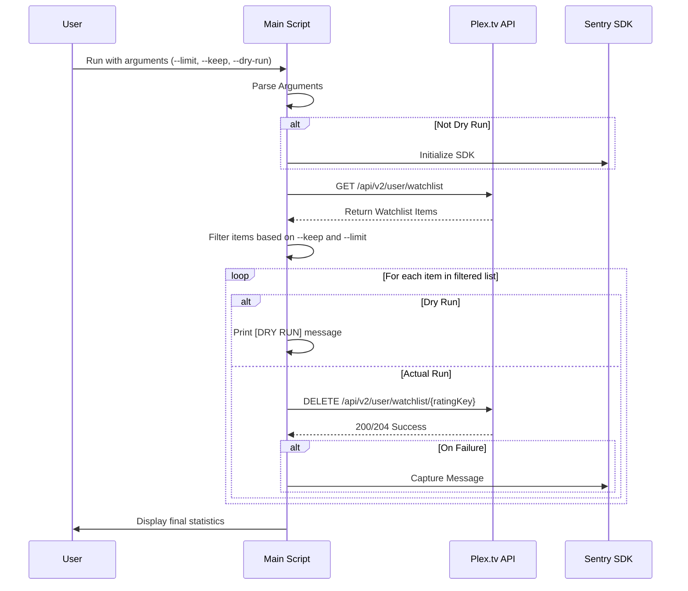

<details>
<summary>Relevant source files</summary>

The following files were used as context for generating this wiki page:

- [plex\_clear\_watchlist.py](plex_clear_watchlist.py)
- [AGENTS.md](AGENTS.md)
- [README.md](README.md)
- [CLAUDE.md](CLAUDE.md)
- [docker-compose.yml](docker-compose.yml)
- [requirements.txt](requirements.txt)
</details>

# Plex API Integration

The Plex API Integration is the core component of the `plex_clear_watchlist` project, designed to programmatically manage a user's Plex Watchlist. Its primary purpose is to retrieve items from the Watchlist and delete them based on user-defined constraints such as limits or retention counts. The integration is implemented as a single-purpose Python script that interfaces with Plex.tv's REST API endpoints.

This system is designed to run in isolated environments, specifically as a one-shot Docker container, ensuring that the necessary Python dependencies and environment configurations are encapsulated. It relies on secure authentication via a Plex Token and provides a safety mechanism through a dry-run mode to prevent accidental data loss.

Sources: [plex\_clear\_watchlist.py:1-13](plex\_clear\_watchlist.py#L1-L13), [AGENTS.md:3-5](AGENTS.md#L3-L5), [README.md:10-15](README.md#L10-L15)

## Authentication and Configuration

The integration requires a valid Plex authentication token, passed via the `PLEX_TOKEN` environment variable. This token is used in the HTTP headers for every request made to the Plex API.

| Configuration Key | Source | Required | Description |
|---|---|---|---|
| `PLEX_TOKEN` | Environment Variable | Yes | Plex authentication token obtained from plex.tv |
| `SENTRY_DSN` | Environment Variable | No | Data Source Name for Sentry error tracking |
| `BASE_URL` | Hardcoded | N/A | Set to `https://plex.tv` |
| `WATCHLIST_URL` | Hardcoded | N/A | Set to `https://plex.tv/api/v2/user/watchlist` |

Sources: [plex\_clear\_watchlist.py:9-22](plex\_clear\_watchlist.py#L9-L22), [docker-compose.yml:6-9](docker-compose.yml#L6-L9), [README.md:20-22](README.md#L20-L22)

### Request Headers
All API calls include a standard header set to ensure the Plex server recognizes the request and returns the data in the expected format:
- `X-Plex-Token`: The user's authentication token.
- `Accept`: Set to `application/json` to receive JSON responses.

Sources: [plex\_clear\_watchlist.py:19-23](plex\_clear\_watchlist.py#L19-L23)

## Watchlist Retrieval Logic

The retrieval process uses a paginated approach to ensure large watchlists are fully captured. The system requests items in batches of 100, sorted by the date they were added in ascending order.

```mermaid
flowchart TD
    Start([Start Retrieval]) --> InitVars[Init page=1, items=[]]
    InitVars --> APIReq[GET /api/v2/user/watchlist]
    APIReq --> Check404{HTTP 404?}
    Check404 -- Yes (Page 1) --> Empty[Return empty list]
    Check404 -- Yes (Page > 1) --> Error[Raise HTTPError]
    Check404 -- No --> ParseData[Parse MediaContainer JSON]
    ParseData --> Append[Add Metadata to items list]
    Append --> CheckEnd{items >= totalSize?}
    CheckEnd -- Yes --> Return[Return all items]
    CheckEnd -- No --> IncPage[Increment page]
    IncPage --> APIReq
```

The logic includes a specific safeguard against "API gaps" where a 404 error received during pagination (after the first page) results in a raised error rather than returning a partial list, preventing accidental incomplete deletions.

Sources: [plex\_clear\_watchlist.py:27-60](plex\_clear\_watchlist.py#L27-L60)

## Watchlist Item Deletion

Deletion is performed per item using the Plex item's `ratingKey`. The system targets a specific endpoint for each individual removal.

### API Endpoints and Parameters

| Method | Endpoint | Description |
|---|---|---|
| `GET` | `/api/v2/user/watchlist` | Fetches watchlist items with parameters `page`, `pageSize`, and `sort`. |
| `DELETE` | `/api/v2/user/watchlist/{rating_key}` | Removes a specific item from the watchlist. |

Sources: [plex\_clear\_watchlist.py:34](plex\_clear\_watchlist.py#L34), [plex\_clear\_watchlist.py:64-66](plex\_clear\_watchlist.py#L64-L66)

### Execution Flow
The `main` function orchestrates the flow from argument parsing to the final execution of deletions.



Sources: [plex\_clear\_watchlist.py:83-149](plex\_clear\_watchlist.py#L83-L149), [CLAUDE.md:12-17](CLAUDE.md#L12-L17)

## Error Handling and Monitoring

The integration utilizes the `requests` library for HTTP communication and `sentry-sdk` for error monitoring.

- **Request Timeouts**: All API requests are configured with a `REQUEST_TIMEOUT` of 30 seconds to prevent the script from hanging indefinitely.
- **Sentry Integration**: If `SENTRY_DSN` is provided, the script captures exceptions during watchlist fetching and logs specific messages if a deletion attempt fails.
- **Exit Codes**: The script exits with status `1` if the `PLEX_TOKEN` is missing or if the initial watchlist fetch fails.

Sources: [plex\_clear\_watchlist.py:10-14](plex\_clear\_watchlist.py#L10-L14), [plex\_clear\_watchlist.py:24](plex\_clear\_watchlist.py#L24), [plex\_clear\_watchlist.py:91-98](plex\_clear\_watchlist.py#L91-L98), [requirements.txt:1-2](requirements.txt#L1-L2)

## Summary

The Plex API Integration provides a robust mechanism for Watchlist management by wrapping standard RESTful calls in a Python-based execution flow. By implementing pagination, strict error handling for 404 responses during data fetching, and flexible filtering options (limit/keep), it ensures that Watchlist clearing is both efficient and controllable. The integration's reliance on environment variables and Docker ensures it remains a portable, secure, and easily deployable tool within the Plex ecosystem.
