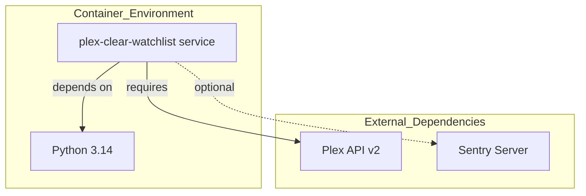
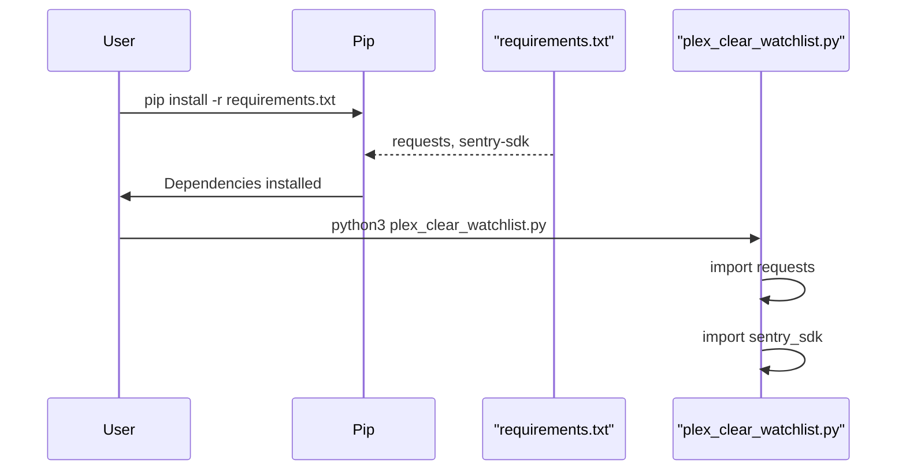

<details>
<summary>Relevant source files</summary>

The following files were used as context for generating this wiki page:

- [requirements.txt](requirements.txt)
- [renovate.json](renovate.json)
- [SECURITY.md](SECURITY.md)
- [plex_clear_watchlist.py](plex_clear_watchlist.py)
- [README.md](README.md)
- [AGENTS.md](AGENTS.md)
- [docker-compose.yml](docker-compose.yml)
</details>

# Dependency Management

Dependency management in the `plex_clear_watchlist` project ensures that the Python environment, external libraries, and containerized components remain secure, updated, and compatible. The project follows a minimalist approach, relying on a small set of core libraries to interface with the Plex API and provide error tracking.

Sources: [AGENTS.md:5-9](AGENTS.md#L5-L9), [README.md:37-41](README.md#L37-L41)

## Core Python Dependencies

The project utilizes two primary external Python libraries to facilitate its core functionality. These are defined in the standard Python requirement format.

| Dependency | Purpose | Constraint |
| :--- | :--- | :--- |
| `requests` | Handles HTTP communication with the Plex API v2 | Unpinned |
| `sentry-sdk` | Provides error tracking and exception reporting | `>=2.0.0` |

Sources: [requirements.txt:1-2](requirements.txt#L1-L2), [plex_clear_watchlist.py:4-5](plex_clear_watchlist.py#L4-L5)

### Implementation Logic
The application imports these dependencies at runtime. While `requests` is essential for the script to function (fetching and deleting watchlist items), `sentry-sdk` is initialized conditionally based on whether the `--dry-run` flag is absent and the `SENTRY_DSN` environment variable is provided.

```python
import requests
import sentry_sdk

# ... initialization inside main()
if not args.dry_run:
    sentry_sdk.init(
        dsn=os.getenv("SENTRY_DSN"),
        # ... configuration options
    )
```

Sources: [plex_clear_watchlist.py:4-5](plex_clear_watchlist.py#L4-L5), [plex_clear_watchlist.py:108-115](plex_clear_watchlist.py#L108-L115)

## Automated Updates and Security

The project employs automated tools to maintain dependency health and security. This is managed through two primary mechanisms: Renovate and GitHub Dependabot.

### Renovate Configuration
The project includes a `renovate.json` file which extends the recommended configuration to automate dependency updates.

```json
{
  "$schema": "https://docs.renovatebot.com/renovate-schema.json",
  "extends": [
    "config:recommended"
  ]
}
```

Sources: [renovate.json:1-6](renovate.json#L1-L6)

### Security Best Practices
Security policy dictates that dependencies must be kept updated, explicitly mentioning that Dependabot is enabled for the repository. Furthermore, the project emphasizes that sensitive credentials (like `PLEX_TOKEN`) should never be hardcoded or committed to version control, which prevents accidental exposure through dependency or configuration leaks.

Sources: [SECURITY.md:16-18](SECURITY.md#L16-L18), [AGENTS.md:21-21](AGENTS.md#L21)

## Infrastructure Dependencies

The project is designed to run in a containerized environment, introducing dependencies on specific runtimes and base images.

### Runtime Environment
The project target runtime is Python 3.14. This environment is orchestrated via Docker and Docker Compose.



The diagram shows the relationship between the service, its internal runtime, and the external services it depends on.
Sources: [AGENTS.md:7-9](AGENTS.md#L7-L9), [docker-compose.yml:1-7](docker-compose.yml#L1-L7)

### Service Dependencies
The `docker-compose.yml` file defines how the environment variables are passed to the containerized application, linking the local shell environment to the internal application logic.

| Environment Variable | Description |
| :--- | :--- |
| `PLEX_TOKEN` | Required for authentication with Plex API |
| `SENTRY_DSN` | Optional; used for error reporting |

Sources: [docker-compose.yml:6-7](docker-compose.yml#L6-L7), [README.md:14-17](README.md#L14-L17)

## Dependency Flow

The following sequence shows how dependencies are satisfied during the setup and execution phase.



This diagram illustrates the manual installation process as described in the project documentation.
Sources: [README.md:37-41](README.md#L37-L41), [plex_clear_watchlist.py:4-5](plex_clear_watchlist.py#L4-L5)

## Summary
Dependency management for `plex_clear_watchlist` is characterized by a "keep it simple" philosophy. By utilizing a minimal set of external libraries (`requests` and `sentry-sdk`) and leveraging automated tools like Renovate and Dependabot, the project maintains a low maintenance overhead while ensuring security and stability. Containerization through Docker further encapsulates these dependencies, providing a consistent execution environment.

Sources: [AGENTS.md:23-23](AGENTS.md#L23), [SECURITY.md:16-18](SECURITY.md#L16-L18)
