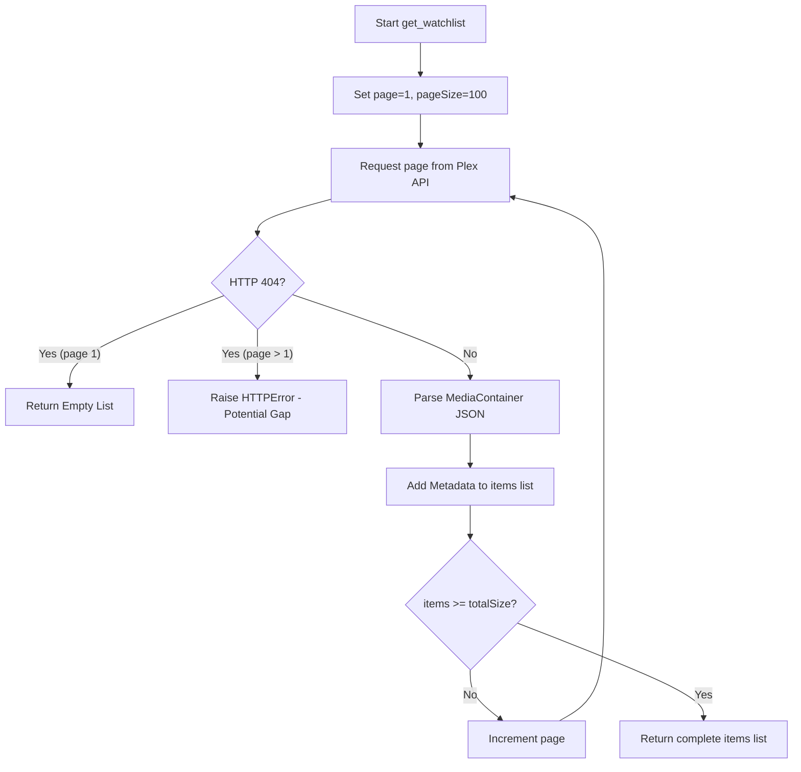
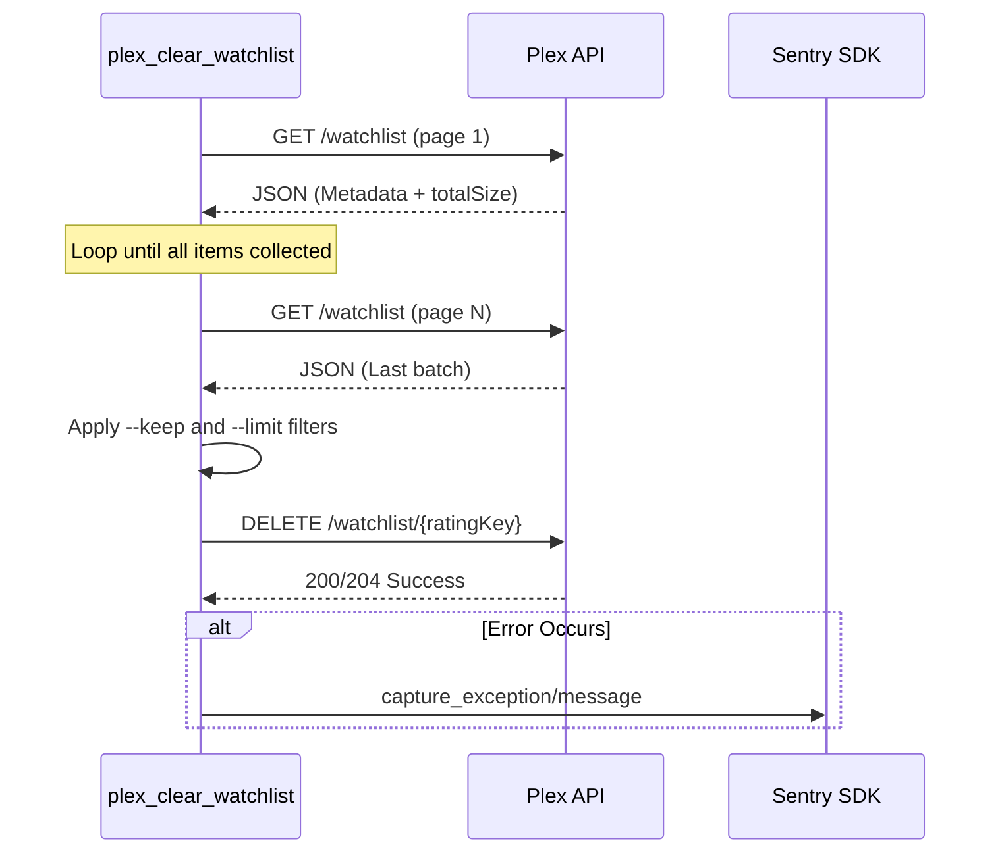

<details>
<summary>Relevant source files</summary>

The following files were used as context for generating this wiki page:

- [plex\_clear\_watchlist.py](plex_clear_watchlist.py)
- [README.md](README.md)
- [AGENTS.md](AGENTS.md)
- [CLAUDE.md](CLAUDE.md)
- [docker-compose.yml](docker-compose.yml)
- [requirements.txt](requirements.txt)
</details>

# Pagination Data Flow

## Introduction
The Pagination Data Flow in this project manages the retrieval of large Watchlists from the Plex API. Because the API limits the number of items returned in a single request, the system implements a iterative polling mechanism to ensure every item is accounted for before any deletion operations occur.

This flow is critical for preventing "partial deletions," where a failure to retrieve all pages might lead the script to believe the list is smaller than it actually is. The process uses environment-based authentication and parameters to navigate the `MediaContainer` JSON structure returned by Plex.

Sources: [plex\_clear\_watchlist.py:22-55](plex\_clear\_watchlist.py#L22-L55), [AGENTS.md:1-5](AGENTS.md#L1-L5)

## API Request Configuration
Pagination is controlled through specific HTTP headers and query parameters sent to the Plex Watchlist endpoint. The system defaults to a page size of 100 items to balance request overhead and reliability.

### Connection Parameters

| Parameter | Value | Description |
|---|---|---|
| `page` | Integer (starts at 1) | The current page index being requested. |
| `pageSize` | 100 | The maximum number of items to return per request. |
| `sort` | `addedAt:asc` | Ensures a stable order during retrieval to prevent skipping items. |
| `X-Plex-Token` | `PLEX_TOKEN` | Required authentication token from environment variables. |

Sources: [plex\_clear\_watchlist.py:10-20](plex\_clear\_watchlist.py#L10-L20), [plex\_clear\_watchlist.py:30-31](plex\_clear\_watchlist.py#L30-L31), [README.md:13-15](README.md#L13-L15)

## Iterative Retrieval Logic
The retrieval process is encapsulated in the `get_watchlist` function. It employs a `while True` loop that increments the `page` variable until all items indicated by the API's `totalSize` field have been collected.

### Logic Flow Diagram
The following diagram illustrates the decision-making process for fetching pages and handling potential API errors.



Sources: [plex\_clear\_watchlist.py:22-55](plex\_clear\_watchlist.py#L22-L55)

### Error Handling in Pagination
A specific safety check exists for `404 Not Found` responses. While a 404 on the first page indicates an empty watchlist, a 404 on subsequent pages is treated as an API glitch. The system raises an exception rather than returning a partial list to avoid accidental data loss through incomplete deletions.

Sources: [plex\_clear\_watchlist.py:33-42](plex\_clear\_watchlist.py#L33-L42)

## Data Structure and Parsing
The script expects a specific JSON response structure from the Plex API. The data is nested within a `MediaContainer` object, which contains the actual item list and metadata about the collection size.

```python
# Example of data extraction from response
container = data.get("MediaContainer", {})
page_items = container.get("Metadata", [])
total_size = container.get("totalSize", 0)
```

Sources: [plex\_clear\_watchlist.py:46-48](plex\_clear\_watchlist.py#L46-L48), [requirements.txt:1](requirements.txt#L1)

## Integration with Deletion Flow
Once the pagination flow completes and returns a full list of items, the data is passed to the filtering and deletion logic. This ensures that features like `--limit` and `--keep` are calculated against the entire dataset rather than just the first page.



Sources: [plex\_clear\_watchlist.py:84-125](plex\_clear\_watchlist.py#L84-L125), [docker-compose.yml:6-8](docker-compose.yml#L6-L8), [CLAUDE.md:17-22](CLAUDE.md#L17-L22)

## Conclusion
The pagination data flow serves as the foundation for the `plex_clear_watchlist` tool. By utilizing a robust iterative fetching strategy with specific error handling for API inconsistencies, the system ensures that watchlist deletions are performed accurately based on the full state of the user's account.

Sources: [plex\_clear\_watchlist.py:127-130](plex\_clear\_watchlist.py#L127-L130), [AGENTS.md:25-27](AGENTS.md#L25-L27)
