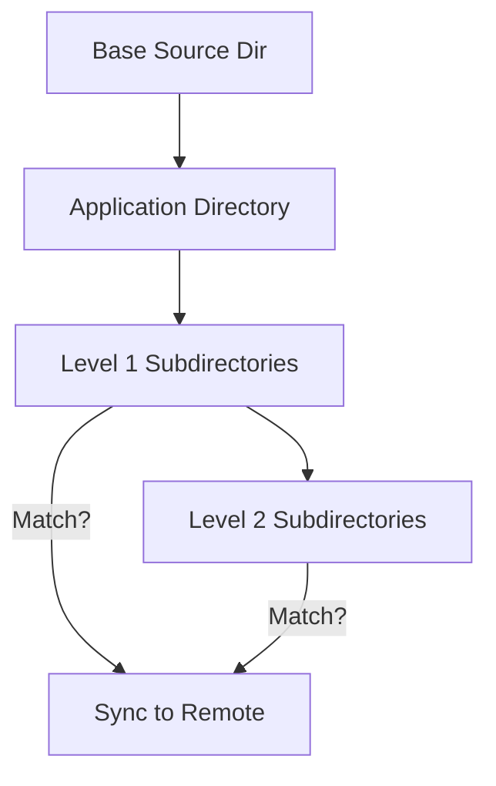
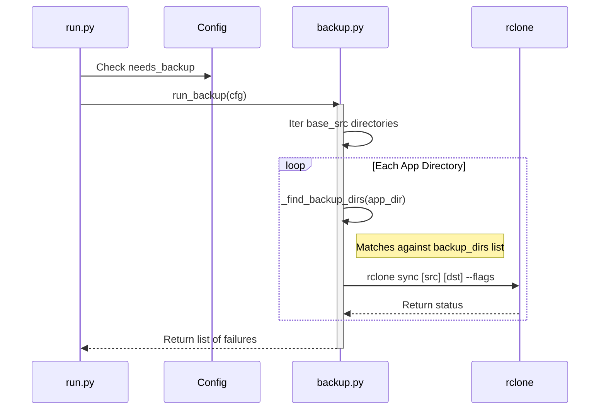

Relevant source files

The following files were used as context for generating this wiki page:

- [src/backup.py](../../../src/backup.py)
- [README.md](../../../README.md)
- [src/config.py](../../../src/config.py)
- [src/run.py](../../../src/run.py)
- [src/entrypoint.py](../../../src/entrypoint.py)
- [CLAUDE.md](../../../CLAUDE.md)

# Backup Folder Structure

The backup system in `docker-idempotent-update` is designed to automatically discover and synchronize specific application data directories to a remote destination using `rclone`. It operates by scanning a designated source directory for subdirectories that match specific naming conventions, ensuring that only relevant backup data is transmitted to the cloud or remote storage.

Sources: [README.md:9-12](README.md#L9-L12), [src/backup.py:46-51](src/backup.py#L46-L51), [CLAUDE.md:5-10](CLAUDE.md#L5-L10)

## Directory Discovery Logic

The system follows a specific hierarchy when scanning for folders to back up. It starts at a base source directory (typically `/data` inside the container) and iterates through top-level application folders. Within each application folder, it looks for specific "backup" directories up to two levels deep.

### Recursive Search Implementation
The search logic is implemented in `_find_backup_dirs`, which uses a generator to yield directories within an application folder and their immediate subdirectories.

*The diagram illustrates the two-level deep scanning process within each application directory to identify backup targets.*

Sources: [src/backup.py:46-51](src/backup.py#L46-L51), [src/backup.py:81-87](src/backup.py#L81-L87), [README.md:126-130](README.md#L126-L130)

## Configuration and Mapping

The mapping of local folders to remote destinations is governed by `backup.conf`. By default, the system scans for folders named `backup` or `backups` (case-insensitive).

### Mapping Example
When a match is found, the system constructs a remote path following the pattern: `{remote_dst}/{app_name}/{relative_path_to_backup_dir}`.

| Source Path (Local) | Remote Path (rclone) |
| :--- | :--- |
| `/data/prowlarr/backups/` | `gdrive:backups/prowlarr/backups/` |
| `/data/sonarr/config/backup/` | `gdrive:backups/sonarr/config/backup/` |

Sources: [README.md:132-137](README.md#L132-L137), [src/backup.py:59](src/backup.py#L59), [src/config.py:20-22](src/config.py#L20-L22)

### Configuration Parameters
The `Config` class reads these settings from environment variables and the `/config/backup.conf` file.

| Parameter | Default Value | Description |
| :--- | :--- | :--- |
| `RCLONE_SRC` | `/data` | The base directory to scan for application data. |
| `RCLONE_DST` | `gdrive:backups` | The rclone remote and path for storing backups. |
| `BACKUP_DIRS` | `backup backups` | Space-separated list of directory names to include. |

Sources: [src/config.py:19-22](src/config.py#L19-L22), [src/config.py:33-41](src/config.py#L33-L41)

## Execution Flow

The backup process is triggered during the daily run if the `MODE` is set to `backup` or `both`.

*Sequence of events during the synchronization process, showing the interaction between the runner, configuration, and the rclone utility.*

Sources: [src/run.py:38-40](src/run.py#L38-L40), [src/backup.py:42-45](src/backup.py#L42-L45), [src/backup.py:65-71](src/backup.py#L65-L71)

## Rclone Synchronization Logic

The actual transfer is performed via the `rclone sync` command. The system includes built-in retry logic and specific performance flags to ensure reliability.

### Retry Mechanism
For every directory sync attempt, the system will try up to 3 times if a failure occurs, with a 15-second delay between attempts.
Sources: [src/backup.py:65-74](src/backup.py#L65-L74)

### Optimization Flags
The following flags are used in every `rclone` operation to optimize performance and ensure data integrity:
- `--fast-list`: Optimizes directory listing for supported remotes.
- `--checksum`: Uses checksums to verify file integrity.
- `--delete-during`: Deletes files on the destination that no longer exist on the source during the transfer.
- `--transfers 4`: Limits concurrent file transfers.
- `--checkers 6`: Limits concurrent file checks.

Sources: [src/backup.py:9-26](src/backup.py#L9-L26)

## Summary of File Interactions
- **src/backup.py**: Contains the core logic for scanning directories and executing `rclone sync`.
- **src/config.py**: Handles the parsing of `backup.conf` and environment variables to define source and destination.
- **src/entrypoint.py**: Ensures `/config/backup.conf` exists, copying from a template if necessary.
- **README.md**: Provides the conceptual overview and directory structure examples.
- **src/run.py**: Coordinates the execution of the backup step within the overall maintenance lifecycle.

Sources: [src/entrypoint.py:46-51](src/entrypoint.py#L46-L51), [src/run.py:38-40](src/run.py#L38-L40), [CLAUDE.md:15-20](CLAUDE.md#L15-L20)
