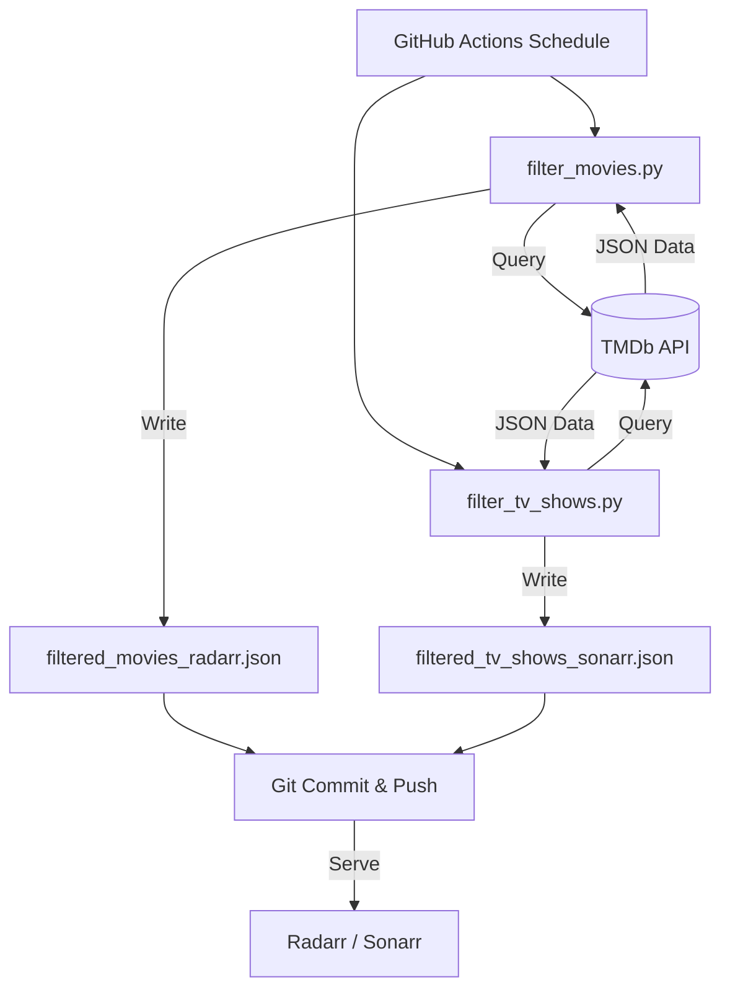

<details>
<summary>Relevant source files</summary>

The following files were used as context for generating this wiki page:

- [README.md](README.md)
- [AGENTS.md](AGENTS.md)
- [CLAUDE.md](CLAUDE.md)
- [SECURITY.md](SECURITY.md)
- [filter_movies.py](filter_movies.py)
- [filter_tv_shows.py](filter_tv_shows.py)
- [renovate.json](renovate.json)
</details>

# CI/CD & Automation Architecture

The "filtered-movies" project utilizes an automated pipeline to maintain up-to-date lists of high-value media content. The architecture is centered around GitHub Actions, which executes Python scripts on a daily schedule to fetch data from The Movie Database (TMDb) API, apply specific filters, and commit the results back to the repository. This ensures that downstream applications like Radarr and Sonarr always have access to current data via raw GitHub URLs.

Sources: [README.md:1-12](README.md#L1-L12), [AGENTS.md:1-10](AGENTS.md#L1-L10), [CLAUDE.md:1-10](CLAUDE.md#L1-L10)

## Automation Workflow

The system relies on two primary workflows that run independently to update movie and TV show data. These workflows execute specific Python scripts that interact with the TMDb API.

### Scheduled Updates
The project uses GitHub Actions to trigger updates at specific times.

| Workflow | Schedule | Output File | Script |
|----------|----------|-------------|--------|
| `update-movies.yml` | 06:00 UTC Daily | `filtered_movies_radarr.json` | `filter_movies.py` |
| `update-tv-shows.yml` | 07:00 UTC Daily | `filtered_tv_shows_sonarr.json` | `filter_tv_shows.py` |

Sources: [README.md:104-110](README.md#L104-L110), [AGENTS.md:5-10](AGENTS.md#L5-L10)

### Data Flow Architecture

The following diagram illustrates the automated data retrieval and update cycle:



The diagram shows the daily schedule triggering Python scripts which fetch data from TMDb, process it, and update the repository files consumed by media managers.
Sources: [README.md:104-110](README.md#L104-L110), [filter_movies.py:27-35](filter_movies.py#L27-L35), [filter_tv_shows.py:44-51](filter_tv_shows.py#L44-L51)

## Script Logic and Filtering

The automation scripts apply strict criteria to filter the vast TMDb database into targeted lists for automation tools.

### Movie Filtering Logic (`filter_movies.py`)
This script targets "Big Budget" movies. The criteria include:
- **Budget**: Minimum of $100,000,000.
- **Release Date**: Within the current calendar year up to the current date.
- **Requirement**: Must have a valid IMDb ID for Radarr compatibility.

Sources: [filter_movies.py:5-15](filter_movies.py#L5-L15), [README.md:18-24](README.md#L18-L24)

### TV Show Filtering Logic (`filter_tv_shows.py`)
This script targets "Prestige" networks. The criteria include:
- **Networks**: Content from HBO, Max, Apple TV+, National Geographic, and Amazon/Prime Video.
- **Release Date**: Premiered in the current year onwards.
- **Requirement**: Must have a valid TVDB ID for Sonarr compatibility.

Sources: [filter_tv_shows.py:5-15](filter_tv_shows.py#L5-L15), [README.md:28-44](README.md#L28-L44)

## Security and Credential Management

The CI/CD pipeline is designed to handle sensitive credentials securely using GitHub Secrets and environment variables.

### Secret Handling
The TMDb API requires a "Read Access Token" for authentication. This is never hardcoded in the scripts.
- **Environment Variable**: `TMDB_API_KEY` is retrieved via `os.environ.get()`.
- **CI Injection**: The GitHub Actions workflow injects the repository secret into the environment during execution.
- **Safety**: `.env` files and local credentials are listed in `.gitignore` to prevent accidental commits.

Sources: [SECURITY.md:46-56](SECURITY.md#L46-L56), [filter_movies.py:30-34](filter_movies.py#L30-L34), [AGENTS.md:32-34](AGENTS.md#L32-L34)

### CI Commit Conventions
Automated updates commit changes back to the repository. A critical convention noted in the documentation is that these commits should **not** use `[skip ci]` if they are intended to trigger subsequent required checks, such as `repository-checks` on PRs.

Sources: [CLAUDE.md:33-37](CLAUDE.md#L33-L37), [AGENTS.md:32-34](AGENTS.md#L32-L34)

## Dependency Management

The project uses automated tools to keep its environment and dependencies secure and up-to-date.

### Renovate Bot
The project includes a `renovate.json` configuration file, which extends the `config:recommended` preset. This automates dependency updates for the project's requirements.

Sources: [renovate.json:1-6](renovate.json#L1-L6)

### Monitoring and Observability
The Python scripts integrate with **Sentry** for error tracking. This allows the maintainers to monitor the health of the automated runs and capture exceptions if the TMDb API structure changes or network errors occur.

```python
import sentry_sdk
sentry_sdk.init(dsn=os.environ.get("SENTRY_DSN"), traces_sample_rate=0)
# ... script execution ...
sentry_sdk.flush(timeout=5)
```

Sources: [filter_movies.py:21-25](filter_movies.py#L21-L25), [filter_tv_shows.py:21-25](filter_tv_shows.py#L21-L25), [requirements.txt:2](requirements.txt#L2)

## Summary

The CI/CD & Automation Architecture of this project is a lightweight, serverless solution that transforms raw API data into structured import lists. By leveraging GitHub Actions for scheduling, GitHub Secrets for security, and Python for logic, the system maintains high-value media lists with minimal manual intervention. The integration of Renovate and Sentry further ensures the long-term maintainability and reliability of the automation pipeline.

Sources: [README.md:104-118](README.md#L104-L118), [AGENTS.md:1-15](AGENTS.md#L1-L15), [SECURITY.md:40-45](SECURITY.md#L40-L45)
