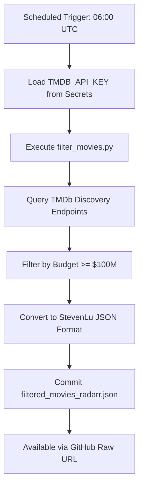
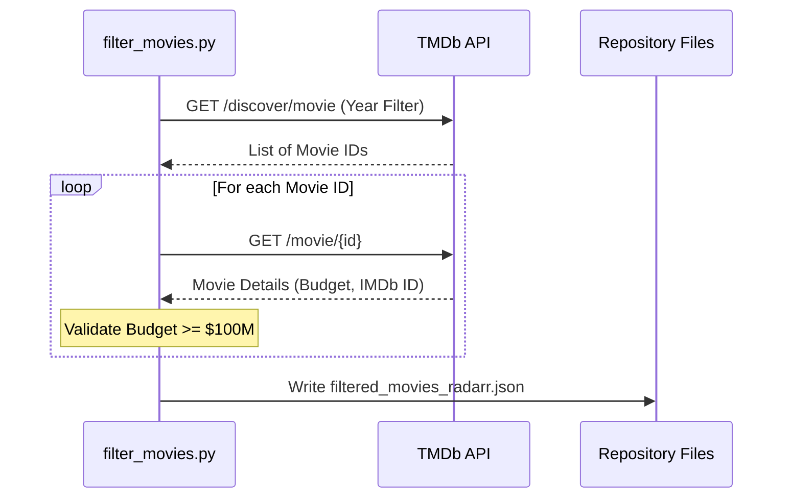

<details>
<summary>Relevant source files</summary>

The following files were used as context for generating this wiki page:

- [filter_movies.py](filter_movies.py)
- [README.md](README.md)
- [AGENTS.md](AGENTS.md)
- [CLAUDE.md](CLAUDE.md)
- [SECURITY.md](SECURITY.md)
- [filtered_movies_radarr.json](filtered_movies_radarr.json)

</details>

# Workflow: Update Movies Daily

The "Update Movies Daily" workflow is an automated process designed to generate and maintain a curated list of high-budget motion pictures for integration into media management tools like Radarr. The workflow operates by querying The Movie Database (TMDb) API to identify films released within the current calendar year that meet specific financial thresholds.

This automated pipeline ensures that the `filtered_movies_radarr.json` file is consistently refreshed, allowing end-users to subscribe to a "Big Budget Only" list via the StevenLu custom import format. The system is built on Python and executed via GitHub Actions to maintain a zero-maintenance, data-driven update cycle.

Sources: [README.md:1-25](README.md#L1-L25), [AGENTS.md:1-15](AGENTS.md#L1-L15), [filter_movies.py:1-18](filter_movies.py#L1-L18)

## Execution Architecture

The update process is triggered daily at 06:00 UTC via a GitHub Actions workflow defined in `update-movies.yml`. The script `filter_movies.py` serves as the core execution engine, handling API communication, data transformation, and file persistence.

The following diagram illustrates the daily execution flow from the scheduled trigger to the final file commit.



The workflow relies on GitHub Secrets for secure API authentication and commits changes back to the repository using automated commit messages.

Sources: [README.md:105-115](README.md#L105-L115), [AGENTS.md:25-30](AGENTS.md#L25-L30), [SECURITY.md:50-65](SECURITY.md#L50-L65)

## Data Retrieval and Filtering Logic

The movie update workflow utilizes a two-stage retrieval process to ensure comprehensive coverage of recent releases while maintaining strict budget criteria.

### 1. Discovery Phase
The system queries multiple TMDb endpoints to gather a candidate list of movie IDs. It searches up to 10 pages for each of the following categories, restricted to movies released from January 1st of the current year to the current date:
*  **Now Playing**: Currently in theaters.
*  **Popularity**: Sorted by TMDb popularity score.
*  **Vote Count**: Sorted by the number of user ratings.
*  **Revenue**: Sorted by total box office returns.

Sources: [filter_movies.py:53-75](filter_movies.py#L53-L75)

### 2. Filtering and Validation Phase
Each identified movie is then queried individually to retrieve detailed metadata. The script applies the following validation logic:

| Criteria | Logic | Requirement |
| :--- | :--- | :--- |
| **Release Date** | `current_year-01-01` <= date <= `today` | Release must be in the current year |
| **Budget** | `budget` >= 100,000,000 | Must meet $100M threshold |
| **ID Presence** | `imdb_id` must exist | Required for Radarr compatibility |
| **Known Data** | `budget` != 0 | Skips films with unreported budgets |

Sources: [filter_movies.py:28-30](filter_movies.py#L28-L30), [filter_movies.py:100-135](filter_movies.py#L100-L135), [README.md:30-35](README.md#L30-L35)

The interaction between the filter script and the TMDb API is detailed in the sequence diagram below:



Sources: [filter_movies.py:53-150](filter_movies.py#L53-L150)

## Output Specification: StevenLu Format

The final output is stored in `filtered_movies_radarr.json`. This file adheres to the StevenLu Custom format, which is a lightweight JSON array of objects containing only the title and the IMDb identifier. This format is specifically chosen for seamless compatibility with Radarr's "Import Lists" feature.

**Example Entry:**

```json
[
  {
    "title": "Project Hail Mary",
    "imdb_id": "tt12042730"
  }
]
```

Sources: [README.md:80-95](README.md#L80-L95), [filtered_movies_radarr.json:1-10](filtered_movies_radarr.json#L1-L10)

## Configuration and Security

The workflow is configured via environment variables and project constants. Security is maintained by strictly forbidding the hardcoding of the `TMDB_API_KEY`.

| Configuration Item | Source/Variable | Default Value / Requirement |
| :--- | :--- | :--- |
| API Authentication | `TMDB_API_KEY` | TMDb Read Access Token (JWT) |
| Minimum Budget | `MIN_BUDGET` | $100,000,000 |
| Output Path | `OUTPUT_FILE` | `filtered_movies_radarr.json` |
| Error Tracking | `SENTRY_DSN` | Optional (from environment) |

Sources: [filter_movies.py:28-44](filter_movies.py#L28-L44), [SECURITY.md:50-60](SECURITY.md#L50-L60), [CLAUDE.md:25-35](CLAUDE.md#L25-L35)

## Summary

The "Update Movies Daily" workflow automates the curation of blockbuster films by bridging the TMDb API and Radarr. By applying a $100M budget filter to movies released in the current year, the system provides a specialized "high-value" feed that is updated every 24 hours at 06:00 UTC, ensuring that the repository's data remains current without manual intervention.

Sources: [README.md:10-20](README.md#L10-L20), [AGENTS.md:5-15](AGENTS.md#L5-L15)
