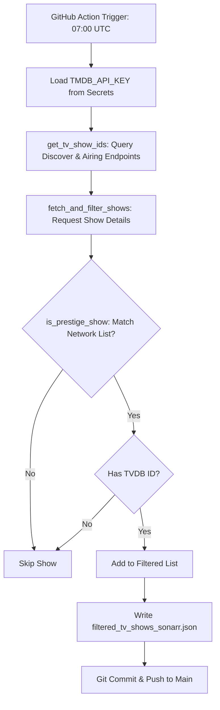
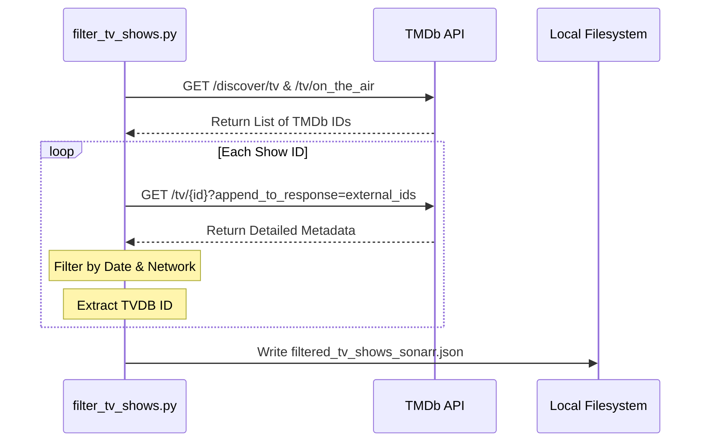

<details>
<summary>Relevant source files</summary>

The following files were used as context for generating this wiki page:

- [README.md](README.md)
- [filter_tv_shows.py](filter_tv_shows.py)
- [AGENTS.md](AGENTS.md)
- [CLAUDE.md](CLAUDE.md)
- [filtered_tv_shows_sonarr.json](filtered_tv_shows_sonarr.json)
- [requirements.txt](requirements.txt)
</details>

# Workflow: Update TV Shows Daily

The "Update TV Shows Daily" workflow is an automated process responsible for generating a curated list of high-value television series. The workflow identifies "prestige" content—shows premiered in the current year on major networks or streaming platforms—and formats them for direct consumption by Sonarr.

This system operates via GitHub Actions, executing daily to ensure the published list reflects the most recent data from The Movie Database (TMDb). The logic is encapsulated in a Python script that interacts with the TMDb API, filters results based on network prestige, and commits a finalized JSON file back to the repository.

Sources: [README.md:1-24](README.md#L1-L24), [AGENTS.md:1-12](AGENTS.md#L1-L12), [filter_tv_shows.py:1-20](filter_tv_shows.py#L1-L20)

## Architecture and Data Flow

The workflow follows a sequential pipeline starting from a scheduled trigger and ending with the deployment of a static JSON asset. The primary execution environment is GitHub Actions, which provides the necessary `TMDB_API_KEY` via repository secrets.

### Process Flow
The following diagram illustrates the lifecycle of a single daily update run:



The workflow ensures that only shows with a valid `TvdbId` are included, as this is a strict requirement for Sonarr Custom Lists.

Sources: [filter_tv_shows.py:46-150](filter_tv_shows.py#L46-L150), [README.md:105-115](README.md#L105-L115), [AGENTS.md:18-25](AGENTS.md#L18-L25)

## Core Components

### 1. Filtering Logic
The system applies specific criteria to determine if a show should be included in the daily update.

| Criterion | Requirement |
|-----------|-------------|
| **Release Date** | Must have premiered in the current year onwards. |
| **Network** | Must be associated with "Prestige Networks" (e.g., HBO, Max, Apple TV+, National Geographic). |
| **Identifiers** | Must possess a valid TVDB ID via TMDb external IDs. |

Sources: [filter_tv_shows.py:25-45](filter_tv_shows.py#L25-L45), [README.md:31-40](README.md#L31-L40)

### 2. Prestige Networks
The script maintains a hardcoded list of networks considered high-value. This list is used for case-insensitive matching against the `networks` field in the TMDb API response.

```python
PRESTIGE_NETWORKS = [
    "HBO", "Max", "Apple TV+", "Apple TV", 
    "National Geographic", "Amazon", "Prime Video", 
    "Amazon Prime Video"
]
```

Sources: [filter_tv_shows.py:46-56](filter_tv_shows.py#L46-L56)

### 3. API Integration
The workflow interacts with several TMDb API endpoints to compile its candidate list:
*  `/tv/on_the_air` and `/tv/airing_today`: To find currently active content.
*  `/discover/tv`: To find shows based on popularity, first air date, and vote counts.
*  `/tv/{tv_id}?append_to_response=external_ids`: To retrieve specific metadata and required external identifiers.

Sources: [filter_tv_shows.py:65-80](filter_tv_shows.py#L65-L80), [filter_tv_shows.py:125-135](filter_tv_shows.py#L125-L135)

## Data Transformation and Output

The output of the workflow is a JSON array of objects, specifically formatted for the Sonarr "Custom List" import type.

### Execution Sequence
The interaction between the local Python environment and the TMDb API is detailed below:



Sources: [filter_tv_shows.py:60-160](filter_tv_shows.py#L60-L160), [README.md:85-95](README.md#L85-L95)

### Output Schema
The resulting file, `filtered_tv_shows_sonarr.json`, contains only the TVDB identifier.

```json
[
  {
    "TvdbId": 376098
  },
  {
    "TvdbId": 430654
  }
]
```

Sources: [filtered_tv_shows_sonarr.json:1-10](filtered_tv_shows_sonarr.json#L1-L10)

## Configuration and Environment

The workflow requires specific environment variables and dependencies to execute successfully within the GitHub Actions runner.

| Variable | Description | Source |
|----------|-------------|--------|
| `TMDB_API_KEY` | TMDb API Read Access Token (JWT format). | GitHub Secrets |
| `SENTRY_DSN` | (Optional) DSN for error tracking and telemetry. | GitHub Secrets |

Sources: [filter_tv_shows.py:38-42](filter_tv_shows.py#L38-L42), [filter_tv_shows.py:31-35](filter_tv_shows.py#L31-L35), [SECURITY.md:55-65](SECURITY.md#L55-L65)

### External Dependencies
The workflow relies on the following Python packages:
*  `requests`: Used for making HTTP calls to the TMDb API.
*  `sentry-sdk`: Used for error reporting.

Sources: [requirements.txt:1-2](requirements.txt#L1-L2)

## Summary
The "Update TV Shows Daily" workflow provides a highly focused automation for media discovery. By filtering TMDb's vast database down to premier content from prestige networks and surfacing these through a Sonarr-compatible JSON feed at 07:00 UTC daily, it eliminates the need for manual list curation while ensuring high-quality metadata is synchronized via TVDB IDs.

Sources: [README.md:105-115](README.md#L105-L115), [filter_tv_shows.py:165-185](filter_tv_shows.py#L165-L185)
