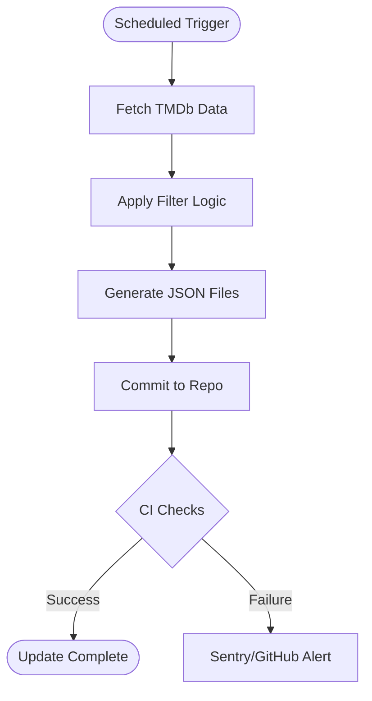
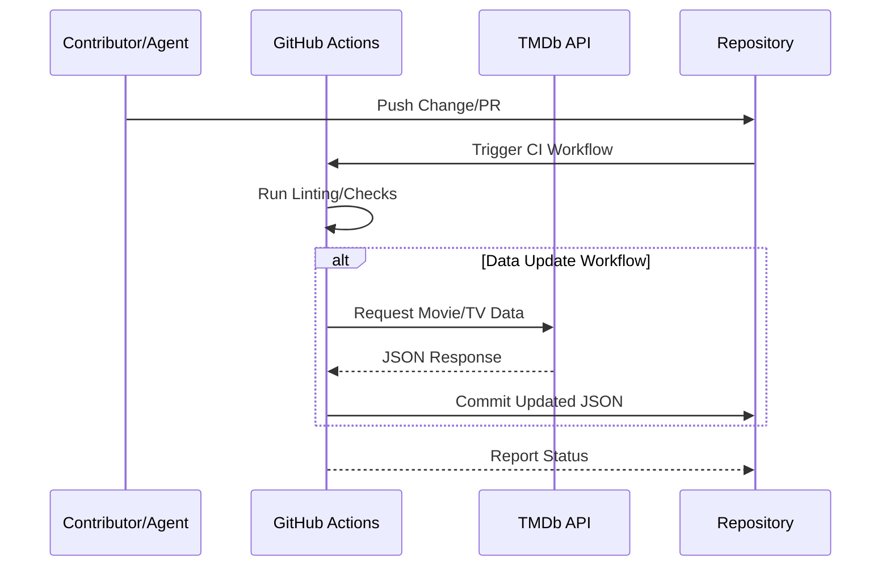

Relevant source files

The following files were used as context for generating this wiki page:

- [CLAUDE.md](CLAUDE.md)
- [AGENTS.md](AGENTS.md)
- [README.md](README.md)
- [filter_movies.py](filter_movies.py)
- [filter_tv_shows.py](filter_tv_shows.py)
- [SECURITY.md](SECURITY.md)
- [renovate.json](renovate.json)

# Automated Commit Conventions

Automated commit conventions in this project govern how the system handles programmatic updates to data files and dependencies. Because the repository serves as a live data source for Radarr and Sonarr, high-frequency updates are performed by GitHub Actions and automated bots to ensure the integrity and freshness of the filtered movie and TV show lists.

The primary purpose of these conventions is to manage the flow of automated updates without triggering unnecessary CI/CD loops or blocking critical repository checks. This is achieved through specific commit message formatting and workflow triggers that distinguish between manual development changes and routine data refreshes.

Sources: [CLAUDE.md:1-5](CLAUDE.md#L1-L5), [AGENTS.md:1-5](AGENTS.md#L1-L5), [README.md:89-91](README.md#L89-L91)

## Automated Data Updates

The project uses GitHub Actions to run Python scripts daily, which fetch data from the TMDb API and update local JSON files. These files are then committed back to the repository automatically.

### Commit Formatting Requirements
There is a critical distinction in how automated commits are labeled to interact with the CI/CD pipeline:

*  **Workflow Commits:** Automated updates to `filtered_movies_radarr.json` and `filtered_tv_shows_sonarr.json` are performed by GitHub workflows.
*  **CI Skipping:** Previously, the project used `[skip ci]` in commit messages. However, current conventions dictate that JSON output files should **NOT** use `[skip ci]`. Using `[skip ci]` was found to block required `repository-checks` on resulting Pull Requests, preventing merges.

Sources: [CLAUDE.md:25-29](CLAUDE.md#L25-L29), [AGENTS.md:24-24](AGENTS.md#L24)

### Data Refresh Flow
The following diagram illustrates the automated process of data retrieval and the subsequent commit to the repository.

The workflow ensures that data remains current while maintaining repository health through continuous verification.
Sources: [README.md:93-97](README.md#L93-L97), [filter_movies.py:144-149](filter_movies.py#L144-L149), [filter_tv_shows.py:157-162](filter_tv_shows.py#L157-L162)

## Dependency Management

Automated conventions also extend to dependency updates through Renovate. This ensures that the Python environment and GitHub Actions remain secure and up-to-date.

| Component | Convention | Implementation |
|-----------|------------|----------------|
| **Renovate Bot** | Uses recommended presets | `extends: ["config:recommended"]` in `renovate.json` |
| **Dependabot** | Automatic updates | Managed via GitHub native integration |
| **Version Tracking** | Specific pinning | `requirements.txt` uses exact versions (e.g., `requests==2.34.2`) |

Sources: [renovate.json:1-6](renovate.json#L1-L6), [SECURITY.md:55-56](SECURITY.md#L55-L56), [requirements.txt:1-2](requirements.txt#L1-L2)

## Contributor and Agent Rules

To maintain the integrity of automated systems, specific rules are enforced for both human contributors and AI agents interacting with the repository.

### Forbidden Actions
To prevent disruption of the automated commit and update cycles, the following actions are prohibited:
*  Pushing directly to the `main` or `master` branches.
*  Disabling workflows that manage the daily data updates.
*  Hardcoding the `TMDB_API_KEY`, which must always be handled as a secret.
*  Including unrelated changes in focused PRs.

Sources: [AGENTS.md:23-26](AGENTS.md#L23-L26), [AGENTS.md:33-40](AGENTS.md#L33-L40), [CLAUDE.md:24-24](CLAUDE.md#L24)

### CI/CD Integration Sequence
When an automated or manual commit is pushed, the following sequence occurs to validate the changes:

The sequence demonstrates how the system balances external data fetching with internal repository state management.
Sources: [AGENTS.md:19-20](AGENTS.md#L19-L20), [README.md:93-97](README.md#L93-L97), [filter_movies.py:48-52](filter_movies.py#L48-L52)

## Conclusion
Automated commit conventions in the `filtered-movies` project prioritize the reliable delivery of data to end-user applications like Radarr and Sonarr. By standardizing commit messages to avoid CI blockage and automating dependency maintenance, the project ensures that the "Big Budget" and "Prestige Network" lists are updated daily with minimal manual intervention.

Sources: [README.md:15-20](README.md#L15-L20), [CLAUDE.md:25-29](CLAUDE.md#L25-L29)
