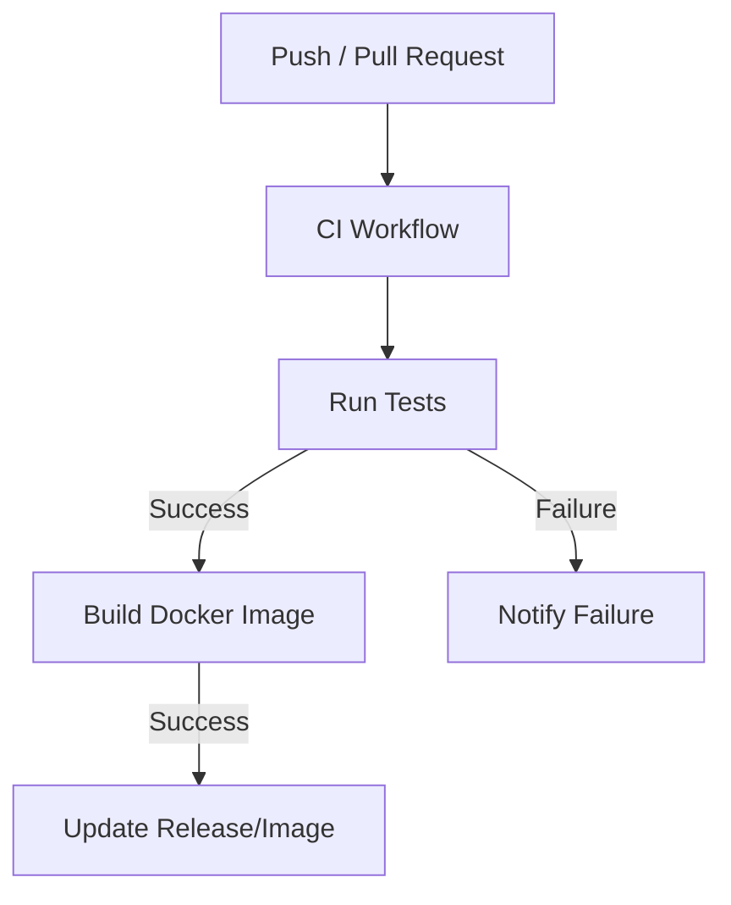

Relevant source files

The following files were used as context for generating this wiki page:

- [README.md](README.md)
- [AGENTS.md](AGENTS.md)
- [SECURITY.md](SECURITY.md)
- [renovate.json](renovate.json)
- [plex_clear_watchlist.py](plex_clear_watchlist.py)

# GitHub Actions Workflow

The GitHub Actions Workflow in the `plex_clear_watchlist` repository facilitates Continuous Integration (CI) and automated delivery. Its primary purpose is to validate code changes, ensure security standards are met, and manage the automated update of project dependencies to maintain compatibility with Python 3.14 and the Plex API.

The workflow is integrated with the GitHub Container Registry (GHCR) for hosting Docker images. It ensures that all contributions follow the project's strict contribution guidelines, such as passing all tests before merging into the main branch. Sentry error tracking is configured at runtime (via `docker-compose.yml`/`SENTRY_DSN`), not by the CI workflow itself — `ci.yml` only tests and builds/pushes the image.

Sources: [README.md:3-6](README.md#L3-L6), [AGENTS.md:5-15](AGENTS.md#L5-L15), [AGENTS.md:27-38](AGENTS.md#L27-L38)

## CI and Automation Pipeline

The project utilizes automated workflows to manage the lifecycle of the application. The CI pipeline, identified by the badge in the project documentation, triggers on repository events to validate the codebase.

### Continuous Integration (CI)
The CI workflow ensures that every pull request or push to the repository meets the quality requirements. This includes running tests and verifying the build of the one-shot Docker container used for clearing the Plex Watchlist.

The diagram above illustrates the high-level flow of the CI pipeline from code submission to potential release.

Sources: [README.md:3-6](README.md#L3-L6), [AGENTS.md:27-30](AGENTS.md#L27-L30)

### Dependency Management
Automated dependency management is handled through Renovate and Dependabot. Renovate is configured using a standard recommended configuration to keep Python packages and Docker base images up to date.

| Tool | Purpose | Configuration File |
|---|---|---|
| Renovate | Automated dependency updates | `renovate.json` |
| Dependabot | Security and dependency updates | `.github/dependabot.yml` |

Sources: [renovate.json:1-6](renovate.json#L1-L6), [SECURITY.md:14-17](SECURITY.md#L14-L17)

## Security and Permissions

The workflow environment is governed by specific security policies and agent permissions to prevent unauthorized modifications to the repository infrastructure.

### Workflow Constraints
Automated agents and contributors are restricted from performing sensitive operations within the GitHub environment to protect secrets and repository integrity.

*  **Forbidden Actions:** Disabling workflows, modifying secrets, and changing GitHub organization settings are strictly prohibited.
*  **Branch Protection:** Pushing directly to main or master branches is forbidden; all changes must arrive via pull requests.
*  **Secret Handling:** `PLEX_TOKEN` and other secrets must never be hardcoded or committed to version control; they are injected via environment variables.

Sources: [AGENTS.md:32-38](AGENTS.md#L32-L38), [SECURITY.md:14-17](SECURITY.md#L14-L17)

### Vulnerability Reporting
While automated tools scan for issues, the project maintains a private vulnerability reporting channel. Security advisories are handled through GitHub's private reporting feature rather than public issues.

Sources: [SECURITY.md:7-12](SECURITY.md#L7-L12)

## Release and Distribution

Successful workflow completion leads to the generation of release artifacts. The project automates the distribution of the script through two primary channels: GitHub Releases and the GitHub Container Registry.

### Distribution Components
The following table describes the artifacts managed by the automation workflows:

| Artifact | Source File | Description |
|---|---|---|
| Release Version | `plex_clear_watchlist.py` | GitHub Release tagged version. |
| Docker Image | `Dockerfile` | Image hosted at `ghcr.io/blixten85/plex-clear-watchlist`. |
| Documentation | `README.md` | Status badges for CI, Release, and Image size. |

Sources: [README.md:3-6](README.md#L3-L6), [README.md:26-28](README.md#L26-L28), [AGENTS.md:14-20](AGENTS.md#L14-L20)

### Error Tracking Integration
If configured via the `SENTRY_DSN` environment variable, the application integrates with Sentry. The workflow supports this by ensuring the environment variable is properly forwarded, allowing the Python script to initialize the Sentry SDK for capturing runtime exceptions and delete failures.

Sources: [README.md:11-13](README.md#L11-L13), [plex_clear_watchlist.py:92-99](plex_clear_watchlist.py#L92-L99), [plex_clear_watchlist.py:137-145](plex_clear_watchlist.py#L137-L145)

The GitHub Actions Workflow serves as the backbone for maintaining the reliability and security of the `plex_clear_watchlist` tool. By enforcing testing, restricting direct branch access, and automating dependency updates, it ensures the project remains functional against the evolving Plex API and Python ecosystem.
