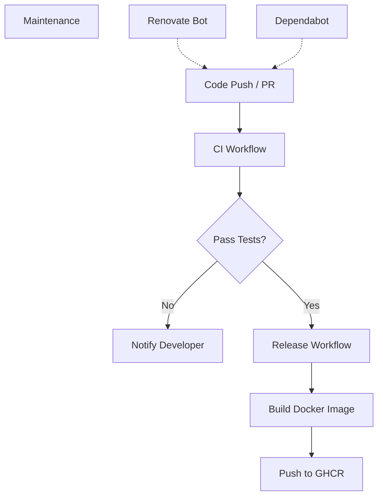
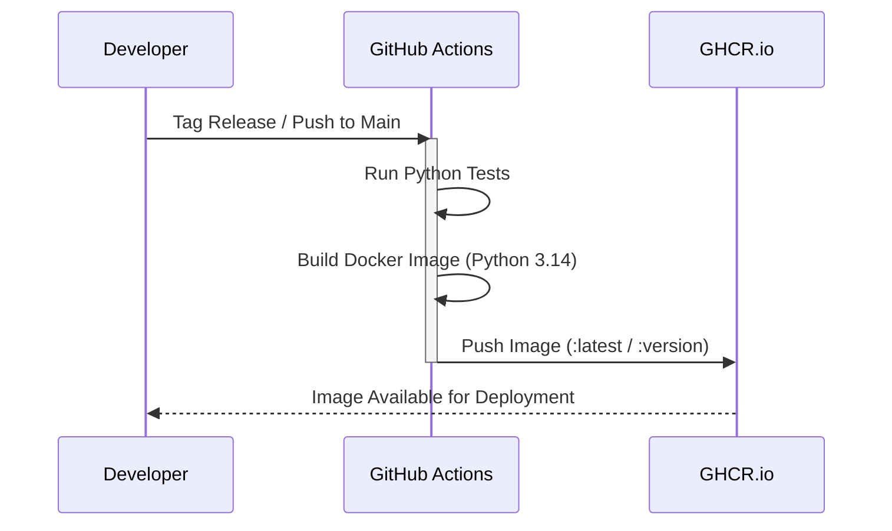

Relevant source files

The following files were used as context for generating this wiki page:

- [README.md](README.md)
- [AGENTS.md](AGENTS.md)
- [CLAUDE.md](CLAUDE.md)
- [renovate.json](renovate.json)
- [SECURITY.md](SECURITY.md)
- [plex_clear_watchlist.py](plex_clear_watchlist.py)

# GitHub Actions Workflow

The GitHub Actions workflow in the `plex_clear_watchlist` repository provides a structured Continuous Integration (CI) and delivery pipeline. It ensures code quality through automated testing and facilitates the distribution of the application as a Docker container. The workflow is integrated with external services like GitHub Container Registry (GHCR) and automated dependency management tools to maintain a secure and up-to-date codebase.

Sources: [README.md:3-8](README.md#L3-L8), [AGENTS.md:35-43](AGENTS.md#L35-L43), [SECURITY.md:14-16](SECURITY.md#L14-L16)

## Continuous Integration and Delivery

The CI/CD pipeline is designed to validate changes and publish releases. It is represented by badges in the project documentation indicating the status of the "CI" workflow and "Release" versions.

### Workflow Components
The automation ecosystem consists of several automated processes:
*  **CI Workflow:** Triggered on code changes to validate the application.
*  **Release Management:** Handles versioning and publication of new releases.
*  **Container Publishing:** Build and push Docker images to `ghcr.io/blixten85/plex-clear-watchlist`.
*  **Dependency Updates:** Automated via Renovate and Dependabot to keep the tech stack (Python 3.14 and libraries) current.

Sources: [README.md:3-8](README.md#L3-L8), [AGENTS.md:7-11](AGENTS.md#L7-L11), [renovate.json:1-6](renovate.json#L1-L6), [SECURITY.md:16](SECURITY.md#L16)

### CI/CD Pipeline Flow
The following diagram illustrates the conceptual flow of the GitHub Actions and automation tools within the project:

This flow shows how code changes trigger validation before moving to release and containerization.
Sources: [README.md:3-8](README.md#L3-L8), [AGENTS.md:35-38](AGENTS.md#L35-L38), [renovate.json:1-6](renovate.json#L1-L6), [SECURITY.md:16](SECURITY.md#L16)

## Integration with External Tools

The workflow interacts with several GitHub-native and third-party tools to manage security, dependencies, and deployment.

### Dependency Management
The project uses `renovate.json` with the `config:recommended` preset to automate dependency updates. Additionally, Dependabot is explicitly enabled to maintain the security of the Python dependencies listed in `requirements.txt`.

| Tool | Purpose | Configuration File |
|---|---|---|
| Renovate | Automated dependency updates | `renovate.json` |
| Dependabot | Security updates and dependency tracking | `SECURITY.md` |
| GitHub Actions | CI/CD Runner | `.github/workflows/ci.yml` (referenced by badge) |

Sources: [renovate.json:1-6](renovate.json#L1-L6), [SECURITY.md:16](SECURITY.md#L16), [README.md:3](README.md#L3)

### Deployment and Distribution
The workflow facilitates the distribution of the application as a one-shot Docker container. The images are tagged and stored in the GitHub Container Registry.

The sequence shows the process from code submission to the availability of the Docker image.
Sources: [README.md:3-8](README.md#L3-L8), [AGENTS.md:7-11](AGENTS.md#L7-L11), [CLAUDE.md:7-11](CLAUDE.md#L7-L11)

## Security and Governance

The workflow and repository settings enforce specific rules for AI agents and developers to maintain project integrity.

### Governance Rules
The repository configuration defines strict permissions for contributors and automated agents:
*  **Allowed:** Creating branches, modifying code, running tests, and opening PRs.
*  **Forbidden:** Direct pushes to main/master, merging PRs, disabling workflows, and modifying secrets.

Sources: [AGENTS.md:25-34](AGENTS.md#L25-L34)

### Vulnerability Reporting
While CI handles automated checks, security vulnerabilities are managed via GitHub's private reporting feature rather than public issues.

Sources: [SECURITY.md:7-12](SECURITY.md#L7-L12)

## Summary
The GitHub Actions Workflows in this project automate the lifecycle of the `plex_clear_watchlist` tool from code validation to Docker image distribution. By integrating Renovate, Dependabot, and GHCR, the project maintains a "latest" supported version that is both secure and easily deployable via Docker Compose.

Sources: [README.md:3-8](README.md#L3-L8), [AGENTS.md:7-11](AGENTS.md#L7-L11), [SECURITY.md:3-5](SECURITY.md#L3-L5)
