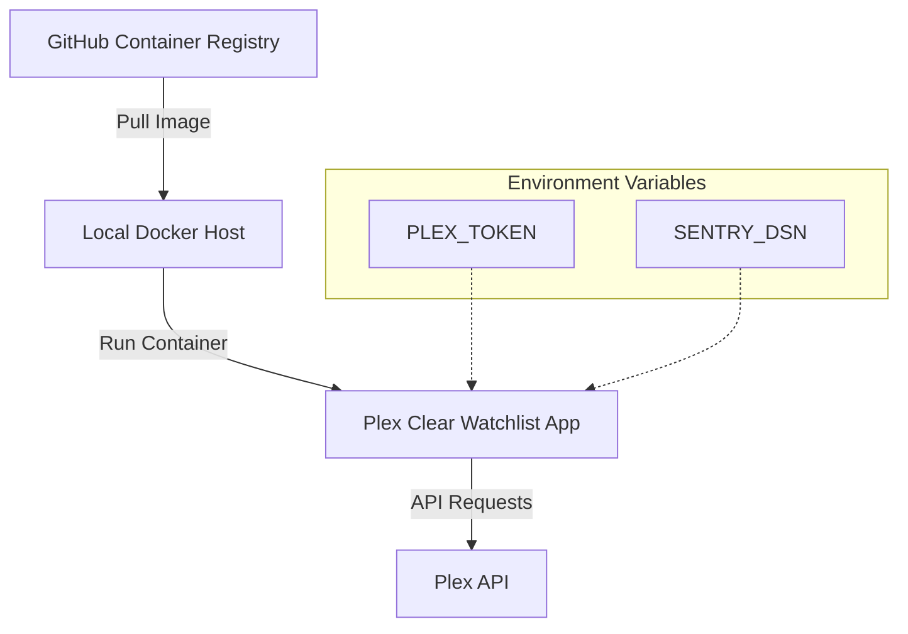
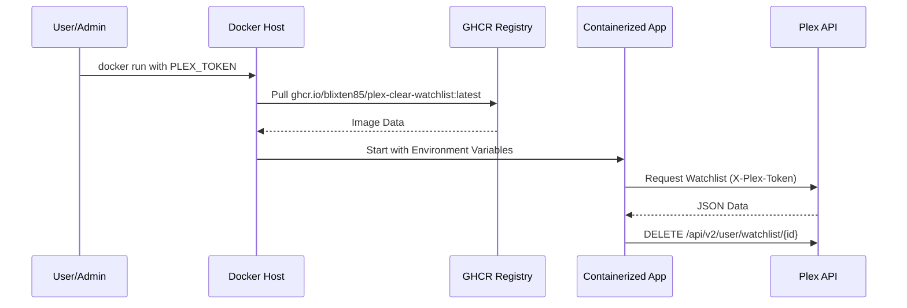

<details>
<summary>Relevant source files</summary>

The following files were used as context for generating this wiki page:

- [README.md](README.md)
- [docker-compose.yml](docker-compose.yml)
- [plex_clear_watchlist.py](plex_clear_watchlist.py)
- [AGENTS.md](AGENTS.md)
- [CLAUDE.md](CLAUDE.md)
- [SECURITY.md](SECURITY.md)
</details>

# Docker Image Registry

The Plex Clear Watchlist project utilizes the GitHub Container Registry (GHCR) as its primary Docker Image Registry. This infrastructure allows for the distribution of the application as a pre-built, one-shot Docker container, facilitating easy deployment across different environments without requiring manual Python environment setup.

The registry hosts the production-ready images, which are versioned and tagged (e.g., `latest`). These images encapsulate the application logic defined in `plex_clear_watchlist.py`, its dependencies, and the Python 3.14 runtime environment.

Sources: [README.md:10-12](README.md#L10-L12), [AGENTS.md:3-8](AGENTS.md#L3-L8), [CLAUDE.md:3-8](CLAUDE.md#L3-L8)

## Registry Architecture and Integration

The integration with the Docker Image Registry is managed through GitHub Actions (implied by the CI badge) and referenced directly in the project's deployment configurations. The image is hosted at `ghcr.io/blixten85/plex-clear-watchlist`.

### Image Distribution Flow

The following diagram illustrates how the Docker image is referenced from the registry to a local environment:



The application is designed to be pulled from the registry and executed with specific environment variables for authentication and error tracking.

Sources: [README.md:10-12](README.md#L10-L12), [docker-compose.yml:3-4](docker-compose.yml#L3-L4), [plex_clear_watchlist.py:10-14](plex_clear_watchlist.py#L10-L14)

## Image Configuration

The Docker image registry contains images configured to run the Python application. The primary configuration for these images is defined in the `docker-compose.yml` and `Dockerfile` (referenced in build context).

### Container Specification

| Feature | Detail | Source |
| :--- | :--- | :--- |
| **Registry URL** | `ghcr.io/blixten85/plex-clear-watchlist` | [README.md:31](README.md#L31) |
| **Image Tag** | `latest` | [docker-compose.yml:3](docker-compose.yml#L3), [SECURITY.md:6](SECURITY.md#L6) |
| **Runtime** | Python 3.14 | [AGENTS.md:5](AGENTS.md#L5), [CLAUDE.md:5](CLAUDE.md#L5) |
| **Base Service** | `plex-clear-watchlist` | [docker-compose.yml:2](docker-compose.yml#L2) |

### Deployment Methods from Registry

Users can interact with the image registry using two primary methods:

1.  **Direct Docker Run:** Pulling and running the image directly from GHCR.

```bash
    docker run --rm -e PLEX_TOKEN=your-token ghcr.io/blixten85/plex-clear-watchlist --dry-run
    ```

Sources: [README.md:31](README.md#L31)

2.  **Docker Compose:** Referencing the image within a `docker-compose.yml` file for structured execution.

```yaml
    services:
      plex-clear-watchlist:
        image: ghcr.io/blixten85/plex-clear-watchlist:latest
        environment:
          - PLEX_TOKEN=${PLEX_TOKEN}
    ```

Sources: [docker-compose.yml:1-7](docker-compose.yml#L1-L7)

## Security and Versioning

The registry maintains the `latest` tag as the officially supported version. Security is prioritized by ensuring that sensitive credentials, specifically the `PLEX_TOKEN`, are never baked into the image stored in the registry but are instead provided at runtime via environment variables.

### Sequence of Authenticated Execution



The sequence demonstrates that while the image logic is public, authentication remains private through runtime injection.

Sources: [SECURITY.md:15-17](SECURITY.md#L15-L17), [plex_clear_watchlist.py:20-24](plex_clear_watchlist.py#L20-L24), [AGENTS.md:19](AGENTS.md#L19)

## Conclusion
The Docker Image Registry at GHCR serves as the central distribution hub for the `plex_clear_watchlist` tool. By providing a pre-configured Python 3.14 environment, it ensures consistent execution of the watchlist clearing logic while maintaining security through environment-based configuration and supporting advanced features like dry-runs and item limits.
