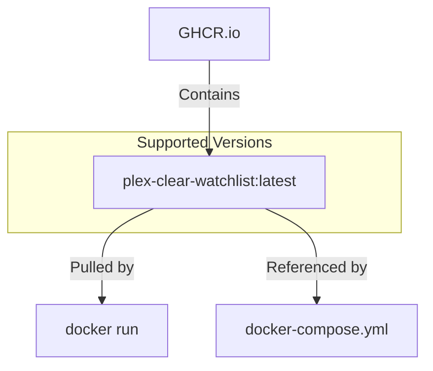
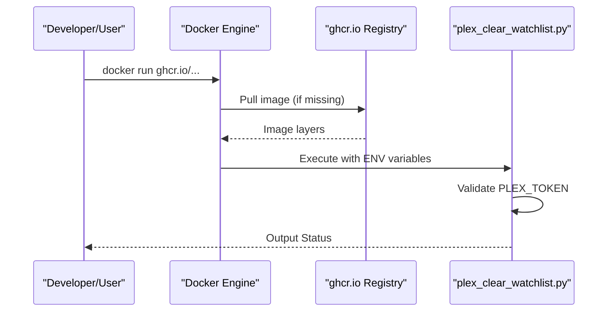

<details>
<summary>Relevant source files</summary>

The following files were used as context for generating this wiki page:

- [README.md](README.md)
- [docker-compose.yml](docker-compose.yml)
- [AGENTS.md](AGENTS.md)
- [CLAUDE.md](CLAUDE.md)
- [SECURITY.md](SECURITY.md)
- [plex_clear_watchlist.py](plex_clear_watchlist.py)
</details>

# Docker Image Registry

The `plex_clear_watchlist` project utilizes the GitHub Container Registry (GHCR) as its primary Docker image registry. This infrastructure hosts the pre-built container images, allowing users to run the application as a one-shot container without needing to build the source code locally. The image is designed to execute a Python 3.14 environment optimized for interacting with the Plex API.

Sources: [README.md:27-29](README.md#L27-L29), [AGENTS.md:5-7](AGENTS.md#L5-L7), [CLAUDE.md:5-7](CLAUDE.md#L5-L7)

## Image Distribution and Identification

The project distributes its official images through the GitHub namespace. The registry path and versioning strategy ensure that users have access to both stable releases and the most current development state.

### Registry Details

| Attribute | Value |
|---|---|
| Registry Host | `ghcr.io` |
| Image Name | `blixten85/plex-clear-watchlist` |
| Primary Tag | `latest` |
| Base Environment | Python 3.14 |

Sources: [README.md:5](README.md#L5), [README.md:27-29](README.md#L27-L29), [docker-compose.yml:3-4](docker-compose.yml#L3-L4), [AGENTS.md:5-7](AGENTS.md#L5-L7)

### Image Lifecycle
CI republishes the `latest` tag (alongside `sha-*` tags) on every push/workflow_dispatch, so `latest` is mutable and always reflects the current image, not a pinned stable release. For production use, prefer a specific SHA or version tag instead of `latest`.



Sources: [SECURITY.md:5-7](SECURITY.md#L5-L7), [docker-compose.yml:4](docker-compose.yml#L4)

## Integration with Deployment Tools

The Docker registry image is integrated directly into the project's orchestration and execution workflows, supporting multiple methods of consumption.

### Docker Compose Configuration
The `docker-compose.yml` file is configured to reference the image from the registry while also providing a `build` context for local development. This allows for seamless switching between using the remote registry and local source modifications.

```yaml
services:
  plex-clear-watchlist:
    image: ghcr.io/blixten85/plex-clear-watchlist:latest
    build: .
    environment:
      - PLEX_TOKEN=${PLEX_TOKEN}
      - SENTRY_DSN=${SENTRY_DSN:-}
```

Sources: [docker-compose.yml:2-7](docker-compose.yml#L2-L7)

### Execution Flow
When a user executes the container, the runtime pulls the image from the registry (if not present locally) and executes the `plex_clear_watchlist.py` script. The following sequence illustrates the interaction between the registry image and the environment.



Sources: [README.md:27-29](README.md#L27-L29), [plex_clear_watchlist.py:9-14](plex_clear_watchlist.py#L9-L14)

## Environment and Security

Images pulled from the registry rely on environment variables provided at runtime. The registry does not store sensitive credentials; instead, it provides the logic and dependencies required to process these variables securely.

*  **Secrets Management**: The registry image is designed to never include hardcoded credentials. It expects `PLEX_TOKEN` and optionally `SENTRY_DSN` to be passed during container instantiation.
*  **Dependency Management**: The image includes all requirements defined in `requirements.txt`, such as `requests` and `sentry-sdk`.

Sources: [SECURITY.md:17-19](SECURITY.md#L17-L19), [AGENTS.md:15-18](AGENTS.md#L15-L18), [requirements.txt:1-2](requirements.txt#L1-L2)

## Summary

The Docker Image Registry (GHCR) serves as the central delivery mechanism for the `plex_clear_watchlist` tool. By providing a pre-configured Python 3.14 environment via `ghcr.io/blixten85/plex-clear-watchlist:latest`, the registry enables a one-shot execution model that simplifies deployment across different environments while maintaining security by relying on externalized configuration.
