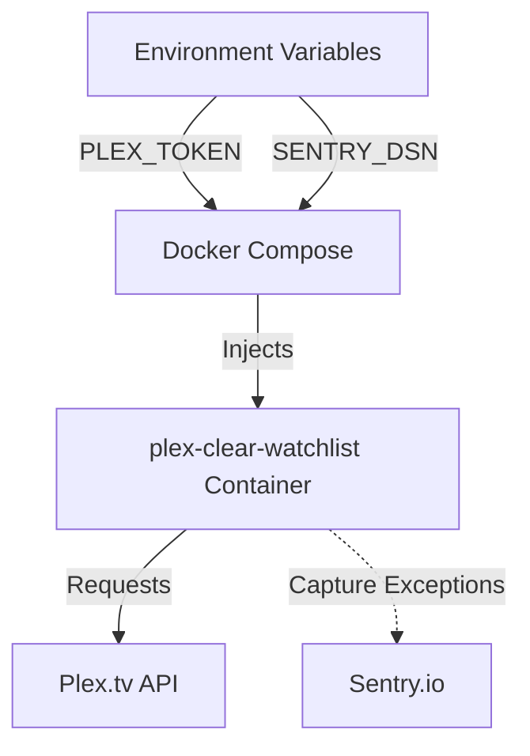
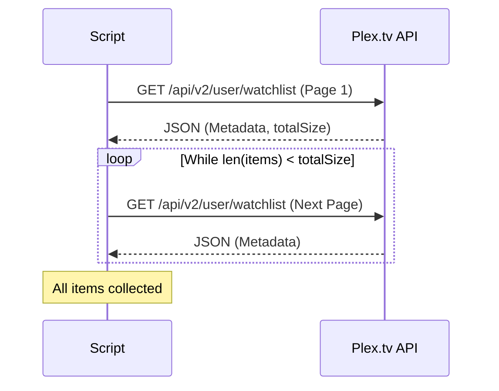

Relevant source files

The following files were used as context for generating this wiki page:

- [requirements.txt](requirements.txt)
- [plex_clear_watchlist.py](plex_clear_watchlist.py)
- [docker-compose.yml](docker-compose.yml)
- [README.md](README.md)
- [AGENTS.md](AGENTS.md)
- [renovate.json](renovate.json)
- [SECURITY.md](SECURITY.md)

# Core Dependencies

The `plex_clear_watchlist` project is a Python-based utility designed to manage and clear items from a user's Plex Watchlist. Its architecture is built around a minimal set of external libraries that facilitate HTTP communication with the Plex API and provide optional error tracking. The project is containerized for consistent execution and utilizes a specific tech stack to ensure reliability and ease of use in automation workflows.

The primary scope of the core dependencies involves handling authentication via environment variables, executing paginated API requests, and managing runtime exceptions. These dependencies are integrated into a single-purpose script meant to run as a one-shot task.

Sources: [plex_clear_watchlist.py:1-20](plex_clear_watchlist.py#L1-L20), [AGENTS.md:5-10](AGENTS.md#L5-L10), [README.md:10-15](README.md#L10-L15)

## Primary Python Libraries

The application relies on two main external Python libraries to perform its primary functions. These are defined in the project's dependency manifest and used throughout the main execution script.

### Requests (HTTP Client)
The `requests` library is the core engine for API interaction. It handles all communication with `plex.tv`, including GET requests for fetching watchlist metadata and DELETE requests for removing items. The implementation uses a standard timeout of 30 seconds for all requests to prevent hanging processes.

Sources: [requirements.txt:1](requirements.txt#L1), [plex_clear_watchlist.py:4, 23, 31, 60](plex_clear_watchlist.py#L4)

### Sentry SDK (Error Tracking)
The `sentry-sdk` is used for optional error monitoring. Initialization is gated on `--dry-run` — it runs whenever the script is NOT in dry-run mode, regardless of whether `SENTRY_DSN` is set (the DSN itself is optional; without one, the SDK simply runs disabled). It captures exceptions during the watchlist retrieval process and specific failures during item deletion.

Sources: [requirements.txt:2](requirements.txt#L2), [plex_clear_watchlist.py:5, 87-94, 110, 142-150](plex_clear_watchlist.py#L5)

| Dependency | Version | Purpose |
| :--- | :--- | :--- |
| `requests` | Latest | Handles HTTP calls to the Plex API v2 |
| `sentry-sdk` | `>=2.0.0` | Provides crash reporting and error tracking |

Sources: [requirements.txt:1-2](requirements.txt#L1-L2), [plex_clear_watchlist.py:1-5](plex_clear_watchlist.py#L1-L5)

## Infrastructure and Runtime Dependencies

The project is designed to run in a controlled environment, primarily through Docker, to ensure the Python runtime and dependencies are correctly configured.

### Python Runtime
The project specifies Python 3.14 as the target tech stack. The script uses standard library modules like `os` for environment variable access, `sys` for error output and exit codes, and `argparse` for command-line interface management.

Sources: [AGENTS.md:7](AGENTS.md#L7), [plex_clear_watchlist.py:2-4](plex_clear_watchlist.py#L2-L4)

### Docker Environment
The `docker-compose.yml` file defines the execution environment, mapping host environment variables to the container. This ensures that sensitive data like the `PLEX_TOKEN` is never hardcoded.

The diagram shows how external configuration flows through Docker into the main application.
Sources: [docker-compose.yml:1-8](docker-compose.yml#L1-L8), [AGENTS.md:18-20](AGENTS.md#L18-L20), [SECURITY.md:17-19](SECURITY.md#L17-L19)

## API Interaction Logic

The core logic depends on the Plex API v2 structure. The application interacts with specific endpoints to manage the watchlist.

### Pagination and Retrieval
The `get_watchlist` function implements a while-loop to handle paginated responses from the Plex API. It relies on the `MediaContainer` JSON structure returned by Plex.

Sources: [plex_clear_watchlist.py:27-56](plex_clear_watchlist.py#L27-L56)

### Endpoint Configuration
The script defines constants for communication with the Plex service:
*  **Base URL:** `https://plex.tv`
*  **Watchlist Endpoint:** `/api/v2/user/watchlist`
*  **Authentication:** Requires `X-Plex-Token` in the HTTP headers.

Sources: [plex_clear_watchlist.py:17-21](plex_clear_watchlist.py#L17-L21)

## Dependency Maintenance

The project uses automated tools to keep core dependencies secure and up to date.
*  **Renovate Bot:** Configured via `renovate.json` using the recommended configuration to monitor and update dependencies.
*  **Dependabot:** Mentioned in security policies as the mechanism for keeping dependencies updated to prevent vulnerabilities.

Sources: [renovate.json:1-6](renovate.json#L1-L6), [SECURITY.md:20](SECURITY.md#L20)

## Conclusion

The core dependencies of `plex_clear_watchlist` are intentionally minimal, focusing on robust HTTP communication via `requests` and optional observability through `sentry-sdk`. By leveraging Docker and strict environment variable management, the project ensures that these dependencies interact securely with the Plex API while maintaining a lightweight and portable footprint.
