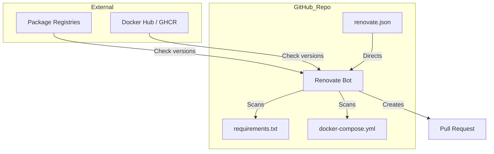
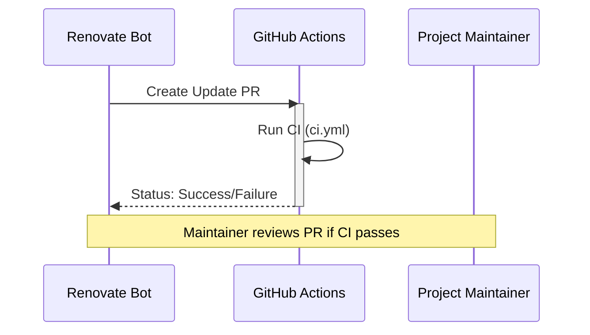

Relevant source files

The following files were used as context for generating this wiki page:

- [renovate.json](renovate.json)
- [SECURITY.md](SECURITY.md)
- [README.md](README.md)
- [requirements.txt](requirements.txt)
- [docker-compose.yml](docker-compose.yml)
- [plex_clear_watchlist.py](plex_clear_watchlist.py)

# Dependency Updates (Renovate)

The `plex_clear_watchlist` project utilizes automated dependency management to ensure that the software remains secure and up-to-date. This is primarily handled through **Renovate**, which monitors external libraries and container images for new versions and automatically proposes updates via Pull Requests.

Maintaining updated dependencies is a core component of the project's security strategy. By automating this process, the project reduces the window of exposure to known vulnerabilities and ensures compatibility with the latest features of the Plex API and supporting Python libraries.

Sources: [renovate.json:1-6](renovate.json#L1-L6), [SECURITY.md:15-17](SECURITY.md#L15-L17), [README.md:1-5](README.md#L1-L5)

## Configuration and Architecture

Renovate is configured using a standard `renovate.json` file located in the root of the repository. It inherits from the recommended configuration suite provided by the Renovate bot community.

### Management Scope
The system monitors several distinct areas of the tech stack:
*  **Python Dependencies**: Managed via `requirements.txt`.
*  **Docker Images**: Specifically the base images defined in the Dockerfile (implicit) and referenced in `docker-compose.yml`.
*  **CI/CD Workflows**: Monitoring GitHub Actions versions as indicated by the CI badge.

Sources: [renovate.json:1-6](renovate.json#L1-L6), [requirements.txt:1-2](requirements.txt#L1-L2), [docker-compose.yml:3-4](docker-compose.yml#L3-L4), [README.md:3](README.md#L3)

### Dependency Update Flow
The following diagram illustrates how Renovate interacts with the project repository to maintain dependencies.

The Renovate bot scans configuration files, compares local versions against remote registries, and generates Pull Requests for maintenance.
Sources: [renovate.json:1-6](renovate.json#L1-L6), [requirements.txt:1-2](requirements.txt#L1-L2), [docker-compose.yml:3-4](docker-compose.yml#L3-L4)

## Security and Best Practices

Automated updates are integrated into the project's security policy. The `SECURITY.md` file explicitly identifies "Keep dependencies updated" as a best practice, specifically mentioning that Dependabot (and Renovate) are active to mitigate risks.

| Tool | Purpose | Primary Target |
| :--- | :--- | :--- |
| **Renovate** | General dependency automation | `requirements.txt`, Docker |
| **Dependabot** | Security-focused updates | Vulnerability patching |

Sources: [SECURITY.md:15-17](SECURITY.md#L15-L17), [renovate.json:1-6](renovate.json#L1-L6)

### Target Components for Updates
The following specific libraries and configurations are subject to automated updates:

*  **requests**: Used for interfacing with the Plex API at `https://plex.tv/api/v2/user/watchlist`.
*  **sentry-sdk**: Currently pinned to version `>=2.0.0` for error tracking and telemetry.
*  **Python Runtime**: The project targets Python 3.14.
*  **Docker Images**: The `plex-clear-watchlist:latest` image and its underlying build components.

Sources: [requirements.txt:1-2](requirements.txt#L1-L2), [plex_clear_watchlist.py:15-17](plex_clear_watchlist.py#L15-L17), [AGENTS.md:5-9](AGENTS.md#L5-L9), [docker-compose.yml:4](docker-compose.yml#L4)

## Integration with CI/CD

Updates proposed by Renovate are automatically processed through the project's Continuous Integration (CI) pipeline. This ensures that any automated dependency change does not break existing functionality, such as the core watchlist deletion logic or the Sentry integration.

Dependency updates trigger the CI workflow to validate the integrity of the main script and its interactions with the Plex API environment.
Sources: [README.md:3](README.md#L3), [AGENTS.md:32-34](AGENTS.md#L32-L34)

## Conclusion
The use of Renovate within `plex_clear_watchlist` ensures that the tool remains reliable and secure by automating the tedious task of version tracking. By combining Renovate's proactive updates with the project's CI requirements, the repository maintains a high standard of code health with minimal manual intervention.

Sources: [renovate.json:1-6](renovate.json#L1-L6), [SECURITY.md:17](SECURITY.md#L17), [AGENTS.md:21-25](AGENTS.md#L21-L25)
