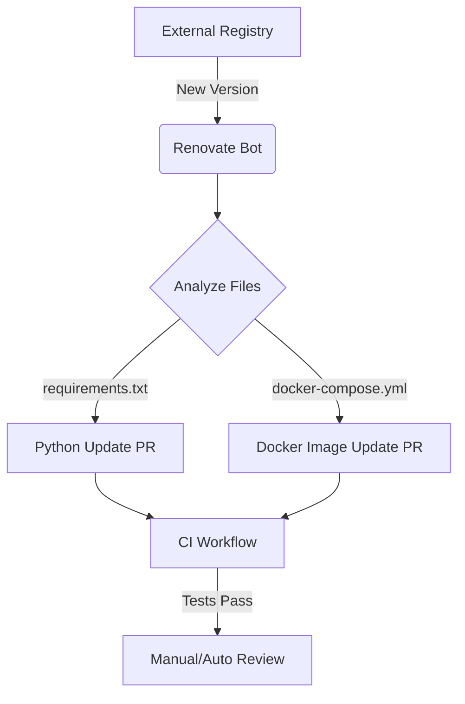
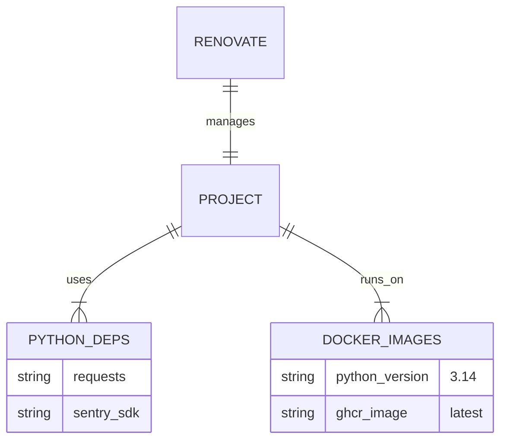

<details>
<summary>Relevant source files</summary>

The following files were used as context for generating this wiki page:

- [renovate.json](renovate.json)
- [SECURITY.md](SECURITY.md)
- [AGENTS.md](AGENTS.md)
- [README.md](README.md)
- [requirements.txt](requirements.txt)
- [docker-compose.yml](docker-compose.yml)
</details>

# Dependency Updates (Renovate)

## Introduction
The Plex Clear Watchlist project utilizes automated dependency management to ensure that the software remains secure and functional. The primary tool used for this purpose is Renovate, which is complemented by GitHub's Dependabot to maintain the integrity of the project's supply chain. This system automatically identifies, suggests, and applies updates to the various libraries and base images used by the application.

Sources: [renovate.json:1-6](renovate.json#L1-L6), [SECURITY.md:18](SECURITY.md#L18)

## Configuration and Implementation
The dependency update logic is driven by a centralized configuration file that adheres to industry standards. The project leverages the recommended Renovate presets to manage updates across its Python and Docker-based infrastructure.

### Renovate Configuration
The project includes a `renovate.json` file that defines the behavior of the update bot. It follows the standard Renovate schema and extends the recommended configuration set to provide a balance between stability and staying current.

```json
{
  "$schema": "https://docs.renovatebot.com/renovate-schema.json",
  "extends": [
    "config:recommended"
  ]
}
```

Sources: [renovate.json:1-6](renovate.json#L1-L6)

### Update Targets
The update system monitors several key files within the repository to detect outdated dependencies:
*  **Python Dependencies**: Monitored via `requirements.txt`, which includes core libraries like `requests` and `sentry-sdk`.
*  **Docker Infrastructure**: The `docker-compose.yml` file and underlying Dockerfile (referenced in `AGENTS.md`) define the runtime environment, including the Python 3.14 base image.

Sources: [requirements.txt:1-2](requirements.txt#L1-L2), [AGENTS.md:7](AGENTS.md#L7), [docker-compose.yml:3](docker-compose.yml#L3)

## Automated Update Workflow
The following diagram illustrates how dependency updates are processed within the project environment.



The update workflow triggers when new versions are released to external registries (like PyPI or GitHub Container Registry), leading to the creation of Pull Requests that are then validated by the project's CI suite.
Sources: [README.md:3](README.md#L3), [AGENTS.md:32](AGENTS.md#L32), [renovate.json:1-6](renovate.json#L1-L6)

## Security and Best Practices
Dependency updates are a core component of the project's security policy. The project mandates keeping dependencies updated and explicitly notes that Dependabot is enabled to provide a secondary layer of security monitoring.

| Feature | Implementation | Description |
| :--- | :--- | :--- |
| **Vulnerability Scanning** | Dependabot | Automatically enabled to scan for known security flaws in dependencies. |
| **Configuration** | `renovate.json` | Extends `config:recommended` for standard update behavior. |
| **CI Integration** | GitHub Actions | All update PRs must pass CI tests before being considered for merging. |

Sources: [SECURITY.md:18](SECURITY.md#L18), [renovate.json:4](renovate.json#L4), [AGENTS.md:38](AGENTS.md#L38), [README.md:3](README.md#L3)

### Dependency Impact Map
The following diagram shows the relationship between the managed dependencies and the project components.



Sources: [AGENTS.md:7](AGENTS.md#L7), [requirements.txt:1-2](requirements.txt#L1-L2), [docker-compose.yml:3-4](docker-compose.yml#L3-L4)

## Summary
By integrating Renovate and Dependabot, the Plex Clear Watchlist project automates the maintenance of its technical stack. This approach reduces manual overhead while ensuring that the Python 3.14 environment and its associated libraries (such as `requests` and `sentry-sdk`) remain updated against the latest security patches and feature improvements.
