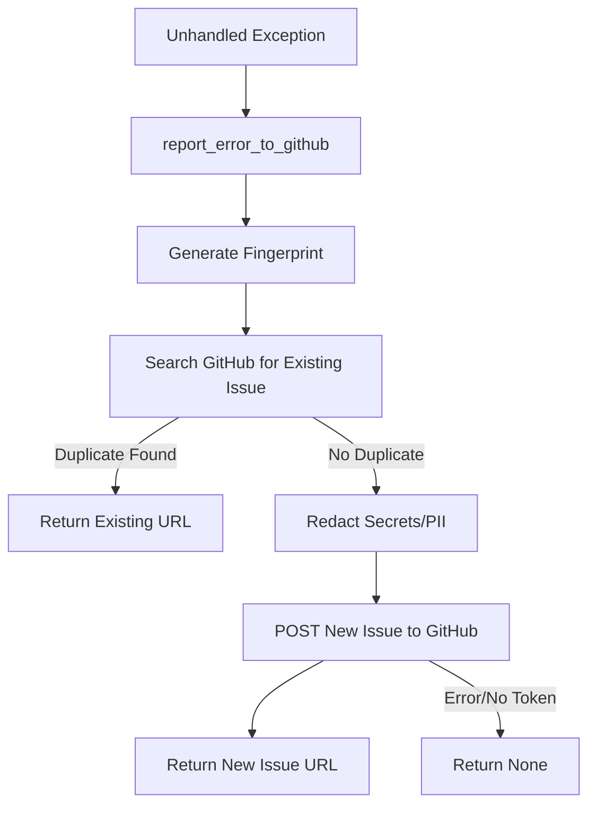

Relevant source files

The following files were used as context for generating this wiki page:

- [src/github_report.py](src/github_report.py)
- [src/run.py](src/run.py)
- [CLAUDE.md](CLAUDE.md)
- [README.md](README.md)
- [tests/test_pr_changes.sh](tests/test_pr_changes.sh)

# GitHub Issues Integration

The GitHub Issues Integration in the `docker-idempotent-update` project serves as an automated error reporting mechanism. When unhandled exceptions occur during the daily maintenance cycle (image updates or backups), the system can automatically open a GitHub issue. This ensures that failures are visible to maintainers without requiring manual log monitoring.

The integration is designed with a "best-effort" approach, prioritizing system stability; reporting failures will not crash the primary application. It includes built-in security features to redact sensitive information such as API tokens, passwords, and email addresses before data is transmitted to GitHub's public API.
Sources: [CLAUDE.md:21-26](CLAUDE.md#L21-L26), [src/github_report.py:1-12](src/github_report.py#L1-L12), [src/run.py:75-81](src/run.py#L75-L81)

## Automated Error Reporting

The core of the integration is found in `src/github_report.py`. When the main execution loop in `src/run.py` encounters an unhandled exception, it invokes `report_error_to_github`. This function utilizes the GitHub REST API to search for existing issues and create new ones if necessary.

### Reporting Workflow

The reporting process follows a specific sequence to prevent duplicate issues and ensure data privacy:

1.  **Fingerprinting**: A unique hash is generated based on the exception type and the location (file/line) where it was raised.
2.  **Deduplication**: The system searches for existing open issues containing this fingerprint in the title. If found, it skips creation to avoid spam.
3.  **Redaction**: All data, including the traceback and provided context, is passed through a sanitization filter.
4.  **Issue Creation**: A POST request is sent to the GitHub repository's issues endpoint with specific labels and a `@claude` tag to trigger downstream automation.

The diagram shows the logic flow from exception detection to GitHub issue creation, including deduplication and redaction steps.
Sources: [src/github_report.py:48-115](src/github_report.py#L48-L115), [src/run.py:75-81](src/run.py#L75-L81)

## Data Sanitization and Security

Security is a critical component of the integration. Because error reports may contain environment variables or path information, the `_redact` function applies several regex-based filters before sending data.

### Redaction Rules

| Category | Description | Implementation Detail |
| :--- | :--- | :--- |
| **Secrets** | Environment variables containing KEY, TOKEN, SECRET, etc. | Value-based replacement with `[REDACTED]` |
| **API Keys** | Common patterns like `sk-...`, `ghp_...`, or `Bearer ...` | Pattern-based regex replacement |
| **Email** | Any string matching an email format | Replaced with `[EMAIL REDACTED]` |
| **Paths** | User home directories (e.g., `/home/username`) | Generalized to `/home/[user]` |

Sources: [src/github_report.py:14-46](src/github_report.py#L14-L46), [CLAUDE.md:21-26](CLAUDE.md#L21-L26)

## Configuration and Implementation

The integration requires a GitHub Personal Access Token (PAT) with "Issues: Write" permissions.

### Configuration Parameters

| Variable | Source | Description |
| :--- | :--- | :--- |
| `GITHUB_ERROR_REPORT_TOKEN` | Environment | Required token for API authentication. If unset, reporting is disabled. |
| `repo` | Argument | The target repository (e.g., `blixten85/docker-idempotent-update`). |
| `labels` | Hardcoded | Issues are created with the labels `["bug", "auto-reported"]`. |

Sources: [src/github_report.py:75-85](src/github_report.py#L75-L85), [README.md:144-144](README.md#L144), [src/run.py:78-80](src/run.py#L78-L80)

### Technical Constraints
- **Standard Library Only**: Per project conventions, the integration uses `urllib` instead of third-party libraries like `requests`.
- **Timeouts**: API requests are limited to a 15-second timeout to prevent the application from hanging.
- **Title Length**: Titles are truncated to 250 characters to comply with GitHub API limits.

Sources: [src/github_report.py:10-10](src/github_report.py#L10), [src/github_report.py:65-65](src/github_report.py#L65), [src/github_report.py:105-105](src/github_report.py#L105)

## Issue Templates

While automated reporting handles runtime crashes, the project also provides structured YAML templates for manual issue reporting. These are validated via CI scripts to ensure consistency.

### Template Types
- **Bug Report**: Requires description, steps to reproduce, and expected behavior.
- **Feature Request**: Requires problem description and proposed solution.
- **Config**: Disables blank issues to encourage the use of defined forms.

Sources: [tests/test_pr_changes.sh:65-115](tests/test_pr_changes.sh#L65-L115)

## Conclusion

The GitHub Issues Integration provides a robust, secure, and automated feedback loop for the project. By combining proactive deduplication, strict data redaction, and standardized issue templates, it ensures that developers are notified of critical failures while maintaining the security and cleanliness of the repository's issue tracker.
Sources: [src/github_report.py:1-12](src/github_report.py#L1-L12), [CLAUDE.md:21-26](CLAUDE.md#L21-L26)
