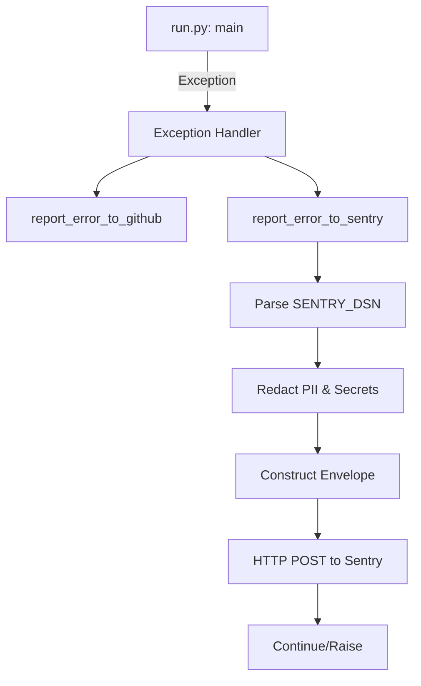
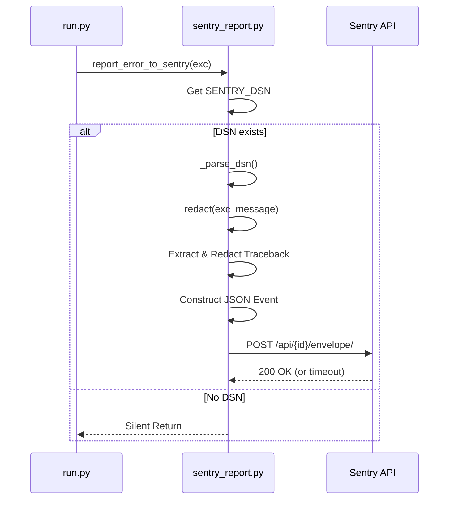

<details>
<summary>Relevant source files</summary>

The following files were used as context for generating this wiki page:

- [src/sentry_report.py](src/sentry_report.py)
- [src/run.py](src/run.py)
- [src/github_report.py](src/github_report.py)
- [src/config.py](src/config.py)
- [CLAUDE.md](CLAUDE.md)
- [README.md](README.md)
</details>

# Sentry Integration

## Introduction
The Sentry integration provides a lightweight, dependency-free error reporting mechanism for the `docker-idempotent-update` project. Adhering to the project's strict "standard library only" convention, it allows the system to capture and transmit unhandled exceptions to a Sentry instance without requiring the official `sentry-sdk` package. 

Its primary purpose is to provide "best-effort" visibility into runtime crashes during the daily maintenance cycle. When an unhandled exception occurs in the main execution loop, the system redacts sensitive information and posts the error details directly to Sentry's envelope API.

Sources: [src/sentry_report.py:1-12](src/sentry_report.py#L1-L12), [CLAUDE.md:23-32](CLAUDE.md#L23-L32), [README.md:120-121](README.md#L120-L121)

## Architecture and Data Flow

The integration is built around a single module, `src/sentry_report.py`, which utilizes Python's `urllib` to communicate with Sentry. The reporting process is triggered by the main execution entry point when a fatal error occurs.

### Error Handling Flow
When `src/run.py` encounters an unhandled exception, it invokes the Sentry reporting logic alongside the GitHub issue reporting logic.



The diagram shows the sequence from an exception occurring in the main loop to the final HTTP post to the Sentry API.
Sources: [src/run.py:72-80](src/run.py#L72-L80), [src/sentry_report.py:70-128](src/sentry_report.py#L70-L128)

### Redaction and Security
Before any data is sent to Sentry, the system applies a multi-layered redaction process to ensure that no credentials, emails, or specific local paths are leaked. This logic is shared conceptually with the GitHub reporting module.

| Pattern Type | Description |
| :--- | :--- |
| Environment Variables | Values of env vars containing `KEY`, `TOKEN`, `SECRET`, `PASSWORD`, or `PASS`. |
| API Keys | Regex patterns for OpenAI (`sk-`), GitHub (`ghp_`, `gho_`), AWS (`AKIA`), and Bearer tokens. |
| Emails | Standard email address regex patterns. |
| Local Paths | Generalization of `/home/[user]` paths to hide specific usernames. |

Sources: [src/sentry_report.py:27-44](src/sentry_report.py#L27-L44), [src/github_report.py:34-47](src/github_report.py#L34-L47)

## Components and Logic

### Configuration
The integration is controlled primarily through environment variables. If the required DSN is not provided, the integration acts as a no-op.

| Environment Variable | Description |
| :--- | :--- |
| `SENTRY_DSN` | The Sentry project Data Source Name. Required for reporting. |
| `SENTRY_ENVIRONMENT` | The environment tag (defaults to `production`). |

Sources: [src/sentry_report.py:73-74](src/sentry_report.py#L73-L74), [src/sentry_report.py:100](src/sentry_report.py#L100), [README.md:121](README.md#L121)

### API Implementation
The system implements a minimal version of the Sentry Envelope protocol. It manually constructs the multipart JSON payload required by the `/api/<project_id>/envelope/` endpoint.

```python
# Sentry envelope format: header line + item header line + item payload
event_json = json.dumps(event)
envelope_header = json.dumps({"event_id": event["event_id"]})
item_header = json.dumps({"type": "event", "content_type": "application/json"})
envelope_body = f"{envelope_header}\n{item_header}\n{event_json}\n"
```

Sources: [src/sentry_report.py:113-117](src/sentry_report.py#L113-L117)

### Sequence of Operations
The following sequence diagram illustrates the internal logic of `report_error_to_sentry`:



The sequence shows how the reporter parses the DSN, redacts the traceback, and performs the POST request.
Sources: [src/sentry_report.py:70-128](src/sentry_report.py#L70-L128), [src/run.py:79](src/run.py#L79)

## Implementation Details

### DSN Parsing
The `_parse_dsn` function decomposes the Sentry DSN into the public key and the specific envelope API URL.

```python
def _parse_dsn(dsn: str) -> tuple[str, str] | None:
    parsed = urllib.parse.urlparse(dsn)
    if not parsed.hostname or not parsed.username or not parsed.path:
        return None
    project_id = parsed.path.strip("/")
    envelope_url = f"{parsed.scheme}://{host}/api/{project_id}/envelope/"
    return envelope_url, parsed.username
```

Sources: [src/sentry_report.py:47-60](src/sentry_report.py#L47-L60)

### Failure Tolerance
The reporting mechanism is designed to be "best-effort." It uses a global `try...except` block at the end of the reporting function to catch any `urllib` errors, network timeouts, or OS errors. This ensures that a failure in the error reporting system itself never crashes the main maintenance job.

Sources: [src/sentry_report.py:125-128](src/sentry_report.py#L125-L128), [CLAUDE.md:32](CLAUDE.md#L32)

## Summary
The Sentry Integration provides a secure, lightweight way to monitor the `docker-idempotent-update` tool. By implementing the Sentry protocol using only the Python standard library and including aggressive data redaction, it balances the need for operational visibility with the project's goals of minimal dependencies and security.
