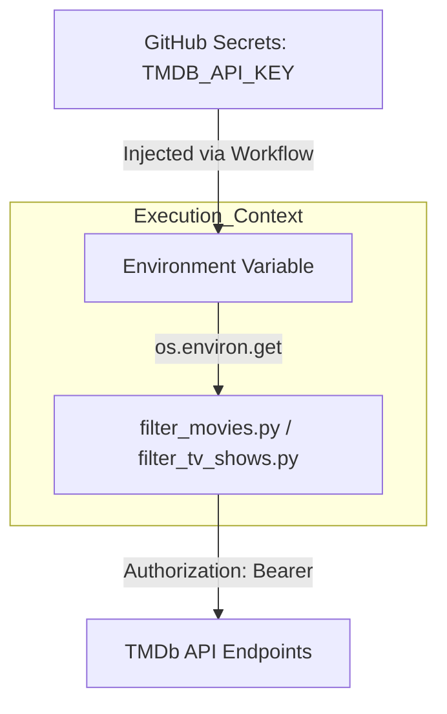
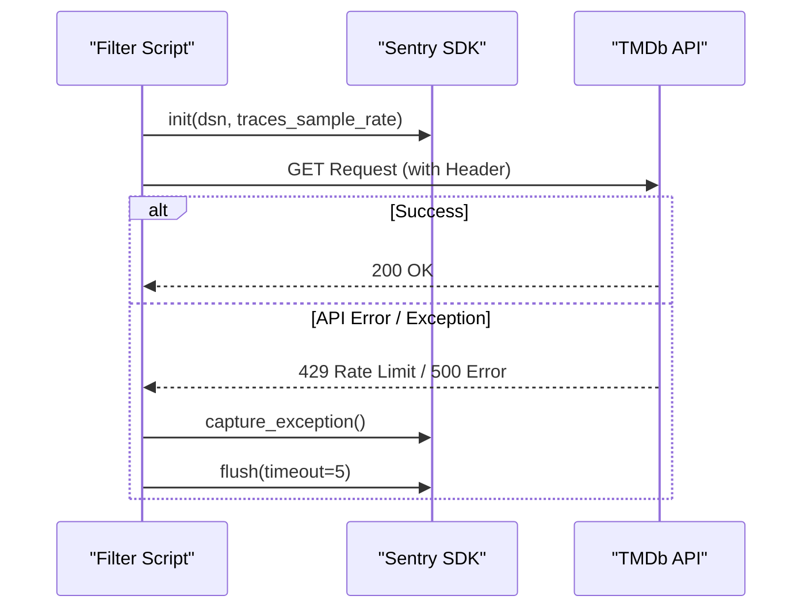

Relevant source files

The following files were used as context for generating this wiki page:

- [SECURITY.md](SECURITY.md)
- [AGENTS.md](AGENTS.md)
- [README.md](README.md)
- [CLAUDE.md](CLAUDE.md)
- [filter_movies.py](filter_movies.py)
- [filter_tv_shows.py](filter_tv_shows.py)
- [renovate.json](renovate.json)

# Security & Vulnerability Policy

The Security & Vulnerability Policy defines the standards and procedures for maintaining the integrity of the `filtered-movies` project. Its primary purpose is to ensure that vulnerabilities are identified, reported, and remediated without exposing the project or its users to unnecessary risk. The policy covers core scripts like `filter_movies.py`, data files, and the automated GitHub Actions workflows that drive the data refresh cycle.

Sources: [SECURITY.md:33-38](SECURITY.md#L33-L38), [AGENTS.md:5-10](AGENTS.md#L5-L10)

## Vulnerability Reporting & Remediation

The project mandates private reporting of security vulnerabilities to prevent public exploitation before a fix is available. Users and researchers are instructed to avoid creating public issues for security-related concerns.

### Reporting Channels
Vulnerabilities should be reported via:
- **Email:** dev@denied.se
- **GitHub:** The "Report a vulnerability" button located under the repository's Security tab.

Sources: [SECURITY.md:5-10](SECURITY.md#L5-L10)

### Response Timeline
The maintenance team follows a structured timeline for addressing reported issues:

| Stage | Timeframe |
| :--- | :--- |
| Initial acknowledgment | Within 48 hours |
| Assessment | Within 5 business days |
| Fix implementation | Based on severity |
| Public disclosure | After fix is released |

Sources: [SECURITY.md:18-28](SECURITY.md#L18-L28)

## Sensitive Data Management

A core security pillar of the project is the strict handling of credentials, specifically the TMDb API Read Access Token. Hardcoding secrets is strictly forbidden, and the project utilizes environmental injection for all sensitive configuration.

### API Key Lifecycle
The project relies on TMDb API Read Access Tokens (prefixed with `eyJ...`). These tokens are managed as follows:
- **Storage:** Saved as GitHub Secrets (e.g., `TMDB_API_KEY`).
- **Injection:** Injected into execution environments (GitHub Actions or local `.env` files) via environment variables.
- **Prevention:** `.gitignore` includes local `.env` files to prevent accidental commits.

Sources: [SECURITY.md:46-51](SECURITY.md#L46-L51), [README.md:126-134](README.md#L126-L134), [AGENTS.md:23-24](AGENTS.md#L23-L24)

### Data Flow for Secret Injection
The following diagram illustrates how secrets are securely passed from the repository configuration to the execution environment without being exposed in the source code.

Sources: [filter_movies.py:34-38](filter_movies.py#L34-L38), [filter_tv_shows.py:35-39](filter_tv_shows.py#L35-L39), [SECURITY.md:46-51](SECURITY.md#L46-L51)

## Proactive Security Best Practices

The project employs several automated and manual checks to maintain a secure posture.

### Dependency & Workflow Management
- **Automated Updates:** `renovate.json` and Dependabot are used to keep third-party dependencies updated, reducing the surface area for known vulnerabilities (CVEs).
- **Workflow Integrity:** GitHub Actions workflows are reviewed for command injection risks.
- **CI/CD Restrictions:** AI agents and contributors are forbidden from modifying secrets, disabling workflows, or pushing directly to protected branches.

Sources: [SECURITY.md:40-44](SECURITY.md#L40-L44), [renovate.json:1-6](renovate.json#L1-L6), [AGENTS.md:32-38](AGENTS.md#L32-L38)

### Security Scope
The policy clearly defines what is within the maintainers' responsibility:

| In Scope | Out of Scope |
| :--- | :--- |
| `filter_movies.py` & `filter_tv_shows.py` | The TMDb API itself |
| `filtered_movies_radarr.json` data | Third-party dependencies (managed by maintainers) |
| GitHub Actions Workflows | Upstream network provider data |
| Repository Configuration | External streaming service APIs |

Sources: [SECURITY.md:31-44](SECURITY.md#L31-L44)

## Error Reporting & Monitoring
The project integrates Sentry for real-time error tracking during the execution of filtering scripts. This ensures that runtime failures or unexpected API responses are captured and reviewed — Sentry provides error tracking here, not vulnerability scanning.

Sources: [filter_movies.py:27-30, 157-166](filter_movies.py#L27-L30), [filter_tv_shows.py:28-31, 159-168](filter_tv_shows.py#L28-L31)

## Conclusion
The Security & Vulnerability Policy ensures that the `filtered-movies` project maintains a high standard of data integrity and credential safety. By combining private reporting channels, strict environmental variable usage, and automated dependency management, the project mitigates the risks associated with public API consumption and automated data processing.

Sources: [SECURITY.md:58-61](SECURITY.md#L58-L61), [AGENTS.md:40-45](AGENTS.md#L40-L45)
