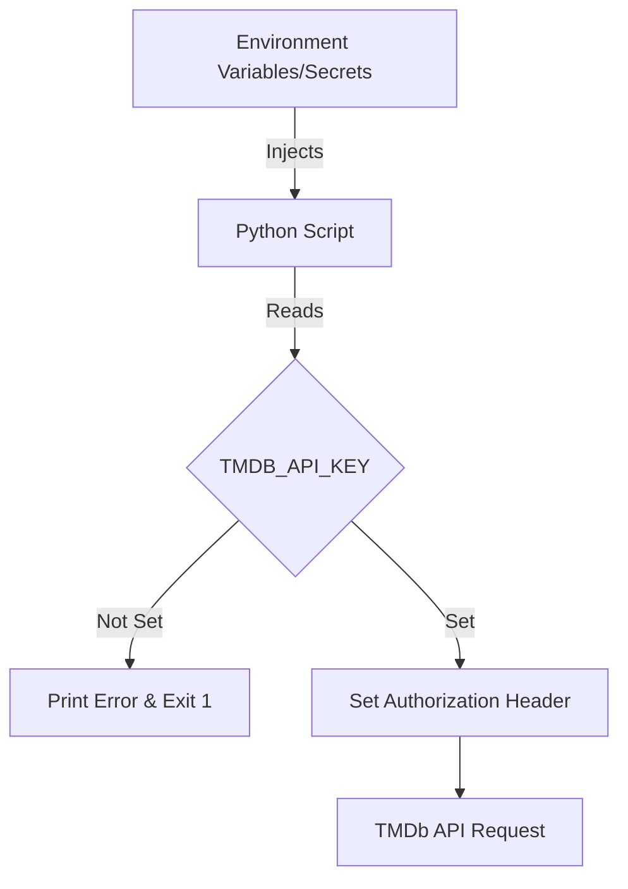

<details>
<summary>Relevant source files</summary>

The following files were used as context for generating this wiki page:

- [SECURITY.md](SECURITY.md)
- [AGENTS.md](AGENTS.md)
- [CLAUDE.md](CLAUDE.md)
- [README.md](README.md)
- [filter_movies.py](filter_movies.py)
- [filter_tv_shows.py](filter_tv_shows.py)
</details>

# Secrets Management Guidelines

## Introduction

The Filtered Movies project relies on secure handling of authentication credentials to interact with The Movie Database (TMDb) API. These guidelines outline the mandatory practices for managing, storing, and utilizing sensitive information such as API keys and tokens to prevent unauthorized access and data leaks. The scope covers local development environments, GitHub Actions workflows, and automated scripts.

Proper management ensures that high-value movie and TV show data lists are refreshed daily without compromising the security of the developer's TMDb account or the integrity of the repository.

Sources: [SECURITY.md:31-34](SECURITY.md#L31-L34), [README.md:120-123](README.md#L120-L123), [AGENTS.md:3-6](AGENTS.md#L3-L6)

## Core Principles

The project mandates a "never hardcode" policy for all credentials. This applies to API keys, tokens, and any form of sensitive credentials.

*  **Prohibition of Committing Secrets:** Contributors must never commit secrets directly to the repository.
*  **Environment-Based Configuration:** All secrets are injected into the application via environment variables.
*  **Local Protection:** Local sensitive data should be stored in `.env` files, which are explicitly listed in `.gitignore`.

Sources: [SECURITY.md:50-54](SECURITY.md#L50-L54), [AGENTS.md:23-23](AGENTS.md#L23), [CLAUDE.md:22-22](CLAUDE.md#L22)

### Credential Types

The project specifically differentiates between TMDb credential types to ensure the correct level of access is used by the scripts.

| Credential Type | Description | Usage Instruction |
| :--- | :--- | :--- |
| **API Key** | A short alphanumeric string | **DO NOT USE** for this project. |
| **API Read Access Token** | A long string starting with `eyJ...` | **MANDATORY** for scripts and CI. |

Sources: [README.md:104-108](README.md#L104-L108), [filter_movies.py:12-14](filter_movies.py#L12-L14), [filter_tv_shows.py:12-14](filter_tv_shows.py#L12-L14)

## Technical Implementation

Secrets are handled by the Python execution environment through standard system calls to environment variables.

### Environment Variable Injection

The scripts `filter_movies.py` and `filter_tv_shows.py` retrieve the `TMDB_API_KEY` (which represents the Read Access Token) from the OS environment. If the variable is missing, the script is designed to terminate with an error code.



The diagram shows the flow of secrets from environment storage into the script logic to authorize external API calls.
Sources: [filter_movies.py:31-34](filter_movies.py#L31-L34), [filter_tv_shows.py:31-34](filter_tv_shows.py#L31-L34)

### Request Authorization

The secrets are utilized within the HTTP request headers using the Bearer token scheme.

```python
# Implementation in filter_movies.py and filter_tv_shows.py
API_KEY = os.environ.get("TMDB_API_KEY")
HEADERS = {
    "accept": "application/json",
    "Authorization": f"Bearer {API_KEY}"
}
```

Sources: [filter_movies.py:38-42](filter_movies.py#L38-L42), [filter_tv_shows.py:43-47](filter_tv_shows.py#L43-L47)

## Secrets in CI/CD (GitHub Actions)

For automated daily updates, secrets are managed through GitHub's native security infrastructure.

*  **GitHub Secrets:** The `TMDB_API_KEY` is stored as a repository secret.
*  **Workflow Injection:** GitHub Actions workflows inject these secrets into the runtime environment for the `update-movies.yml` and `update-tv-shows.yml` runs.
*  **Modification Restrictions:** Modification of repository secrets or GitHub organization settings is strictly forbidden for AI agents and general contributors.

Sources: [SECURITY.md:57-61](SECURITY.md#L57-L61), [README.md:120-123](README.md#L120-L123), [AGENTS.md:32-32](AGENTS.md#L32)

## Incident Response and Vulnerability Reporting

If a secret is accidentally exposed or a vulnerability is found, specific protocols must be followed.

### Exposure Recovery Steps
1.  **Immediate Revocation:** Revoke the token at [TMDb API Settings](https://www.themoviedb.org/settings/api).
2.  **Repository Cleaning:** Follow GitHub guides for removing sensitive data from the repository history.
3.  **Notification:** Contact the maintainer immediately.

Sources: [SECURITY.md:63-68](SECURITY.md#L63-L68)

### Reporting Procedure
Security vulnerabilities should be reported privately rather than via public issues.

| Method | Contact Detail |
| :--- | :--- |
| **Email** | dev@denied.se |
| **GitHub** | "Report a vulnerability" button under Security tab |

Sources: [SECURITY.md:5-13](SECURITY.md#L5-L13)

## Summary

Secrets management in the Filtered Movies project centers on the secure handling of the TMDb API Read Access Token. By utilizing environment variables, repository secrets, and strict gitignore policies, the project maintains a secure posture for automated data fetching. Adherence to these guidelines is mandatory for all contributors to prevent credential leakage and ensure continuous service operation.
