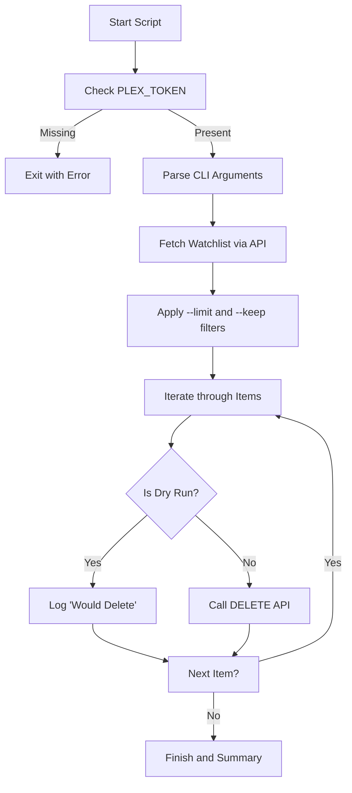
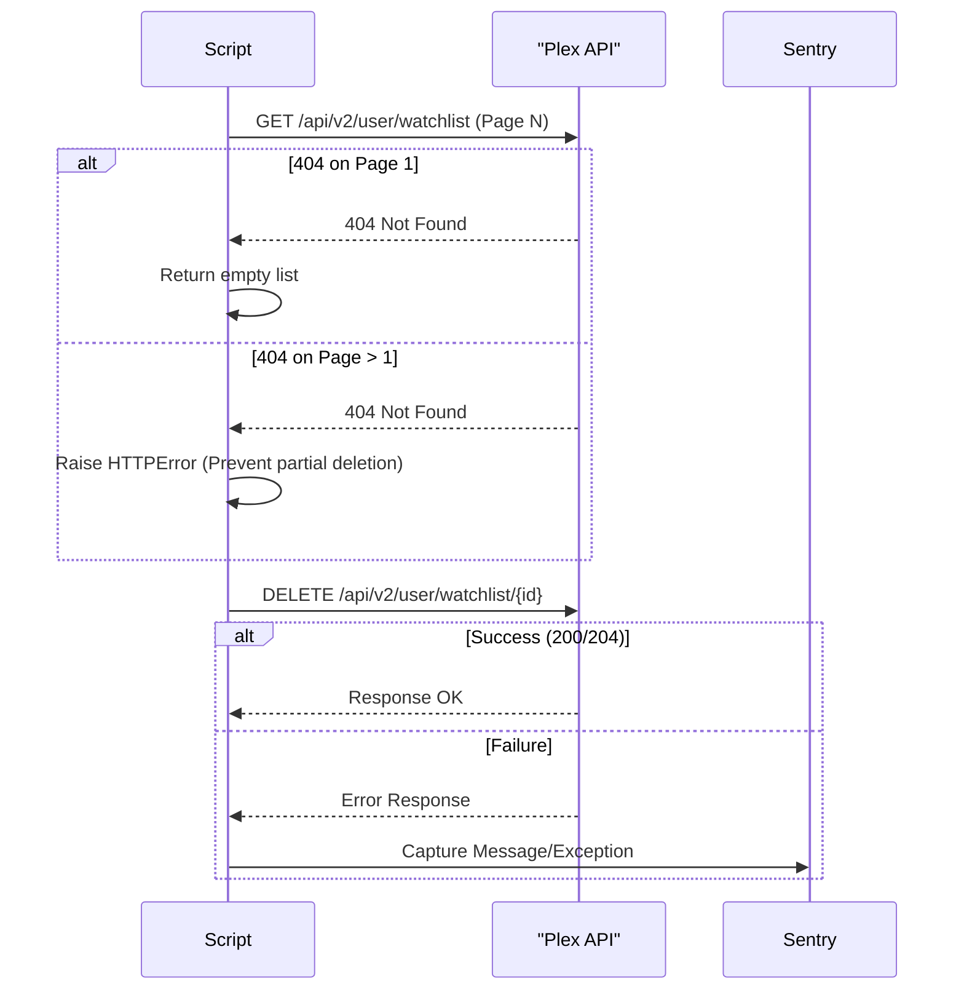

<details>
<summary>Relevant source files</summary>

The following files were used as context for generating this wiki page:

- [AGENTS.md](AGENTS.md)
- [CLAUDE.md](CLAUDE.md)
- [README.md](README.md)
- [plex_clear_watchlist.py](plex_clear_watchlist.py)
- [docker-compose.yml](docker-compose.yml)
- [SECURITY.md](SECURITY.md)
- [requirements.txt](requirements.txt)
</details>

# AI Agent & Developer Guide

The **plex_clear_watchlist** project is a single-purpose utility designed to programmatically delete items from a user's Plex Watchlist via the Plex API. It is built as a one-shot script intended for use within a Docker container or as a standalone Python application.

Sources: [AGENTS.md:3](AGENTS.md#L3), [README.md:9](README.md#L9)

This guide provides developers and AI agents with the necessary technical context to maintain, extend, or operate the codebase safely. It covers the core logic, environment configuration, and strict development conventions required to ensure stability and security.

Sources: [AGENTS.md:15-38](AGENTS.md#L15-L38), [CLAUDE.md:14-25](CLAUDE.md#L14-L25)

## System Architecture

The application is structured as a procedural Python script that interacts with the Plex TV API (v2). It utilizes a simple request-response model to fetch watchlist metadata and issue deletion commands.

### Logic Flow

The following diagram illustrates the execution flow of the main script:



The script handles pagination when fetching items to ensure the entire watchlist is retrieved before processing filters.

Sources: [plex_clear_watchlist.py:9-115](plex_clear_watchlist.py#L9-L115)

### Core Components and Functions

The script's functionality is encapsulated in several key functions:

| Function | Description |
| :--- | :--- |
| `get_watchlist()` | Retrieves all items from the Plex Watchlist using paginated GET requests. Raises `HTTPError` if a 404 occurs mid-pagination to prevent partial deletions. |
| `delete_from_watchlist()` | Performs a DELETE request for a specific `ratingKey`. |
| `get_item_title()` | Extracts the title or GUID from a watchlist item dictionary for logging purposes. |
| `main()` | Orchestrates argument parsing, Sentry initialization, filtering logic, and the deletion loop. |

Sources: [plex_clear_watchlist.py:24-115](plex_clear_watchlist.py#L24-L115)

## Configuration and Environment

The application relies on environment variables for authentication and error tracking.

| Variable | Required | Description |
| :--- | :--- | :--- |
| `PLEX_TOKEN` | Yes | Authentication token retrieved from Plex settings. Used in the `X-Plex-Token` header. |
| `SENTRY_DSN` | No | Data Source Name for Sentry error tracking. Script runs without tracking if unset. |

Sources: [plex_clear_watchlist.py:9-19](plex_clear_watchlist.py#L9-L19), [README.md:13-16](README.md#L13-L16), [docker-compose.yml:6-8](docker-compose.yml#L6-L8)

### API Integration

The script communicates with `https://plex.tv/api/v2/user/watchlist`.
*  **Headers**: Includes `X-Plex-Token` and `Accept: application/json`.
*  **Pagination**: Uses `page`, `pageSize` (default 100), and `sort` (addedAt:asc) parameters.
*  **Timeout**: Requests are configured with a 30-second timeout.

Sources: [plex_clear_watchlist.py:17-22](plex_clear_watchlist.py#L17-L22), [plex_clear_watchlist.py:32-34](plex_clear_watchlist.py#L32-L34)

## Development Guidelines

### CLI Usage and Options

Developers can control the script's behavior using the following flags:

```bash
python3 plex_clear_watchlist.py --dry-run --limit 10 --keep 5
```

| Flag | Type | Description |
| :--- | :--- | :--- |
| `--dry-run` | Boolean | Prevents actual deletions; logs what would happen. |
| `--limit N` | Integer | Limits deletions to the first N items fetched. |
| `--keep N` | Integer | Preserves the N most recently added items in the watchlist. |

Sources: [README.md:36-40](README.md#L36-L40), [plex_clear_watchlist.py:75-80](plex_clear_watchlist.py#L75-L80)

### AI Agent Constraints and Conventions

Agents working on this repository must adhere to the following rules:

*  **Security**: Never hardcode `PLEX_TOKEN`. Use environment variables only. Secrets must never be committed.
*  **Safety**: The `--dry-run` flag must remain safe and side-effect free.
*  **Simplicity**: Maintain the script as a single-purpose utility.
*  **Workflow**: 
   *  Create branches for changes.
   *  Forbidden to push directly to `main`/`master` or merge PRs.
   *  Never force push.
   *  Ensure all tests pass and PRs remain focused.

Sources: [AGENTS.md:25-38](AGENTS.md#L25-L38), [SECURITY.md:18-20](SECURITY.md#L18-L20), [CLAUDE.md:22-25](CLAUDE.md#L22-L25)

### Maintenance and Dependencies

*  **Runtime**: Python 3.14.
*  **Dependencies**: Managed via `requirements.txt` (includes `requests` and `sentry-sdk`).
*  **Updates**: Automated via Renovate (using `config:recommended`).
*  **Security Reporting**: Use GitHub's private reporting feature for vulnerabilities; do not open public issues.

Sources: [AGENTS.md:8](AGENTS.md#L8), [requirements.txt:1-2](requirements.txt#L1-L2), [renovate.json:2-5](renovate.json#L2-L5), [SECURITY.md:8-12](SECURITY.md#L8-L12)

## Error Handling

The system employs a specific strategy for API reliability:



Sources: [plex_clear_watchlist.py:35-49](plex_clear_watchlist.py#L35-L49), [plex_clear_watchlist.py:102-111](plex_clear_watchlist.py#L102-L111)

## Conclusion

The **plex_clear_watchlist** utility provides a robust mechanism for managing Plex metadata. By strictly following the environment-driven configuration and safety flags, developers can ensure that automated cleanup tasks do not result in accidental data loss or security credential exposure.
