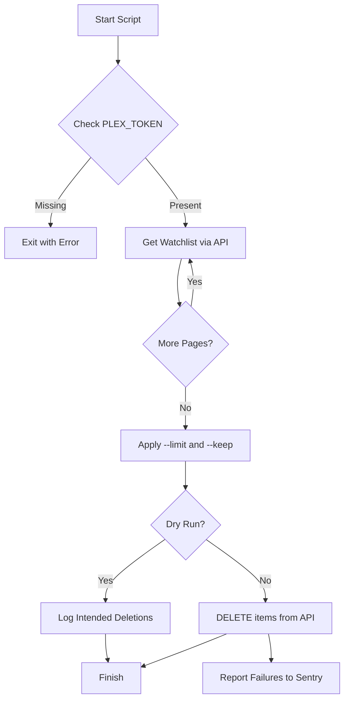
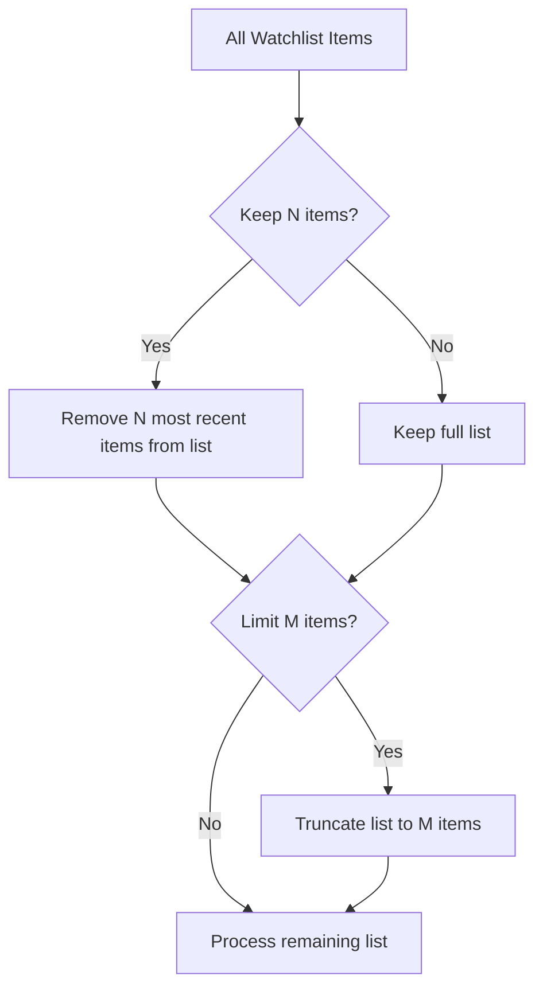

Relevant source files

The following files were used as context for generating this wiki page:

- [README.md](README.md)
- [AGENTS.md](AGENTS.md)
- [CLAUDE.md](CLAUDE.md)
- [SECURITY.md](SECURITY.md)
- [plex_clear_watchlist.py](plex_clear_watchlist.py)
- [docker-compose.yml](docker-compose.yml)

# Contributing Guidelines

## Introduction
The `plex_clear_watchlist` project is a specialized utility designed to manage and delete items from a user's Plex Watchlist via the Plex API. It is built as a single-purpose Python script intended to run in a one-shot Docker container. Contributing to this project requires adherence to specific workflow constraints and technical standards to maintain the simplicity and reliability of the tool.

Sources: [README.md:1-10](README.md#L1-L10), [AGENTS.md:1-5](AGENTS.md#L1-L5), [CLAUDE.md:1-5](CLAUDE.md#L1-L5)

## Development Workflow and Constraints
The project enforces a strict set of permissions and prohibitions for contributors (including AI agents) to ensure code quality and repository integrity.

### Allowed Actions
*  Creating new feature or bugfix branches.
*  Modifying code to improve functionality or fix issues.
*  Running tests and opening Pull Requests (PRs).

### Forbidden Actions
*  Pushing directly to the `main` or `master` branches.
*  Merging PRs or deleting branches.
*  Disabling CI/CD workflows or modifying repository secrets.
*  Changing GitHub organization settings or force-pushing to the remote.

Sources: [AGENTS.md:19-33](AGENTS.md#L19-L33)

### PR Requirements
All Pull Requests must:
1.  Pass all continuous integration (CI) tests.
2.  Remain focused on a single change; unrelated changes are strictly forbidden.
3.  Ensure no credentials or secrets are ever committed to the repository.

Sources: [AGENTS.md:35-41](AGENTS.md#L35-L41), [SECURITY.md:21-23](SECURITY.md#L21-L23)

## Technical Architecture
The system logic is contained within `plex_clear_watchlist.py`, which interacts with the Plex API v2.

### Data Flow for Watchlist Management
The script follows a linear execution path: authentication check, item retrieval with pagination, filtering based on user arguments, and conditional deletion.

The diagram shows the logic flow from environment validation through the paginated retrieval of items to the final deletion step.
Sources: [plex_clear_watchlist.py:10-146](plex_clear_watchlist.py#L10-L146)

### Core Components
| Component | File | Description |
| :--- | :--- | :--- |
| Main Script | `plex_clear_watchlist.py` | Handles CLI arguments, API communication, and item filtering logic. |
| Configuration | `docker-compose.yml` | Defines the environment variables (`PLEX_TOKEN`, `SENTRY_DSN`) and image tags. |
| API Interface | `plex_clear_watchlist.py` | Uses `requests` to interact with `https://plex.tv/api/v2/user/watchlist`. |

Sources: [plex_clear_watchlist.py:17-25](plex_clear_watchlist.py#L17-L25), [docker-compose.yml:1-8](docker-compose.yml#L1-L8)

## Coding Standards and Conventions
Contributors must follow these technical conventions when modifying the codebase:

*  **Python Version:** Target Python 3.14.
*  **Security:** `PLEX_TOKEN` must always be provided via environment variables and never hardcoded.
*  **Safety:** The `--dry-run` flag must be implemented such that it produces no side effects or API deletions.
*  **Simplicity:** Maintain the "single-purpose" nature of the script.

Sources: [AGENTS.md:7-17](AGENTS.md#L7-L17), [CLAUDE.md:7-17](CLAUDE.md#L7-L17)

### Argument Handling Logic
The script supports three primary flags that determine which items are processed.

The diagram illustrates how the `--keep` filter is applied before the `--limit` filter to ensure the most recently added items are preserved if requested.
Sources: [plex_clear_watchlist.py:106-118](plex_clear_watchlist.py#L106-L118)

## Security Policy
Security is a critical part of the contribution process. Vulnerabilities should not be reported through public issues.

*  **Vulnerability Reporting:** Use GitHub's private reporting feature. A response is expected within 48 hours.
*  **Dependency Management:** The project uses Renovate for automated dependency updates.
*  **Credential Handling:** `.env` files and hardcoded credentials must never be committed.

Sources: [SECURITY.md:7-23](SECURITY.md#L7-L23), [renovate.json:1-6](renovate.json#L1-L6)

## Summary
Contributors to `plex_clear_watchlist` are expected to maintain its lightweight, Docker-ready architecture. By adhering to the branch-based workflow, ensuring strict environment variable usage for secrets, and respecting the logic flow for item filtering, developers can ensure the tool remains a reliable utility for Plex users.
