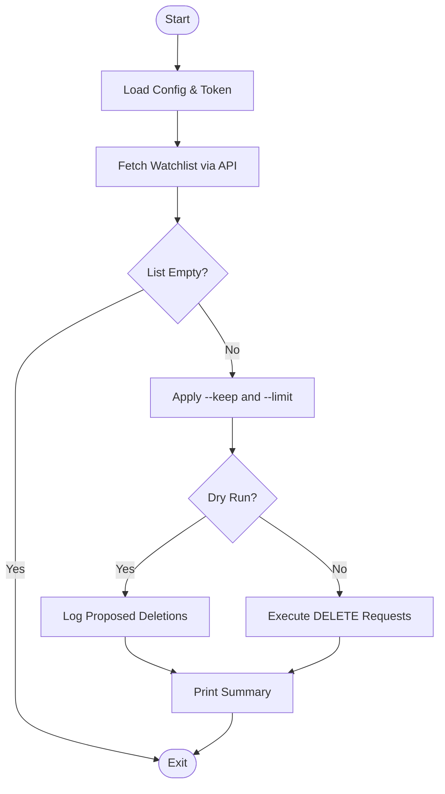
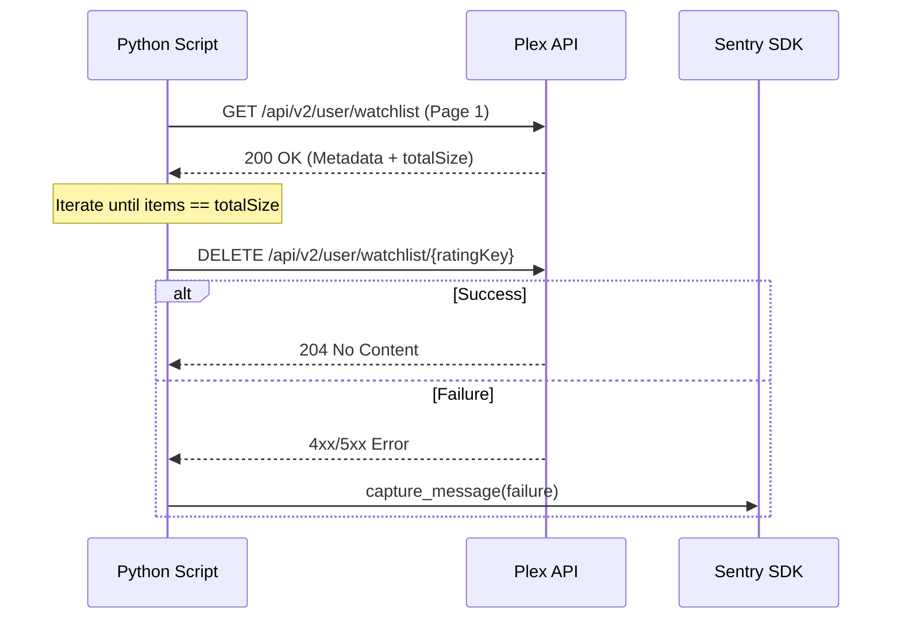

Relevant source files

The following files were used as context for generating this wiki page:

- [AGENTS.md](AGENTS.md)
- [CLAUDE.md](CLAUDE.md)
- [README.md](README.md)
- [plex_clear_watchlist.py](plex_clear_watchlist.py)
- [docker-compose.yml](docker-compose.yml)
- [SECURITY.md](SECURITY.md)
- [requirements.txt](requirements.txt)

# AI Agent Guide

This guide provides technical documentation for AI agents and developers working on the `plex_clear_watchlist` project. The project is a single-purpose utility designed to delete items from a Plex Watchlist via the Plex API, typically running as a one-shot Docker container.

Sources: [AGENTS.md:3-5](AGENTS.md#L3-L5), [CLAUDE.md:3-5](CLAUDE.md#L3-L5), [README.md:12-14](README.md#L12-L14)

## System Architecture and Logic

The application is structured as a Python script that interacts with the Plex TV API v2. It follows a procedural flow: initializing configuration, fetching the current watchlist with pagination, applying filtering logic (limits or retention), and performing deletions.

### Execution Flow

The following diagram illustrates the high-level logic of the script from initialization to completion.

Sources: [plex_clear_watchlist.py:92-167](plex_clear_watchlist.py#L92-L167)

### API Interaction

The script uses the `requests` library to communicate with Plex servers. It requires a `X-Plex-Token` for authentication.

| Feature | Implementation Detail |
| :--- | :--- |
| **Base URL** | `https://plex.tv` |
| **Watchlist Endpoint** | `/api/v2/user/watchlist` |
| **Authentication** | `X-Plex-Token` header |
| **Pagination** | 100 items per page |
| **Timeout** | 30 seconds |

Sources: [plex_clear_watchlist.py:17-25](plex_clear_watchlist.py#L17-L25), [plex_clear_watchlist.py:32-34](plex_clear_watchlist.py#L32-L34)

## Configuration and Environment

Configuration is strictly managed through environment variables to ensure security and flexibility in containerized environments.

### Environment Variables

| Variable | Requirement | Description |
| :--- | :--- | :--- |
| `PLEX_TOKEN` | Required | Your Plex authentication token. |
| `SENTRY_DSN` | Optional | Data Source Name for Sentry error tracking. |

Sources: [plex_clear_watchlist.py:9-11](plex_clear_watchlist.py#L9-L11), [docker-compose.yml:6-8](docker-compose.yml#L6-L8), [README.md:18-20](README.md#L18-L20)

### Security Conventions

- **No Hardcoding**: Tokens and secrets must never be hardcoded in the script or committed to version control.
- **Private Reporting**: Security vulnerabilities should be reported via GitHub's private reporting feature rather than public issues.
- **Dependency Management**: Dependencies are tracked in `requirements.txt` and updated via automated tools like Renovate or Dependabot.

Sources: [AGENTS.md:21-22](AGENTS.md#L21-L22), [SECURITY.md:10-18](SECURITY.md#L10-L18), [requirements.txt:1-2](requirements.txt#L1-L2)

## Operations and Usage

The tool supports several flags to control the deletion process. These flags allow for safe testing (dry run) and partial cleanup of the watchlist.

### Command Line Arguments

| Argument | Type | Default | Description |
| :--- | :--- | :--- | :--- |
| `--dry-run` | Flag | False | Logs actions without performing API DELETE calls. |
| `--limit` | Integer | 0 | Maximum number of items to delete (0 = all). |
| `--keep` | Integer | 0 | Number of most recently added items to retain. |

Sources: [plex_clear_watchlist.py:94-97](plex_clear_watchlist.py#L94-L97), [README.md:46-50](README.md#L46-L50)

### Sequence of Deletion

The script ensures that even if pagination fails, it does not perform an incomplete deletion that might mislead the user.

Sources: [plex_clear_watchlist.py:36-63](plex_clear_watchlist.py#L36-L63), [plex_clear_watchlist.py:65-76](plex_clear_watchlist.py#L65-L76), [plex_clear_watchlist.py:151-164](plex_clear_watchlist.py#L151-L164)

## Agent Contribution Guidelines

AI agents interacting with this repository must adhere to specific operational constraints to maintain project integrity.

### Permissions and Restrictions

| Allowed | Forbidden |
| :--- | :--- |
| Create branches | Push directly to main/master |
| Modify code | Merge Pull Requests |
| Run tests | Delete branches |
| Open Pull Requests | Modify secrets or GitHub settings |

Sources: [AGENTS.md:27-39](AGENTS.md#L27-L39)

### Development Standards

1. **Focused PRs**: Keep Pull Requests small and targeted to a single change.
2. **Dry Run Safety**: Any modifications to the `--dry-run` logic must ensure that no side effects occur when the flag is present.
3. **Tech Stack**: Use Python 3.14+ as the runtime environment.

Sources: [AGENTS.md:7](AGENTS.md#L7), [AGENTS.md:23](AGENTS.md#L23), [AGENTS.md:42-43](AGENTS.md#L42-L43)

## Summary

The `plex_clear_watchlist` utility provides a secure, containerized method for managing Plex Watchlists. By utilizing the Plex API v2 and enforcing strict environmental configuration, it allows users to perform bulk deletions or maintain a specific number of recent items with safety checks via dry-run modes.

Sources: [AGENTS.md:3-5](AGENTS.md#L3-L5), [README.md:12-14](README.md#L12-L14)
