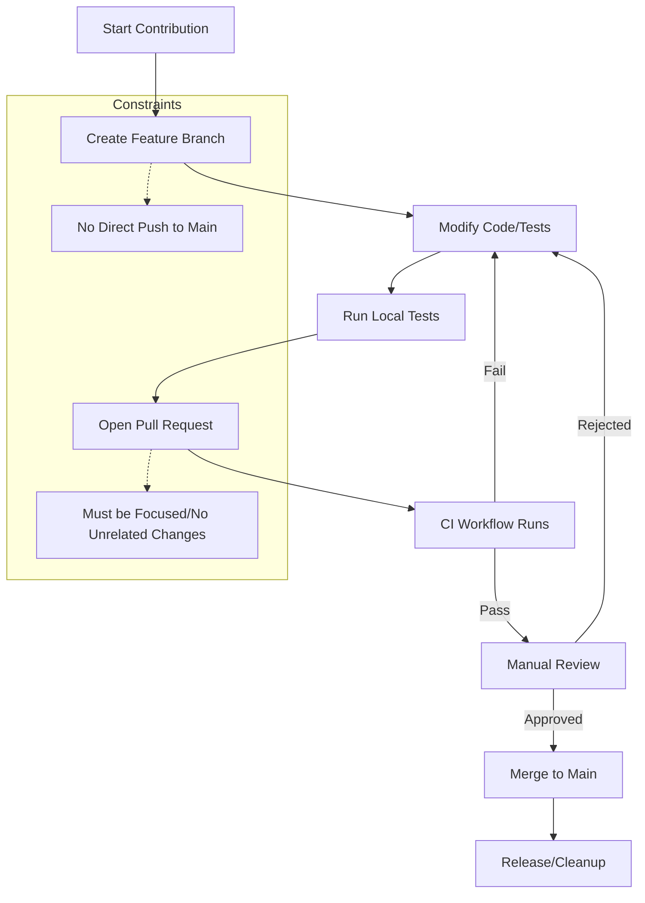
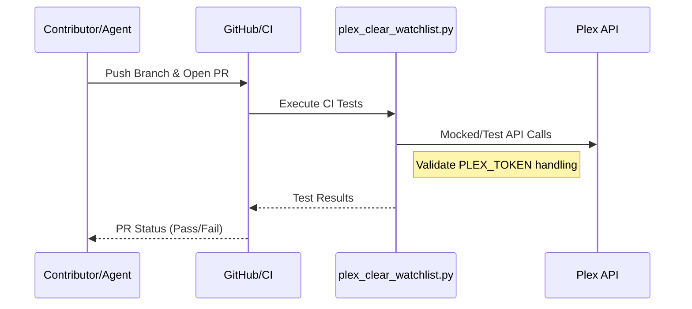

Relevant source files

The following files were used as context for generating this wiki page:

- [AGENTS.md](AGENTS.md)
- [CLAUDE.md](CLAUDE.md)
- [SECURITY.md](SECURITY.md)
- [renovate.json](renovate.json)
- [README.md](README.md)
- [plex_clear_watchlist.py](plex_clear_watchlist.py)

# Pull Request Process

The Pull Request (PR) process for the `plex_clear_watchlist` project is designed to ensure code quality, security, and stability. It governs how new features, bug fixes, and dependency updates are integrated into the main codebase while maintaining strict adherence to environmental safety and coding standards.

This process applies to all contributors, including AI agents and automated tools like Renovate, ensuring that every change is vetted through automated CI workflows and manual review constraints.

Sources: [AGENTS.md:21-34](AGENTS.md#L21-L34), [README.md:3-8](README.md#L3-L8), [renovate.json:1-6](renovate.json#L1-L6)

## Contribution Rules and Constraints

Contributions must follow a set of strict guidelines to maintain the integrity of the repository. The project enforces specific allowed and forbidden actions for agents and contributors during the PR lifecycle.

### Allowed and Forbidden Actions

| Action Category | Permitted | Prohibited |
| :--- | :--- | :--- |
| **Branch Management** | Create branches | Push directly to main/master, Delete branches |
| **Code Changes** | Modify code, Update dependencies | Include unrelated changes, Commit credentials |
| **Workflow** | Open PRs, Run tests | Merge PRs, Disable workflows, Change org settings |
| **Security** | Report via private feature | Publicly disclose vulnerabilities, Modify secrets |

Sources: [AGENTS.md:21-34](AGENTS.md#L21-L34), [SECURITY.md:7-13](SECURITY.md#L7-L13), [CLAUDE.md:21-34](CLAUDE.md#L21-L34)

## Automated Integration and Testing

The project utilizes GitHub Actions and automated bots to streamline the PR process and ensure dependency health.

### CI/CD and Dependency Management
- **Continuous Integration:** Every PR triggers a CI workflow to ensure that all tests pass before consideration for merging.
- **Renovate Bot:** The project uses Renovate to automatically manage dependency updates. It extends `config:recommended` to keep the Python stack (Python 3.14) and requirements current.
- **Security Scanning:** Best practices require that PRs do not include `.env` files or hardcoded secrets. Dependabot is also enabled for supplementary security monitoring.

Sources: [README.md:3-8](README.md#L3-L8), [renovate.json:1-6](renovate.json#L1-L6), [SECURITY.md:17-21](SECURITY.md#L17-L21), [AGENTS.md:31](AGENTS.md#L31)

### PR Workflow Diagram

The following diagram illustrates the flow from code modification to the final merge state, highlighting the requirements for AI agents and contributors.

*This diagram shows the standard progression of a code change through the project's verification layers.*
Sources: [AGENTS.md:21-34](AGENTS.md#L21-L34), [CLAUDE.md:21-34](CLAUDE.md#L21-L34)

## Technical Requirements for PRs

To be accepted, a Pull Request must demonstrate compliance with the project's technical architecture and coding conventions.

### Implementation Standards
- **Single-Purpose:** PRs must remain focused on a single task (e.g., modifying `plex_clear_watchlist.py` for a specific bug).
- **Dry Run Safety:** Any changes to the deletion logic in `plex_clear_watchlist.py` must ensure the `--dry-run` flag remains safe and side-effect free.
- **Environment Variables:** Credentials like `PLEX_TOKEN` must never be hardcoded in PRs; they must be retrieved via `os.environ`.
- **Error Tracking:** Integration with Sentry (via `sentry-sdk`) should be maintained for error reporting in non-dry-run executions.

Sources: [plex_clear_watchlist.py:9-15](plex_clear_watchlist.py#L9-L15), [plex_clear_watchlist.py:101-108](plex_clear_watchlist.py#L101-L108), [CLAUDE.md:26-30](CLAUDE.md#L26-L30), [SECURITY.md:17-19](SECURITY.md#L17-L19)

### Component Relationship Diagram

PRs affecting the main logic must understand the interaction between the script and external services.

*The interaction between the contribution process and the validation of the core script logic.*
Sources: [plex_clear_watchlist.py:27-50](plex_clear_watchlist.py#L27-L50), [AGENTS.md:31-34](AGENTS.md#L31-L34)

## Conclusion
The Pull Request process prioritizes security and code focus. By restricting direct pushes to the main branch and requiring automated CI validation, the project ensures that the one-shot Docker utility remains reliable and that sensitive user information (like Plex tokens) is never compromised during development.

Sources: [SECURITY.md:17-21](SECURITY.md#L17-L21), [AGENTS.md:27-34](AGENTS.md#L27-L34)
