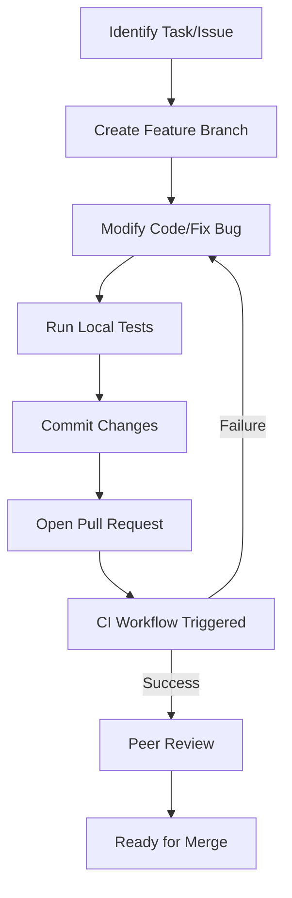
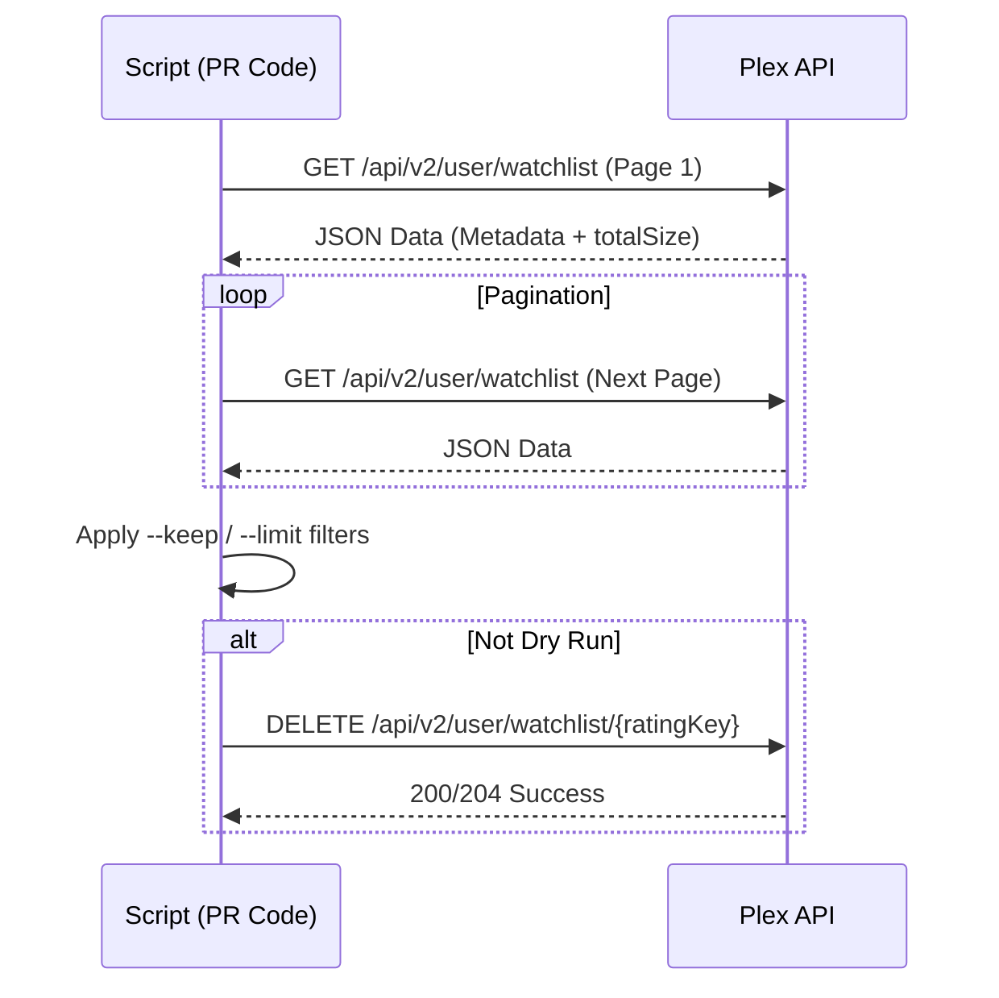

<details>
<summary>Relevant source files</summary>

The following files were used as context for generating this wiki page:

- [AGENTS.md](AGENTS.md)
- [README.md](README.md)
- [CLAUDE.md](CLAUDE.md)
- [SECURITY.md](SECURITY.md)
- [renovate.json](renovate.json)
- [plex_clear_watchlist.py](plex_clear_watchlist.py)
</details>

# Pull Request Process

The Pull Request (PR) process for the `plex_clear_watchlist` project is designed to ensure code quality, maintain security standards, and automate dependency management. It establishes a workflow where changes are proposed via branches, validated through automated Continuous Integration (CI), and governed by specific operational constraints for AI agents and human contributors alike.

This process is integral to the project's stability, ensuring that every modification to the Python-based Plex API tool is vetted before being merged into the main codebase. It enforces strict rules against direct commits to protected branches and mandates the use of environment variables for all sensitive credentials.
Sources: [AGENTS.md:28-36](AGENTS.md#L28-L36), [README.md:3-8](README.md#L3-L8)

## Contribution Workflow

All code changes must follow a structured flow involving branch creation and PR submission. This ensures that the `main` branch remains stable and that all features are tested via the project's CI pipeline.

### General Guidelines
The project enforces specific "Allowed" and "Forbidden" actions to maintain repository integrity:

| Category | Permitted Actions | Prohibited Actions |
| :--- | :--- | :--- |
| **Development** | Create branches, Modify code | Push directly to main/master, Force push |
| **Testing** | Run tests | Disable workflows |
| **Maintenance** | Open PRs | Merge PRs, Delete branches |
| **Security** | Report via private feature | Modify secrets, Commit credentials |

Sources: [AGENTS.md:28-41](AGENTS.md#L28-L41), [SECURITY.md:12-16](SECURITY.md#L12-L16)

### PR Lifecycle
The following diagram illustrates the lifecycle of a code change from local development to being ready for merge.



The workflow emphasizes that all tests must pass before a PR is considered viable.
Sources: [AGENTS.md:33-40](AGENTS.md#L33-L40), [README.md:3-6](README.md#L3-L6)

## Automated Dependency Updates

The project utilizes Renovate and Dependabot to automate the tracking and updating of dependencies. This ensures that the Tech Stack, including Python 3.14 and libraries like `requests` and `sentry-sdk`, remains current and secure.

### Renovate Configuration
Renovate is configured using a standard recommended schema to manage automated PRs for dependency updates.

```json
{
  "$schema": "https://docs.renovatebot.com/renovate-schema.json",
  "extends": [
    "config:recommended"
  ]
}
```

Sources: [renovate.json:1-6](renovate.json#L1-L6), [SECURITY.md:21](SECURITY.md#L21)

## Security and Compliance in PRs

Security is a primary concern during the PR process. Reviewers and automated tools check for the accidental inclusion of secrets or insecure practices.

### Core Security Rules
*  **No Hardcoded Secrets**: `PLEX_TOKEN` must always be provided via environment variables. PRs containing hardcoded tokens will be rejected.
*  **Environment Management**: The project uses `.env` files for local development, but these must never be committed to version control.
*  **Vulnerability Reporting**: Security issues should not be addressed through public PRs initially; they must be reported through GitHub's private reporting feature.

Sources: [SECURITY.md:12-20](SECURITY.md#L12-L20), [AGENTS.md:21](AGENTS.md#L21), [CLAUDE.md:20](CLAUDE.md#L20)

### Error Tracking Integration
The PR process ensures that any changes to error handling correctly integrate with Sentry. The `plex_clear_watchlist.py` script initializes `sentry_sdk` only when `--dry-run` is disabled, and PRs are expected to maintain this logic.

```python
if not args.dry_run:
    sentry_sdk.init(
        dsn=os.getenv("SENTRY_DSN"),
        traces_sample_rate=0.0,
        # ... additional configuration
    )
```

Sources: [plex_clear_watchlist.py:97-104](plex_clear_watchlist.py#L97-L104)

## Validation and Testing

Before a Pull Request is merged, it must satisfy the requirements of the CI workflow. This includes verifying that the script's core functionality—fetching and deleting from the Plex Watchlist—remains intact across various flags.

### Testing Scenarios
PRs are validated against the following execution patterns:
1.  **Dry Run**: `python3 plex_clear_watchlist.py --dry-run` (Must be safe with no side effects).
2.  **Limited Deletion**: `python3 plex_clear_watchlist.py --limit 10`.
3.  **Retention Logic**: `python3 plex_clear_watchlist.py --keep 5`.

Sources: [AGENTS.md:11-15](AGENTS.md#L11-L15), [CLAUDE.md:11-15](CLAUDE.md#L11-L15), [plex_clear_watchlist.py:90-95](plex_clear_watchlist.py#L90-L95)

### API Interaction Flow
Contributors must ensure that modifications to `get_watchlist()` or `delete_from_watchlist()` do not break the paginated API flow.



Sources: [plex_clear_watchlist.py:30-66](plex_clear_watchlist.py#L30-L66), [plex_clear_watchlist.py:115-144](plex_clear_watchlist.py#L115-L144)

## Summary

The Pull Request process for `plex_clear_watchlist` acts as a gatekeeper for code quality and security. By mandating branch-based development, prohibiting direct pushes to `main`, and integrating automated dependency management via Renovate, the project maintains a reliable toolset for Plex users. Every PR is evaluated against its adherence to the core tech stack (Python 3.14) and its safe handling of sensitive data via environment variables.
