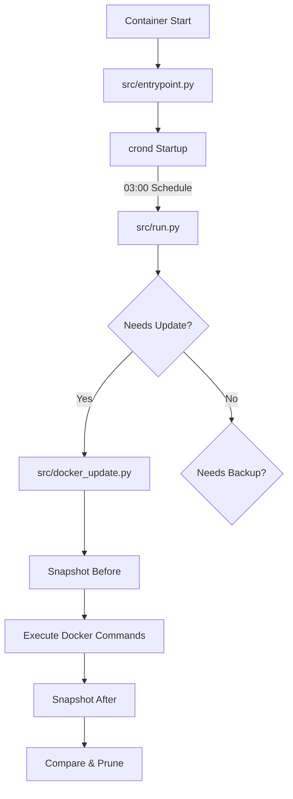
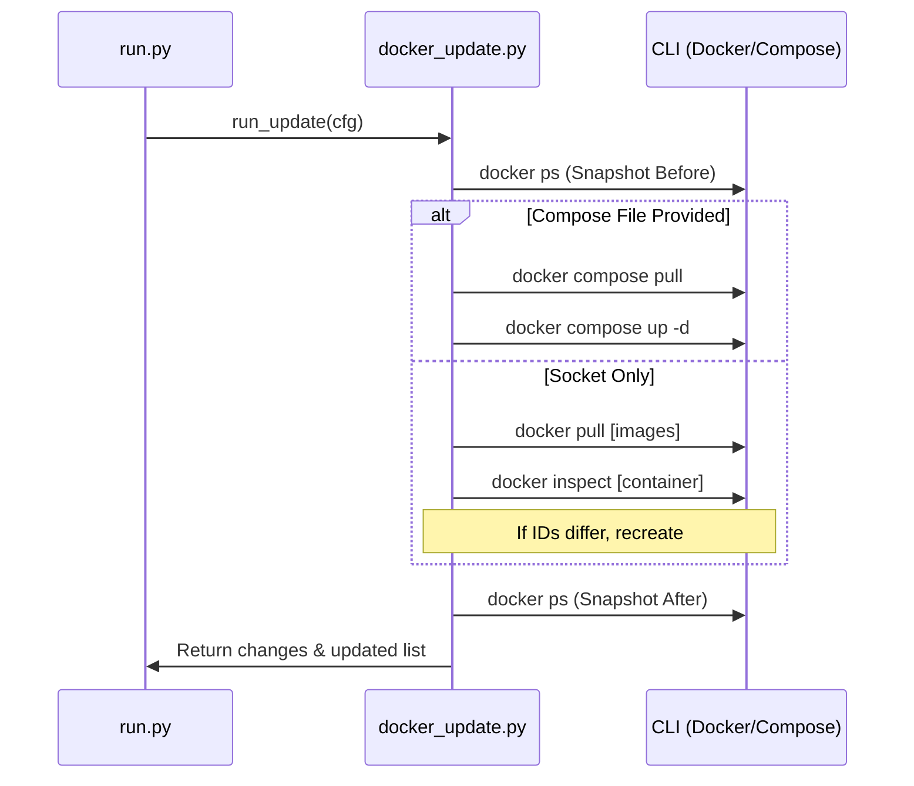

Relevant source files

The following files were used as context for generating this wiki page:

- [README.md](../../../README.md)
- [src/entrypoint.py](../../../src/entrypoint.py)
- [src/docker_update.py](../../../src/docker_update.py)
- [src/config.py](../../../src/config.py)
- [src/run.py](../../../src/run.py)
- [CLAUDE.md](../../../CLAUDE.md)

# Docker Compose Deployment

The Docker Compose Deployment feature allows this project to perform daily maintenance on a Docker host by interacting with Docker Compose files or the Docker socket directly. The system is designed to run within a single container, acting as an orchestrator to pull updated images, recreate changed containers, and manage backups.

The deployment logic supports two primary modes for updates: **Option A (Socket-only)**, which pulls images for all running containers, and **Option B (Compose-file)**, which uses standard `docker compose` commands to manage services defined in a specific configuration file.

Sources: [README.md:8-13](README.md#L8-L13), [CLAUDE.md:6-12](CLAUDE.md#L6-L12)

## System Orchestration and Lifecycle

The deployment cycle is managed by a sequence of Python scripts triggered by an internal cron daemon. The lifecycle begins at container startup with configuration validation and scheduling.

### Execution Flow

1.  **Entrypoint Initialization:** `entrypoint.py` validates the `MODE` environment variable, ensures the Docker socket is present (if required), and sets up the crontab.
2.  **Cron Trigger:** By default, the system executes `src/run.py` at 03:00 daily.
3.  **Main Execution:** `src/run.py` coordinates the update and backup steps based on the configuration.
4.  **Update Logic:** `src/docker_update.py` handles the actual interaction with the Docker engine or Compose CLI.

Sources: [src/entrypoint.py:20-67](src/entrypoint.py#L20-L67), [src/run.py:23-44](src/run.py#L23-L44)

*The flowchart illustrates the progression from container initialization to the execution of update logic, including state snapshots for idempotency.*

Sources: [README.md:19-27](README.md#L19-L27), [src/docker_update.py:12-25](src/docker_update.py#L12-L25)

## Deployment Modes

The deployment behavior is dictated by the `MODE` environment variable and the presence of `COMPOSE_FILE`.

| Mode | Functionality | Requirement |
| :--- | :--- | :--- |
| `update` | Container updates only | `/var/run/docker.sock` |
| `backup` | Rclone backups only | `rclone.conf`, `backup.conf` |
| `both` | Updates and Backups | Docker socket + Rclone config |

Sources: [README.md:31-38](README.md#L31-L38), [src/config.py:7-12](src/config.py#L7-L12)

### Option A: Docker Socket Update
When `COMPOSE_FILE` is unset, the system iterates through all running containers via the Docker socket. It performs a `docker pull` for every image and uses `docker inspect` to compare the running image ID against the newly pulled latest ID. If they differ, the container is recreated using extracted `HostConfig` and `Config` parameters (Env, Binds, PortBindings, etc.).

Sources: [src/docker_update.py:84-122](src/docker_update.py#L84-L122), [README.md:92-94](README.md#L92-L94)

### Option B: Docker Compose Update
When `COMPOSE_FILE` is provided, the system uses the `docker compose` CLI. It identifies services using `docker compose config --services`, pulls new images for each service (with up to 3 retries), and executes `docker compose up -d --remove-orphans`.

Sources: [src/docker_update.py:38-73](src/docker_update.py#L38-L73), [README.md:96-98](README.md#L96-L98)

## Configuration Parameters

Configuration is primarily driven by environment variables and configuration files mounted to the `/config` directory.

### Environment Variables
| Variable | Default | Description |
| :--- | :--- | :--- |
| `MODE` | `both` | Execution mode (`update`, `backup`, `both`). |
| `COMPOSE_FILE` | *(unset)* | Path to the `docker-compose.yml` for Option B. |
| `COMPOSE_ENV_FILE`| *(unset)* | Path to an optional `.env` file for Compose. |
| `DRY_RUN` | `false` | If true, logs actions without executing changes. |
| `CRON_SCHEDULE` | `0 3 * * *` | Standard cron syntax for execution timing. |

Sources: [README.md:121-131](README.md#L121-L131), [src/config.py:14-22](src/config.py#L14-L22)

### Deployment Logic Sequence

*Sequence diagram showing the interaction between the runner, the update module, and the host Docker engine.*

Sources: [src/docker_update.py:12-28](src/docker_update.py#L12-L28), [src/run.py:33-35](src/run.py#L33-L35)

## Recreations and Idempotency

The system maintains idempotency by taking snapshots of the container state before and after the update process using `docker ps --format "{{.Names}} {{.Image}} {{.ImageID}}"`. 

### Pruning Logic
If changes are detected and the system is not in `DRY_RUN` mode, it automatically executes cleanup commands to remove unused resources:
- `docker container prune -f`
- `docker image prune -f`

Sources: [src/docker_update.py:21-25](src/docker_update.py#L21-L25), [src/docker_update.py:28-36](src/docker_update.py#L28-L36)

### Recreate Implementation
For socket-based updates, the `_recreate_container` function manually builds a `docker run` command by parsing the existing container's JSON inspection data. This includes:
- **Restart Policies:** Maps `on-failure` and other policies.
- **Networking:** Preserves `NetworkMode`.
- **Environment & Volumes:** Re-binds all environment variables and volume mounts.
- **Port Bindings:** Maps Host IP and Ports to container ports.

Sources: [src/docker_update.py:125-177](src/docker_update.py#L125-L177)

## Summary
The Docker Compose Deployment system provides a streamlined way to maintain a Docker host. By offering both a generic socket-based update method and a specific Compose-based method, it adapts to various hosting environments. It ensures reliability through automatic retries during image pulls and maintains host cleanliness by pruning old images and containers after successful updates.
