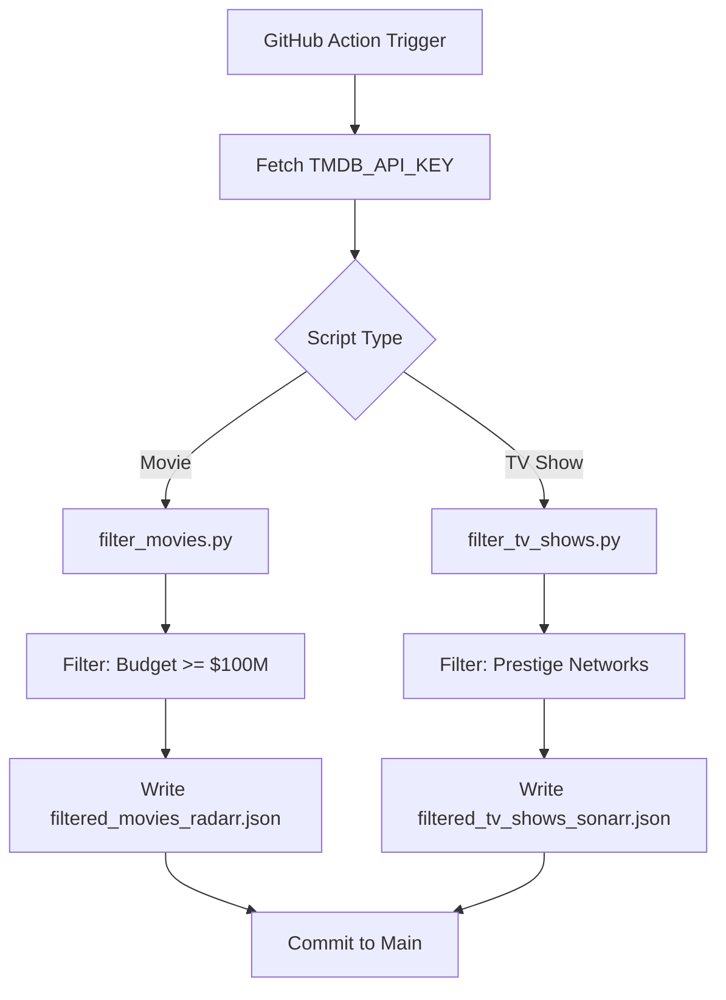
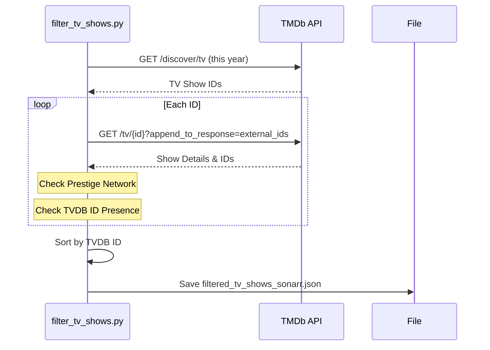

Relevant source files

The following files were used as context for generating this wiki page:

- [AGENTS.md](AGENTS.md)
- [CLAUDE.md](CLAUDE.md)
- [SECURITY.md](SECURITY.md)
- [filter_movies.py](filter_movies.py)
- [filter_tv_shows.py](filter_tv_shows.py)
- [README.md](README.md)

# AI Agent Development Guidelines

## Introduction
The AI Agent Development Guidelines provide a framework for contributors and automated agents to interact with the `filtered-movies` repository. This project focuses on generating high-value movie and TV show lists from The Movie Database (TMDb) for integration with Radarr and Sonarr. The guidelines ensure consistency in code quality, security protocols, and operational workflows for daily automated updates.

Sources: [AGENTS.md:1-10](AGENTS.md#L1-L10), [README.md:1-10](README.md#L1-L10)

## Core Tech Stack and Workflow
The project leverages a lightweight Python-based architecture integrated with GitHub Actions for orchestration.

| Component | Technology | Description |
|-----------|------------|-------------|
| Language | Python 3 | Main processing logic for filtering and data transformation. |
| Data Source | TMDb API | Source for movie and TV metadata. |
| Orchestration | GitHub Actions | Daily scheduled runs to refresh JSON outputs. |
| Error Tracking | Sentry SDK | Used for monitoring script failures in production. |

Sources: [AGENTS.md:12-16](AGENTS.md#L12-L16), [requirements.txt:1-2](requirements.txt#L1-L2), [filter_movies.py:24-28](filter_movies.py#L24-L28)

### Operational Logic
The system follows a linear data flow from TMDb ingestion to formatted JSON generation.

The diagram shows the automated workflow from trigger to output commitment.
Sources: [AGENTS.md:18-28](AGENTS.md#L18-L28), [filter_movies.py:34-45](filter_movies.py#L34-L45), [filter_tv_shows.py:44-55](filter_tv_shows.py#L44-L55)

## Security and Credentials
Strict adherence to security protocols is required to protect API access and repository integrity.

*  **API Key Handling**: `TMDB_API_KEY` must never be hardcoded. It is stored as a GitHub Secret and accessed via environment variables.
*  **Vulnerability Reporting**: Security issues must be reported privately to `dev@denied.se` or via the GitHub Security tab rather than public issues.
*  **Dependency Management**: Dependabot and Renovate are used to maintain up-to-date and secure dependencies.

Sources: [SECURITY.md:3-10](SECURITY.md#L3-L10), [SECURITY.md:46-55](SECURITY.md#L46-L55), [renovate.json:1-6](renovate.json#L1-L6)

## Development Rules for Agents
Agents must follow specific behavioral constraints to maintain project stability.

### Permitted Actions
*  Creating feature or fix branches.
*  Modifying code to update filter logic or fix bugs.
*  Running local scripts for testing purposes.
*  Opening Pull Requests for review.

### Forbidden Actions
*  Direct pushes to the `main` or `master` branches.
*  Deleting branches or disabling active workflows.
*  Modifying repository secrets or organization-level settings.
*  Including `[skip ci]` in commit messages for automated PRs, as this may block required checks.

Sources: [AGENTS.md:33-51](AGENTS.md#L33-L51), [CLAUDE.md:28-32](CLAUDE.md#L28-L32)

## Data Filtering Logic
The two primary scripts use specific criteria to generate the output lists.

### Movie Filtering (`filter_movies.py`)
*  **Target**: Radarr (StevenLu Custom format).
*  **Criteria**: Budget must be $\ge$ $100,000,000$ and the release date must be within the current year.
*  **Requirement**: Must have an `imdb_id`.

### TV Show Filtering (`filter_tv_shows.py`)
*  **Target**: Sonarr (Custom List format).
*  **Criteria**: Must premiere on "Prestige Networks" (e.g., HBO, Max, Apple TV+, Amazon, National Geographic).
*  **Requirement**: Must have a `TvdbId`.

The sequence diagram illustrates the TV show filtering process including external ID resolution.
Sources: [filter_movies.py:40-100](filter_movies.py#L40-L100), [filter_tv_shows.py:35-130](filter_tv_shows.py#L35-L130), [README.md:15-35](README.md#L15-L35)

## Conclusion
The AI Agent Development Guidelines ensure that both human contributors and automated agents follow a standardized process for maintaining the high-value media lists. By strictly adhering to the defined tech stack, security protocols, and filtering logic, the project maintains reliable daily updates for the Radarr and Sonarr communities.
