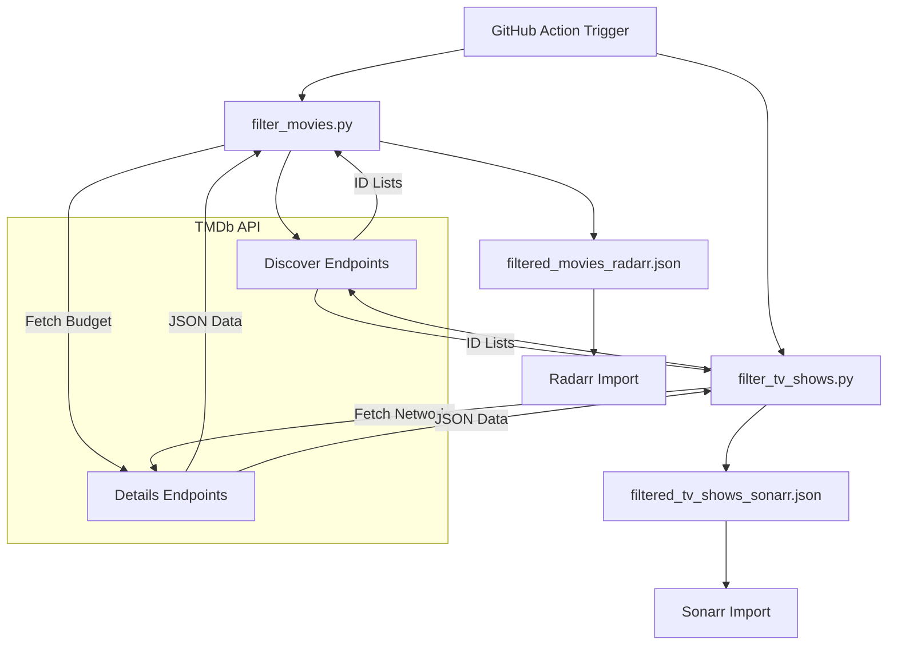

<details>
<summary>Relevant source files</summary>

The following files were used as context for generating this wiki page:

- [CLAUDE.md](CLAUDE.md)
- [AGENTS.md](AGENTS.md)
- [SECURITY.md](SECURITY.md)
- [filter_movies.py](filter_movies.py)
- [filter_tv_shows.py](filter_tv_shows.py)
- [README.md](README.md)
</details>

# Claude Code Guidelines

The Claude Code Guidelines establish the technical standards, operational constraints, and development workflows for the `filtered-movies` project. This project is designed to automate the generation of high-value media lists—specifically movies with high budgets and TV shows from prestige networks—formatted for direct consumption by Radarr and Sonarr instances.

These guidelines ensure that automated agents and contributors maintain the integrity of the daily GitHub Actions updates, adhere to security protocols regarding TMDb API keys, and follow specific coding patterns for data filtering and Sentry error reporting.

Sources: [CLAUDE.md:1-5](CLAUDE.md#L1-L5), [AGENTS.md:1-5](AGENTS.md#L1-L5), [README.md:1-10](README.md#L1-L10)

## Project Architecture & Tech Stack

The system operates as a periodic ETL (Extract, Transform, Load) pipeline using Python scripts triggered by GitHub Actions. It fetches data from The Movie Database (TMDb) API, applies specific business logic filters, and outputs JSON files to the repository.

### Component Overview

| Component | Responsibility |
|-----------|----------------|
| **Python 3 Scripts** | Executing API queries, filtering results, and formatting JSON. |
| **TMDb API** | Primary data source for movie budgets, release dates, and network info. |
| **GitHub Actions** | Orchestrating daily runs (06:00 and 07:00 UTC) and committing results. |
| **Sentry SDK** | Error tracking and exception capturing for script failures. |

Sources: [CLAUDE.md:7-12](CLAUDE.md#L7-L12), [filter_movies.py:27-31](filter_movies.py#L27-L31), [README.md:108-115](README.md#L108-L115)

### Data Flow Diagram

The following diagram illustrates the flow from TMDb data retrieval to the final production of Radarr/Sonarr compatible lists.



The diagram shows how scripts interact with TMDb endpoints to filter data based on project-specific criteria before saving to the final JSON output.
Sources: [filter_movies.py:48-93](filter_movies.py#L48-L93), [filter_tv_shows.py:61-104](filter_tv_shows.py#L61-L104), [README.md:12-25](README.md#L12-L25)

## Development & Contribution Conventions

### Script Execution and Environments
Developers and agents must use the defined environment variables and commands to run the filtering logic locally.

*  **API Key Requirement**: `TMDB_API_KEY` must be a TMDb API Read Access Token (starting with `eyJ...`), not a standard API key.
*  **Execution Commands**: 
  *  `python filter_movies.py`
  *  `python filter_tv_shows.py`

Sources: [CLAUDE.md:20-25](CLAUDE.md#L20-L25), [README.md:83-93](README.md#L83-L93)

### Agent Constraints
AI agents operating on this repository are subject to specific permissions and prohibitions to protect the stability of the automated workflows.

| Allowed Actions | Forbidden Actions |
|-----------------|-------------------|
| Create branches | Push directly to main/master |
| Modify code | Delete branches |
| Run tests | Disable or modify workflows |
| Open Pull Requests | Modify secrets or org settings |

Sources: [AGENTS.md:28-44](AGENTS.md#L28-L44)

### Workflow and Commit Logic
A critical convention exists regarding commit messages for automated updates. Commit messages for JSON output files **must not** include `[skip ci]`. Including this tag prevents `repository-checks` from running on subsequent PRs, which can permanently block merges.

Sources: [CLAUDE.md:28-31](CLAUDE.md#L28-L31)

## Filtering Logic & Standards

The project implements strict criteria for what constitutes a "high-value" entry.

### Movie Filtering (Radarr)
Movies are filtered in `filter_movies.py` based on:
1.  **Budget**: Minimum of $100,000,000 (`MIN_BUDGET = 100_000_000`).
2.  **Date**: Released within the current calendar year up to the current date.
3.  **Identifiers**: Must have an `imdb_id` to be compatible with the StevenLu format.

Sources: [filter_movies.py:12-16](filter_movies.py#L12-L16), [filter_movies.py:41](filter_movies.py#L41)

### TV Show Filtering (Sonarr)
TV shows are filtered in `filter_tv_shows.py` based on:
1.  **Networks**: Must belong to "Prestige Networks" (HBO, Max, Apple TV+, National Geographic, Amazon, etc.).
2.  **Date**: Premiered from the start of the current year onwards.
3.  **Identifiers**: Must have a `tvdb_id` (captured via TMDb `external_ids` append-to-response).

Sources: [filter_tv_shows.py:14-18](filter_tv_shows.py#L14-L18), [filter_tv_shows.py:43-52](filter_tv_shows.py#L43-L52)

## Security Guidelines

Security is primarily focused on credential management and vulnerability reporting.

### Secret Management
*  **No Hardcoding**: API keys and tokens must never be hardcoded in scripts.
*  **Environment Variables**: All secrets must be accessed via `os.environ.get("TMDB_API_KEY")`.
*  **Git Hygiene**: `.env` files and local secrets are excluded via `.gitignore`.

Sources: [SECURITY.md:50-58](SECURITY.md#L50-L58), [filter_movies.py:36](filter_movies.py#L36)

### Vulnerability Reporting
Vulnerabilities should be reported privately via email (`dev@denied.se`) or the GitHub Security tab. The project commits to an initial acknowledgment within 48 hours.

Sources: [SECURITY.md:5-20](SECURITY.md#L5-L20)

## Error Handling & Monitoring

The scripts utilize `sentry-sdk` for error tracking. Because the scripts are short-lived, an explicit flush is required.

```python
# From filter_movies.py:148-155
if __name__ == "__main__":
    try:
        main()
    except Exception:
        sentry_sdk.capture_exception()
        sentry_sdk.flush(timeout=5)
        raise
    else:
        sentry_sdk.flush(timeout=5)
```

Sources: [filter_movies.py:27-31](filter_movies.py#L27-L31), [filter_movies.py:148-155](filter_movies.py#L148-L155)

## Summary
The Claude Code Guidelines ensure that `filtered-movies` remains a reliable source for automated media management. By adhering to the strict filtering logic, security protocols for API tokens, and the specific GitHub Actions commit conventions, the project maintains a stable and high-quality data stream for Radarr and Sonarr users.
