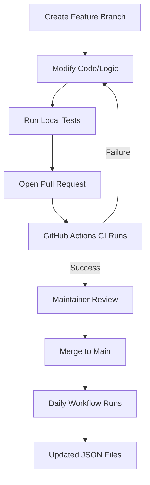
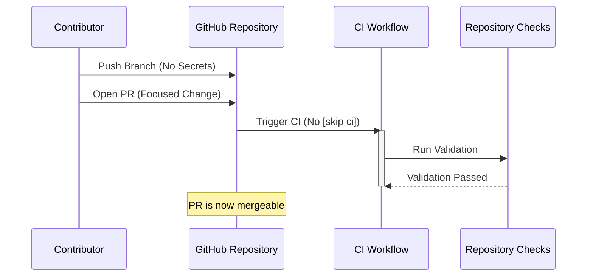

Relevant source files

The following files were used as context for generating this wiki page:

- [AGENTS.md](AGENTS.md)
- [CLAUDE.md](CLAUDE.md)
- [SECURITY.md](SECURITY.md)
- [README.md](README.md)
- [renovate.json](renovate.json)

# Pull Request Standards

Pull Request (PR) standards in the `filtered-movies` project ensure the integrity of the automated movie and TV show lists, maintain security protocols, and ensure that the CI/CD pipelines function correctly. Because the project relies on daily automated updates via GitHub Actions, strict adherence to contribution rules is necessary to prevent breaking the production JSON files used by Radarr and Sonarr.

The standards cover forbidden actions (such as direct pushes to main), security best practices regarding API keys, and specific technical requirements for commit messages to ensure repository checks are not bypassed.

Sources: [AGENTS.md:1-5](AGENTS.md#L1-L5), [CLAUDE.md:1-5](CLAUDE.md#L1-L5), [README.md:1-10](README.md#L1-L10)

## Contributor Guidelines

Contributors are permitted to create branches, modify code, run tests, and open PRs. However, several restrictions are in place to protect the stability of the `main` branch and the security of the TMDb integration.

### Allowed and Forbidden Actions

| Action Type | Permitted | Prohibited |
| :--- | :--- | :--- |
| **Branch Management** | Create branches | Delete branches, Force push |
| **Code Changes** | Modify code, Open PRs | Push directly to main/master |
| **CI/CD** | Run tests | Disable workflows, Modify secrets |
| **Administration** | N/A | Merge PRs, Change GitHub org settings |

Sources: [AGENTS.md:20-33](AGENTS.md#L20-L33)

### General Requirements
*  **Focus:** PRs must remain focused on a single task. Unrelated changes should not be included in a single submission.
*  **Testing:** All tests must pass before a PR is considered for review.
*  **Secrets:** Credentials, API keys, and tokens must never be committed to the repository.
*  **Integrity:** Force pushing to shared branches is forbidden to maintain a clean git history.

Sources: [AGENTS.md:35-40](AGENTS.md#L35-L40)

## CI/CD and Commit Conventions

The project uses GitHub Actions to run Continuous Integration (CI) and daily updates. A critical standard involves the use of CI skip flags in commit messages.

### The `[skip ci]` Restriction
Contributors must avoid using `[skip ci]` in commit messages for JSON output files. While these files are updated automatically, using the skip flag prevents the `repository-checks` job from running on the resulting PR. This can lead to PRs becoming permanently blocked from merging because required checks are never triggered.

Sources: [CLAUDE.md:20-25](CLAUDE.md#L20-L25)

### Automation Workflow
The following diagram illustrates the lifecycle of a contribution from branch creation to the automated daily update triggered after merging.

This flow ensures that all changes are validated before affecting the `filtered_movies_radarr.json` and `filtered_tv_shows_sonarr.json` files.

Sources: [README.md:108-115](README.md#L108-L115), [AGENTS.md:20-40](AGENTS.md#L20-L40), [CLAUDE.md:20-25](CLAUDE.md#L20-L25)

## Security Standards

Security is a primary concern for PRs, specifically regarding the handling of The Movie Database (TMDb) API Read Access Tokens.

### API Key Handling
*  **Environment Variables:** All secrets must be handled via environment variables (`TMDB_API_KEY`) or local `.env` files.
*  **Gitignore:** `.env` files must remain listed in `.gitignore` to prevent accidental commits.
*  **Exposure Protocol:** If a key is accidentally exposed in a PR, it must be revoked immediately at TMDb, and the sensitive data must be removed from the repository history following official GitHub guides.

Sources: [SECURITY.md:35-55](SECURITY.md#L35-L55)

### Dependency Management
The project uses automated tools to maintain security and keep libraries updated.
*  **Renovate:** The project extends `config:recommended` for Renovate to manage dependencies.
*  **Dependabot:** Automatically reviews and updates dependencies to mitigate vulnerabilities.

Sources: [renovate.json:1-6](renovate.json#L1-L6), [SECURITY.md:38](SECURITY.md#L38)

## Technical Requirements for PRs

PRs affecting the filtering logic in `filter_movies.py` or `filter_tv_shows.py` must maintain the existing simple, well-commented structure to ensure criteria remain easy to adjust.

### Data Structure Standards
Changes to output formats must remain compatible with the target applications:

| Target | Format | Required Fields |
| :--- | :--- | :--- |
| **Radarr** | StevenLu Custom | `title`, `imdb_id` |
| **Sonarr** | Custom List | `TvdbId` |

Sources: [filter_movies.py:65-75](filter_movies.py#L65-L75), [filter_tv_shows.py:125-135](filter_tv_shows.py#L125-L135), [README.md:70-85](README.md#L70-L85)

The sequence above emphasizes the requirement of passing the `repository-checks` which are essential for the merge process.

Sources: [CLAUDE.md:20-25](CLAUDE.md#L20-L25), [AGENTS.md:35-40](AGENTS.md#L35-L40)

Pull Request Standards serve as the gatekeeper for the `filtered-movies` project, ensuring that automated updates remain functional, API keys remain secure, and the codebase remains maintainable for both human contributors and AI agents.
