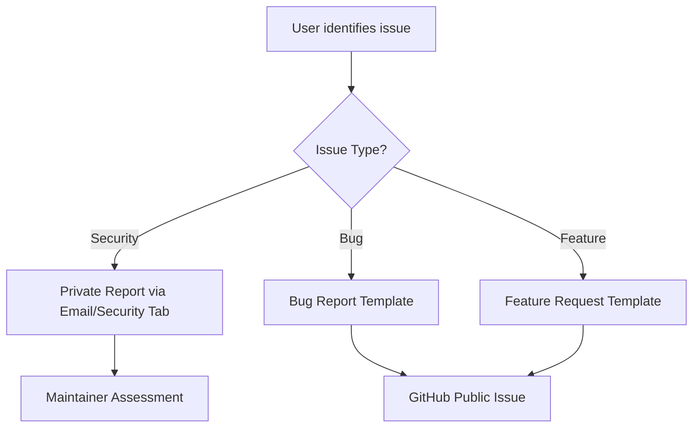
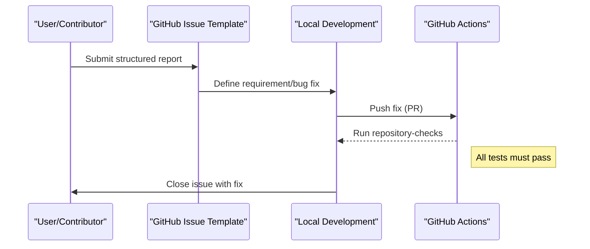

Relevant source files

The following files were used as context for generating this wiki page:

- [.github/ISSUE_TEMPLATE/bug-reports.md](.github/ISSUE_TEMPLATE/bug-reports.md)
- [.github/ISSUE_TEMPLATE/feature-requests.md](.github/ISSUE_TEMPLATE/feature-requests.md)
- [SECURITY.md](SECURITY.md)
- [README.md](README.md)
- [AGENTS.md](AGENTS.md)

# Issue Reporting Templates

The issue reporting system in the `filtered-movies` project provides structured pathways for contributors and users to communicate bugs, suggest enhancements, or report security vulnerabilities. By utilizing GitHub's issue template features, the project ensures that all necessary technical context—such as logs, environment details, and reproduction steps—is captured upfront to facilitate rapid resolution.

The scope of these templates covers the core Python scripts (`filter_movies.py`, `filter_tv_shows.py`), the generated JSON data files used by Radarr and Sonarr, and the automated GitHub Actions workflows.
Sources: [SECURITY.md:25-30](SECURITY.md#L25-L30), [AGENTS.md:14-17](AGENTS.md#L14-L17), [README.md:11-20](README.md#L11-L20)

## Reporting Channels and Categorization

The project categorizes incoming feedback into three primary streams. Each stream has a specific protocol to ensure information is handled by the appropriate system or maintainer.

| Report Type | Channel | Description |
|--- |--- |--- |
| **Bug Reports** | GitHub Issues | Used for technical failures in scripts or incorrect data output. |
| **Feature Requests** | GitHub Issues | Used for suggesting new filters, networks, or integration formats. |
| **Security Vulnerabilities** | Private (Email/Security Tab) | Used for sensitive issues like credential leaks or injection risks. |

Sources: [.github/ISSUE_TEMPLATE/bug-reports.md](.github/ISSUE_TEMPLATE/bug-reports.md), [.github/ISSUE_TEMPLATE/feature-requests.md](.github/ISSUE_TEMPLATE/feature-requests.md), [SECURITY.md:5-10](SECURITY.md#L5-L10)

### Security Vulnerability Protocol
A critical distinction in the reporting architecture is the handling of security flaws. Users are explicitly instructed **not** to create public issues for vulnerabilities. Instead, they must use the "Report a vulnerability" button or direct email to prevent public disclosure before a fix is implemented.
Sources: [SECURITY.md:3-10](SECURITY.md#L3-L10)

The diagram above illustrates the decision logic for selecting the correct reporting template based on the nature of the discovery.
Sources: [SECURITY.md:5-10](SECURITY.md#L5-L10), [.github/ISSUE_TEMPLATE/bug-reports.md](.github/ISSUE_TEMPLATE/bug-reports.md), [.github/ISSUE_TEMPLATE/feature-requests.md](.github/ISSUE_TEMPLATE/feature-requests.md)

## Bug Report Structure

The Bug Report template is designed to gather environmental context and reproduction data. This is essential for debugging the interaction between the Python scripts and the TMDb API.

*  **Description:** A clear and concise description of the bug.
*  **Reproduction Steps:** Sequential steps to recreate the error (e.g., running `python filter_movies.py` without a specific environment variable).
*  **Expected vs. Actual Behavior:** Contrast between the intended outcome and the observed failure.
*  **Logs/Screenshots:** Provision for terminal output or GitHub Action logs.
*  **Environment Info:** Details regarding the Python version (3.8+ recommended) and OS.

Sources: [.github/ISSUE_TEMPLATE/bug-reports.md](.github/ISSUE_TEMPLATE/bug-reports.md), [README.md:84-85](README.md#L84-L85)

## Feature Request Structure

Feature requests focus on the evolution of the filtering logic. Since the project's primary value is in its "High-Value" filters (e.g., $100M+ budgets), the template asks for the rationale behind new criteria.

*  **Problem Statement:** Is the feature related to a specific limitation of the current lists?
*  **Proposed Solution:** Detailed description of the desired change (e.g., adding a new network like "Disney+" to the prestige list).
*  **Alternatives:** Discussion of other ways to achieve the same result.

Sources: [.github/ISSUE_TEMPLATE/feature-requests.md](.github/ISSUE_TEMPLATE/feature-requests.md), [README.md:27-40](README.md#L27-L40)

## Data Flow for Issue Resolution

Once an issue is reported via a template, it typically follows a workflow involving local development and CI validation before being merged.

This sequence demonstrates how templates initiate the development lifecycle, leading to automated verification.
Sources: [AGENTS.md:28-45](AGENTS.md#L28-L45), [CLAUDE.md:21-25](CLAUDE.md#L21-L25)

## Contribution Guidelines for Reporters

When using the templates, the project enforces several conventions to maintain repository health:
1.  **Secret Handling:** Reporters must never include their `TMDB_API_KEY` or `SENTRY_DSN` in bug report logs.
2.  **Focus:** Each report should be limited to a single bug or feature to keep pull requests focused.
3.  **Validation:** Contributors are expected to ensure that all tests pass and no unrelated changes are included when submitting a PR linked to an issue.

Sources: [AGENTS.md:22-45](AGENTS.md#L22-L45), [CLAUDE.md:21-25](CLAUDE.md#L21-L25), [SECURITY.md:46-55](SECURITY.md#L46-L55)

## Conclusion
The issue reporting templates serve as the primary interface for project maintenance, ensuring that the automated "high-value" movie and TV show lists remain accurate. By enforcing a strict separation between public bugs and private security reports, the project maintains a secure and stable environment for its automation scripts.
