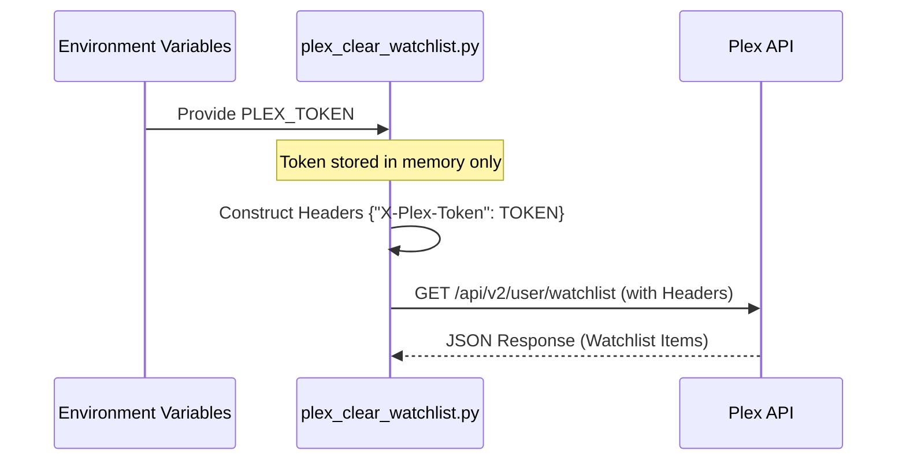
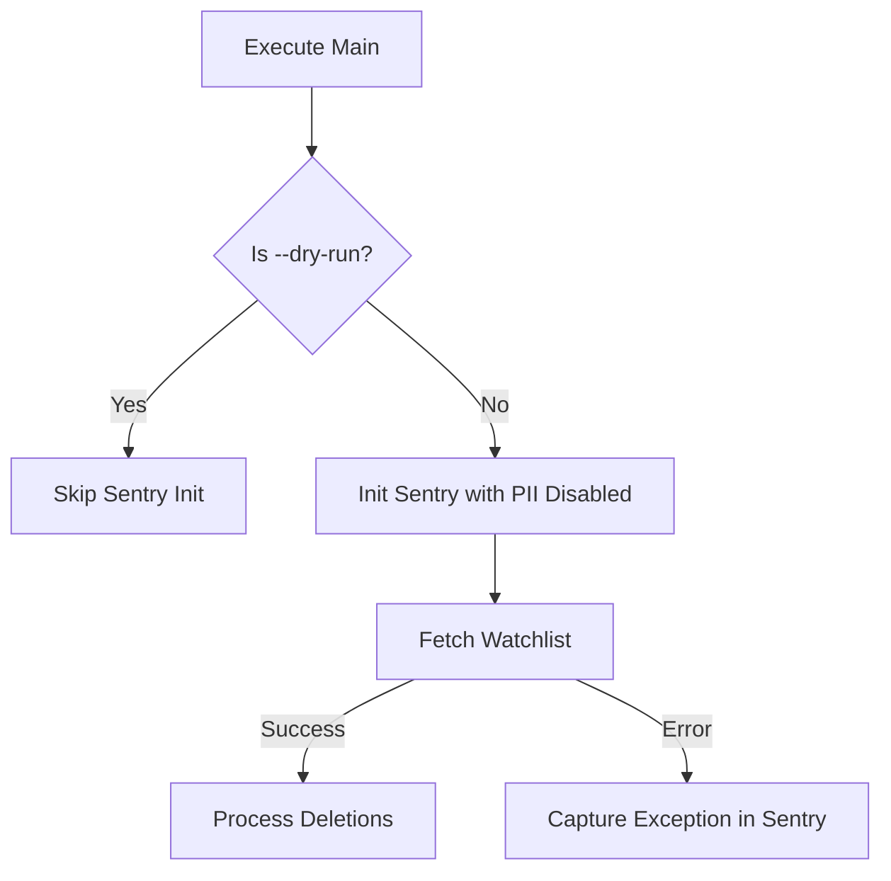

<details>
<summary>Relevant source files</summary>

The following files were used as context for generating this wiki page:

- [SECURITY.md](SECURITY.md)
- [AGENTS.md](AGENTS.md)
- [README.md](README.md)
- [CLAUDE.md](CLAUDE.md)
- [plex_clear_watchlist.py](plex_clear_watchlist.py)
- [docker-compose.yml](docker-compose.yml)
- [renovate.json](renovate.json)
</details>

# Security Policy

The Security Policy for `plex_clear_watchlist` defines the protocols and best practices for protecting sensitive user credentials and managing vulnerabilities within the application. The project is designed as a single-purpose utility that interacts with the Plex API, necessitating strict handling of authentication tokens and error reporting data.

This policy covers the supported versions for security updates, the procedure for confidential vulnerability reporting, and the architectural implementations used to prevent credential leakage.

Sources: [SECURITY.md:1-20](SECURITY.md#L1-L20), [AGENTS.md:1-15](AGENTS.md#L1-L15), [plex_clear_watchlist.py:1-25](plex_clear_watchlist.py#L1-L25)

## Authentication and Credential Management

The primary security mechanism of the application is the management of the `PLEX_TOKEN`. This token provides full access to the user's Plex account via the `https://plex.tv/api/v2/user/watchlist` endpoint. To minimize the risk of exposure, the application enforces a strict environment-variable-only policy for secrets.

### Credential Enforcement Logic
The application checks for the existence of the `PLEX_TOKEN` immediately upon execution. If the environment variable is missing, the script terminates to prevent unauthenticated requests.

```python
# Configuration enforcement
PLEX_TOKEN = os.environ.get("PLEX_TOKEN", "")
if not PLEX_TOKEN:
    print("❌ Error: PLEX_TOKEN environment variable not set", file=sys.stderr)
    sys.exit(1)
```

Sources: [plex_clear_watchlist.py:9-14](plex_clear_watchlist.py#L9-L14), [CLAUDE.md:24-27](CLAUDE.md#L24-L27)

### Data Flow for Authentication
The following sequence shows how the token is ingested and applied to outgoing API requests.



The application uses the `X-Plex-Token` header for all requests to the Plex API, ensuring that credentials are never passed as URL parameters.
Sources: [plex_clear_watchlist.py:19-23](plex_clear_watchlist.py#L19-L23), [AGENTS.md:24-27](AGENTS.md#L24-L27)

## Vulnerability Reporting and Maintenance

The project maintains a policy for reporting security flaws privately to avoid exploitation.

### Supported Versions
Only the `latest` version of the software is supported for security patches.
Sources: [SECURITY.md:3-7](SECURITY.md#L3-L7)

### Reporting Process
1.  **Confidentiality:** Security vulnerabilities must not be reported via public GitHub issues.
2.  **Channel:** Users must use the [GitHub private reporting feature](https://github.com/blixten85/plex_clear_watchlist/security/advisories/new).
3.  **Response Time:** The maintainers aim to respond within 48 hours and release patches as soon as possible upon confirmation.
Sources: [SECURITY.md:9-15](SECURITY.md#L9-L15)

### Dependency Management
To mitigate risks from third-party library vulnerabilities, the project utilizes automated dependency tracking.

| Feature | Implementation |
|---|---|
| **Dependabot** | Enabled for automated security updates |
| **Renovate** | Configured via `renovate.json` using `config:recommended` |
| **Requirement Pinning** | `sentry-sdk` is pinned to version `>=2.0.0` |

Sources: [SECURITY.md:20](SECURITY.md#L20), [renovate.json:1-6](renovate.json#L1-L6), [requirements.txt:2](requirements.txt#L2)

## Data Privacy and Error Tracking

The application optionally uses Sentry for error tracking. To protect user privacy, the integration is configured to minimize data collection.

### Sentry Configuration
When initialized, the Sentry SDK is configured with the following privacy settings:
- `send_default_pii=False`: Prevents sending Personally Identifiable Information.
- `include_local_variables=False`: Prevents capturing local variable states that might contain the `PLEX_TOKEN`.
- `max_request_body_size="never"`: Ensures request bodies are not transmitted to Sentry.



Sources: [plex_clear_watchlist.py:94-100](plex_clear_watchlist.py#L94-L100), [docker-compose.yml:8](docker-compose.yml#L8)

## Secure Deployment Practices

The application is distributed as a Docker container, which allows for isolation of the runtime environment.

- **Non-persistence:** The application runs as a one-shot container (`--rm`), which removes the container and its writable layer after execution. This does not remove image layers or named volumes — only the one-shot container's own state is cleaned up.
- **Environment Isolation:** Secrets are injected via the `docker-compose.yml` file using standard shell expansion, preventing them from being hardcoded in the image.

```yaml
services:
  plex-clear-watchlist:
    environment:
      - PLEX_TOKEN=${PLEX_TOKEN}
      - SENTRY_DSN=${SENTRY_DSN:-}
```

Sources: [docker-compose.yml:1-8](docker-compose.yml#L1-L8), [README.md:32-34](README.md#L32-L34)

## Summary of Security Best Practices

The following rules are mandatory for all contributors and users to ensure the security of the project:

1.  **Environment Variables:** Always use environment variables for secrets; never hardcode credentials.
2.  **Version Control:** Never commit `.env` files or specific credentials to the repository.
3.  **Forbidden Actions:** Contributors are forbidden from pushing directly to the main branch or modifying secrets within the CI/CD environment.

Sources: [SECURITY.md:18-20](SECURITY.md#L18-L20), [AGENTS.md:35-43](AGENTS.md#L35-L43)
