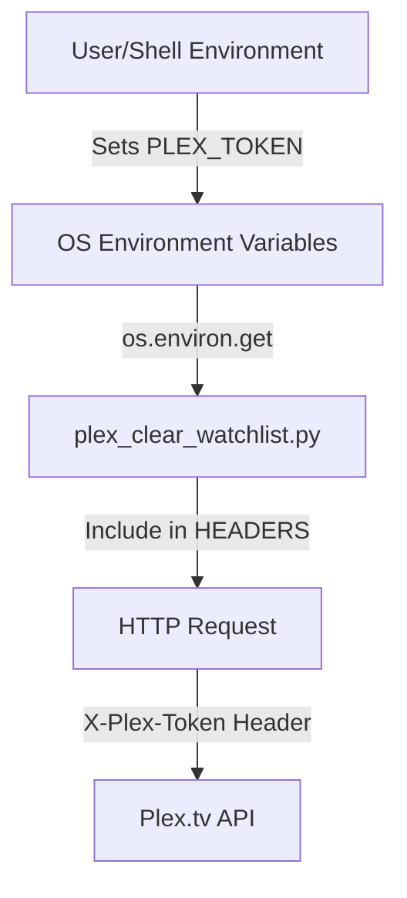
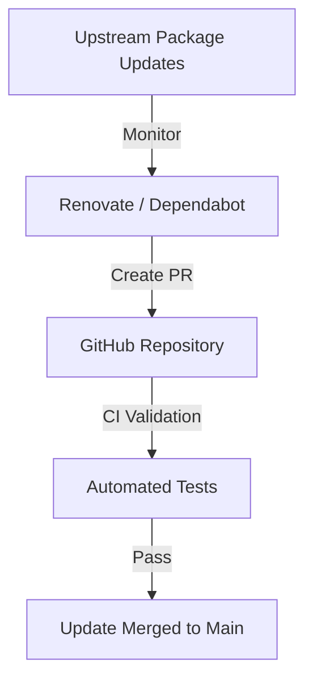

<details>
<summary>Relevant source files</summary>

The following files were used as context for generating this wiki page:

- [SECURITY.md](SECURITY.md)
- [plex_clear_watchlist.py](plex_clear_watchlist.py)
- [AGENTS.md](AGENTS.md)
- [README.md](README.md)
- [docker-compose.yml](docker-compose.yml)
- [renovate.json](renovate.json)
</details>

# Security Policy

The Security Policy for the `plex_clear_watchlist` project defines the protocols and practices used to protect user credentials, handle vulnerabilities, and ensure safe operation when interacting with the Plex API. This policy applies to all deployment methods, including Docker and standalone Python execution.

The primary scope of this policy covers the management of the `PLEX_TOKEN` and `SENTRY_DSN` environment variables, the use of automated dependency updates, and the procedure for reporting security vulnerabilities.
Sources: [SECURITY.md](SECURITY.md), [AGENTS.md](AGENTS.md), [README.md](README.md)

## Authentication and Secret Management

The application requires a Plex authentication token (`PLEX_TOKEN`) to interact with the user's account. To prevent unauthorized access or credential leakage, the project enforces strict rules regarding how this secret is handled.

### Secret Handling Rules
*  **Environment Variables Only:** Secrets must always be provided via environment variables. Hardcoding credentials in the source code is strictly forbidden.
*  **No Persistence in Version Control:** Users are instructed never to commit `.env` files or credentials to version control.
*  **Validation:** The application validates the presence of the `PLEX_TOKEN` at startup and terminates with an error if it is missing.

Sources: [SECURITY.md:16-17](SECURITY.md#L16-L17), [AGENTS.md:31](AGENTS.md#L31), [plex_clear_watchlist.py:10-14](plex_clear_watchlist.py#L10-L14)

### Credential Data Flow
The following diagram illustrates how the `PLEX_TOKEN` flows from the user environment to the Plex API request headers.



Sources: [plex_clear_watchlist.py:10-22](plex_clear_watchlist.py#L10-L22), [docker-compose.yml:7](docker-compose.yml#L7)

## Vulnerability Reporting and Support

The project maintains a structured approach for addressing security flaws found in the software.

### Reporting Procedure
If a security vulnerability is discovered, it should not be reported through public issues. Instead, users must use GitHub's private reporting feature to ensure confidentiality until a patch is available.
Sources: [SECURITY.md:7-11](SECURITY.md#L7-L11)

### Response and Support
The maintainers commit to the following response timeline and version support:

| Aspect | Policy |
| --- | --- |
| Supported Versions | `latest` |
| Initial Response Time | Within 48 hours |
| Remediation | Patch released as soon as possible after confirmation |

Sources: [SECURITY.md:3-13](SECURITY.md#L3-L13)

## Secure Operation and Observability

The script includes features to prevent accidental data loss and to monitor errors without compromising user privacy.

### Dry-Run Mode
The `--dry-run` flag allows users to simulate the deletion process. This is a safety feature ensuring that no destructive actions are taken on the Plex API while the flag is active.
Sources: [AGENTS.md:32](AGENTS.md#L32), [plex_clear_watchlist.py:101-105](plex_clear_watchlist.py#L101-L105)

### Error Tracking with Sentry
Error tracking is implemented via Sentry but is configured with privacy-preserving settings.

```python
if not args.dry_run:
    sentry_sdk.init(
        dsn=os.getenv("SENTRY_DSN"),
        traces_sample_rate=0.0,
        send_default_pii=False,
        include_local_variables=False,
        max_request_body_size="never",
    )
```

Sources: [plex_clear_watchlist.py:90-98](plex_clear_watchlist.py#L90-L98)

**Privacy Controls:**
*  `send_default_pii=False`: Prevents sending Personally Identifiable Information.
*  `include_local_variables=False`: Prevents local variable values from being sent in stack traces.
*  `max_request_body_size="never"`: Ensures request bodies are never transmitted to Sentry.

Sources: [plex_clear_watchlist.py:93-96](plex_clear_watchlist.py#L93-L96)

## Supply Chain Security

To mitigate risks from third-party dependencies, the project employs automated tools to keep components up to date.

*  **Dependabot:** Enabled to monitor and update dependencies.
*  **Renovate:** Configured using the recommended preset to automate dependency management and ensure the latest secure versions are used.

Sources: [SECURITY.md:18](SECURITY.md#L18), [renovate.json:1-6](renovate.json#L1-L6)

### Dependency Update Flow
The following diagram shows the automated dependency lifecycle.



Sources: [SECURITY.md:18](SECURITY.md#L18), [renovate.json:1-6](renovate.json#L1-L6), [README.md:3](README.md#L3)

## Summary
The security posture of `plex_clear_watchlist` relies on strict environment variable isolation for secrets, automated dependency management via Renovate and Dependabot, and privacy-focused error reporting. By providing a `--dry-run` mode and requiring private vulnerability reporting, the project minimizes the risk of accidental data loss and public exploit disclosure.
