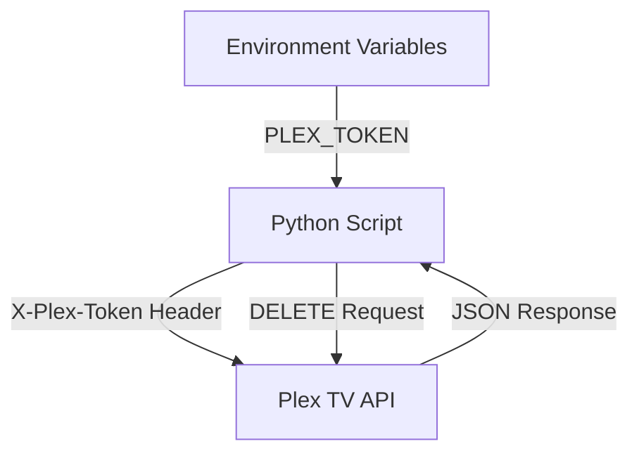
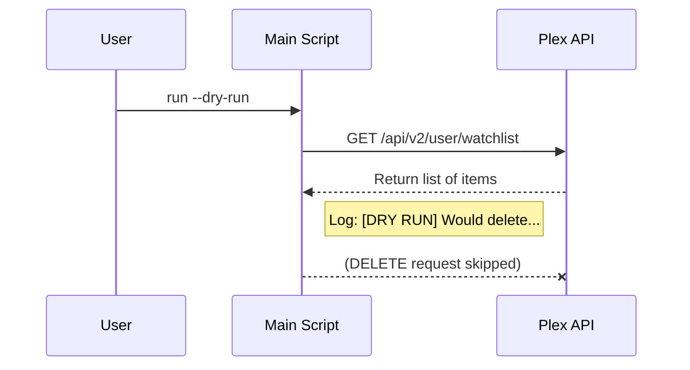

<details>
<summary>Relevant source files</summary>

The following files were used as context for generating this wiki page:

- [SECURITY.md](SECURITY.md)
- [AGENTS.md](AGENTS.md)
- [CLAUDE.md](CLAUDE.md)
- [README.md](README.md)
- [plex_clear_watchlist.py](plex_clear_watchlist.py)
- [docker-compose.yml](docker-compose.yml)
- [renovate.json](renovate.json)
</details>

# Security Best Practices

This page outlines the security protocols, configuration standards, and development practices used to maintain the integrity of the `plex_clear_watchlist` tool. The project focuses on the secure handling of Plex authentication tokens and the safe execution of bulk deletion operations.

The primary scope covers credential management, vulnerability reporting, and operational safeguards like dry-run modes to prevent accidental data loss.

Sources: [SECURITY.md:1-20](SECURITY.md#L1-L20), [AGENTS.md:1-40](AGENTS.md#L1-L40), [plex_clear_watchlist.py:1-150](plex_clear_watchlist.py#L1-L150)

## Credential Management

The most critical security aspect of this project is the protection of the `PLEX_TOKEN`. This token provides full access to the user's Plex account via the API.

### Environment Variables
Credentials must never be hardcoded in the source code. The application retrieves the token exclusively through the `PLEX_TOKEN` environment variable.

```python
# plex_clear_watchlist.py:11-15
PLEX_TOKEN = os.environ.get("PLEX_TOKEN", "")
if not PLEX_TOKEN:
    print("❌ Error: PLEX_TOKEN environment variable not set", file=sys.stderr)
    sys.exit(1)
```

### Secrets in Deployment
For Docker deployments, environment variables are passed through the shell or a `.env` file. The project guidelines strictly forbid committing `.env` files or credentials to version control.

| Method | Implementation | Source |
| :--- | :--- | :--- |
| **Docker Compose** | Uses `${PLEX_TOKEN}` interpolation | [docker-compose.yml:7](docker-compose.yml#L7) |
| **Manual Docker** | Uses `-e PLEX_TOKEN=your-token` | [README.md:36](README.md#L36) |
| **Local Python** | Uses `export PLEX_TOKEN="..."` | [README.md:43](README.md#L43) |

Sources: [SECURITY.md:15-17](SECURITY.md#L15-L17), [AGENTS.md:21-23](AGENTS.md#L21-L23), [CLAUDE.md:19-21](CLAUDE.md#L19-L21), [plex_clear_watchlist.py:11-15](plex_clear_watchlist.py#L11-L15)

## API Security and Communication

The tool communicates with the Plex API using HTTPS. Authentication is handled by including the token in the request headers rather than URL parameters, reducing the risk of token exposure in logs.



The diagram shows the flow of the authentication token from the environment into the HTTP headers for secure API communication.

### Header Implementation
The script constructs a header object that is reused for all requests to ensure consistent authentication.

```python
# plex_clear_watchlist.py:19-22
HEADERS = {
    "X-Plex-Token": PLEX_TOKEN,
    "Accept": "application/json"
}
```

Sources: [plex_clear_watchlist.py:19-22](plex_clear_watchlist.py#L19-L22), [plex_clear_watchlist.py:33](plex_clear_watchlist.py#L33), [plex_clear_watchlist.py:61](plex_clear_watchlist.py#L61)

## Safe Execution and Error Handling

To prevent unintended data loss during bulk operations, the application implements safety flags and telemetry controls.

### Dry Run Functionality
The `--dry-run` flag is an optional, recommended safety feature (`store_true`, defaults to off) — normal invocations perform real deletions. When `--dry-run` is passed, the script simulates the deletion process without making destructive API calls; include it explicitly for a safe test run.



The sequence diagram illustrates how the dry-run flag interrupts the deletion process while still validating the connection and item list.

### Telemetry and Privacy
Error tracking via Sentry is optional and configured to minimize data exposure:
- **Default PII**: Disabled (`send_default_pii=False`).
- **Local Variables**: Not included in crash reports.
- **Request Bodies**: Never sent to Sentry servers.

Sources: [plex_clear_watchlist.py:84-140](plex_clear_watchlist.py#L84-L140), [AGENTS.md:21-23](AGENTS.md#L21-L23), [README.md:20-22](README.md#L20-L22)

## Software Supply Chain

The project employs automated tools to ensure dependencies are secure and up to date.

*  **Dependabot**: Enabled to monitor and update Python dependencies.
*  **Renovate**: Configured with recommended settings for automated dependency management.
*  **Version Pinning**: Critical dependencies like `sentry-sdk` use version constraints in `requirements.txt`.

| Tool | Purpose | Source |
| :--- | :--- | :--- |
| **Dependabot** | General dependency updates | [SECURITY.md:18](SECURITY.md#L18) |
| **Renovate** | Automated PRs for library updates | [renovate.json:1-6](renovate.json#L1-L6) |
| **CI Workflow** | Validates code integrity on changes | [README.md:3](README.md#L3) |

Sources: [SECURITY.md:18](SECURITY.md#L18), [renovate.json:1-6](renovate.json#L1-L6), [requirements.txt:1-2](requirements.txt#L1-L2)

## Vulnerability Reporting

The project follows a responsible disclosure policy. Users who discover security vulnerabilities are instructed to avoid public issues.

1.  **Private Reporting**: Use the GitHub private reporting feature for confidential submission.
2.  **Triage**: A response is expected within 48 hours.
3.  **Remediation**: Confirmed issues result in an immediate patch release.

Sources: [SECURITY.md:7-13](SECURITY.md#L7-L13)

## Summary of Best Practices

Security in the Plex Clear Watchlist project is maintained through strict environment-based credential handling, the implementation of non-destructive execution modes, and automated dependency management. These layers ensure that the tool remains a safe utility for managing Plex account data without compromising user privacy or account security.
