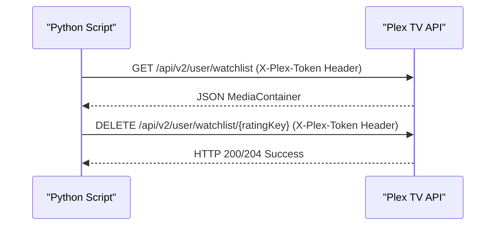
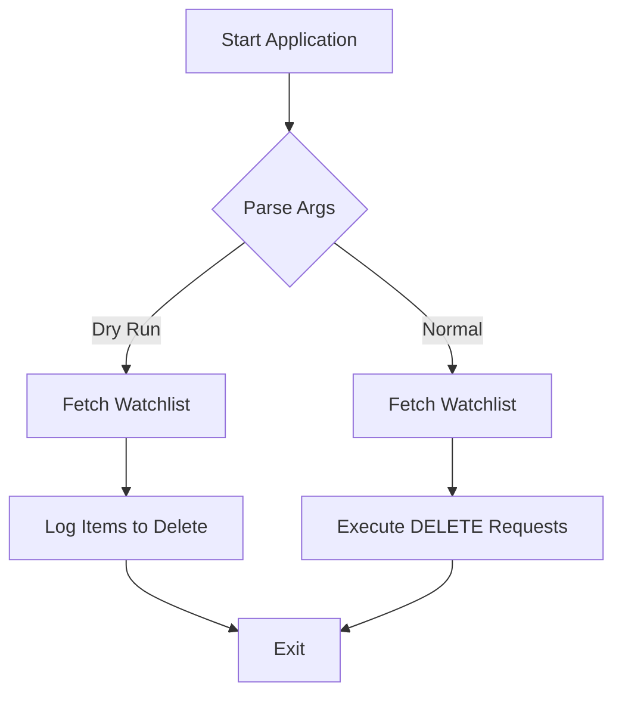

<details>
<summary>Relevant source files</summary>

The following files were used as context for generating this wiki page:

- [SECURITY.md](SECURITY.md)
- [AGENTS.md](AGENTS.md)
- [README.md](README.md)
- [plex_clear_watchlist.py](plex_clear_watchlist.py)
- [docker-compose.yml](docker-compose.yml)
- [renovate.json](renovate.json)
- [CLAUDE.md](CLAUDE.md)
</details>

# Security Best Practices

## Introduction

This document outlines the security policies, configuration requirements, and operational conventions for the `plex_clear_watchlist` tool. The project is designed to interact with the Plex API to delete items from a user's watchlist, requiring sensitive authentication data.

The primary security focus is on the protection of the `PLEX_TOKEN`, safe execution via dry-run modes, and maintaining up-to-date dependencies to mitigate known vulnerabilities.
Sources: [SECURITY.md:1-20](SECURITY.md#L1-L20), [AGENTS.md:1-10](AGENTS.md#L1-L10), [README.md:1-15](README.md#L1-L15)

## Credential Management

The most critical security requirement is the handling of the `PLEX_TOKEN`. This token provides access to the user's Plex account and must be handled with care.

### Environment Variables
Sensitive credentials must always be provided via environment variables. Hardcoding the `PLEX_TOKEN` or any other secret is strictly forbidden.
Sources: [SECURITY.md:18-20](SECURITY.md#L18-L20), [AGENTS.md:21-21](AGENTS.md#L21), [CLAUDE.md:21-21](CLAUDE.md#L21)

| Setting | Source | Purpose |
| :--- | :--- | :--- |
| `PLEX_TOKEN` | Environment Variable | Authenticates requests to the Plex API |
| `SENTRY_DSN` | Environment Variable | (Optional) Error tracking endpoint |

Sources: [plex_clear_watchlist.py:9-14](plex_clear_watchlist.py#L9-L14), [docker-compose.yml:7-8](docker-compose.yml#L7-L8)

### Version Control Safety
Files containing credentials, such as `.env` files, must never be committed to version control.
Sources: [SECURITY.md:19-19](SECURITY.md#L19), [AGENTS.md:43-43](AGENTS.md#L43)

## Secure API Interaction

The application interacts with the Plex API using HTTPS. The `PLEX_TOKEN` is passed in the request headers to ensure it is not exposed in URL parameters or logs.



This diagram illustrates the secure flow of authentication tokens via request headers.
Sources: [plex_clear_watchlist.py:19-23](plex_clear_watchlist.py#L19-L23), [plex_clear_watchlist.py:61-63](plex_clear_watchlist.py#L61-L63)

### Header Configuration

```python
HEADERS = {
    "X-Plex-Token": PLEX_TOKEN,
    "Accept": "application/json"
}
```

Sources: [plex_clear_watchlist.py:19-22](plex_clear_watchlist.py#L19-L22)

## Safe Execution (Dry Run)

To prevent accidental data loss, the project implements a `--dry-run` flag. This flag must be safe to execute without side effects. When active, the application logs what would be deleted without issuing DELETE requests to the API.



Sources: [plex_clear_watchlist.py:78-83](plex_clear_watchlist.py#L78-L83), [AGENTS.md:22-22](AGENTS.md#L22)

## Error Tracking and Privacy

The application uses Sentry for error tracking. To maintain user privacy, the integration is configured to avoid sending Personally Identifiable Information (PII) or local variable values.

### Privacy Constraints
- `send_default_pii` is set to `False`.
- `include_local_variables` is set to `False`.
- `max_request_body_size` is set to `never`.
- Sentry is disabled during dry runs.

Sources: [plex_clear_watchlist.py:86-92](plex_clear_watchlist.py#L86-L92)

## Dependency Maintenance

To mitigate vulnerabilities in third-party libraries, the project uses automated tools to keep dependencies current.
- **Renovate/Dependabot**: Enabled to automatically update `requirements.txt` and other dependencies.
- **Supported Versions**: Only the `latest` version of the tool is officially supported for security patches.

Sources: [SECURITY.md:8-12](SECURITY.md#L8-L12), [SECURITY.md:20-20](SECURITY.md#L20), [renovate.json:1-6](renovate.json#L1-L6)

## Vulnerability Reporting

Security vulnerabilities should not be reported through public issues. Instead, users should use GitHub's private reporting feature to ensure confidential disclosure and patching.
Sources: [SECURITY.md:14-17](SECURITY.md#L14-L17)

## Summary

Security in `plex_clear_watchlist` is achieved through strict environment variable usage for credentials, the implementation of side-effect-free dry runs, and automated dependency management. By following these practices, users can manage their Plex Watchlist while minimizing the risk of credential exposure or accidental data deletion.
