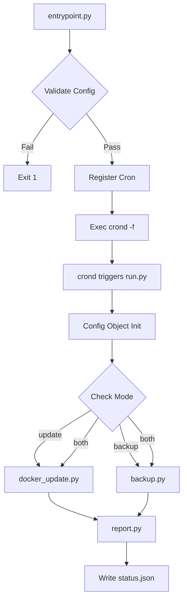
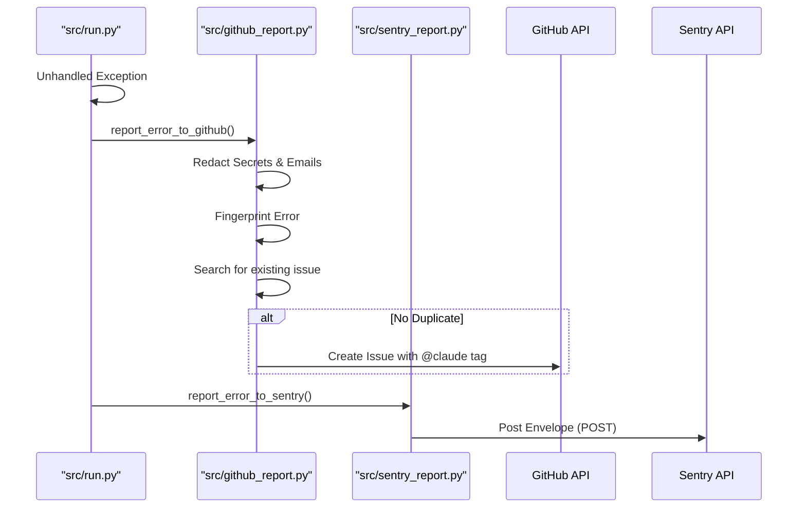

<details>
<summary>Relevant source files</summary>

The following files were used as context for generating this wiki page:

- [CLAUDE.md](CLAUDE.md)
- [src/run.py](src/run.py)
- [README.md](README.md)
- [tests/test_pr_changes.sh](tests/test_pr_changes.sh)
- [AGENTS.md](AGENTS.md)
- [src/entrypoint.py](src/entrypoint.py)
- [src/config.py](src/config.py)
</details>

# Local Development Guide

The `docker-idempotent-update` project is a Python-based utility designed for daily Docker host maintenance, including image updates, container recreation, and rclone-based backups. This guide outlines the architectural structure, configuration requirements, and development workflows necessary for local contributors.

Sources: [README.md:1-12](README.md#L1-L12), [CLAUDE.md:1-5](CLAUDE.md#L1-L5)

## Tech Stack and Conventions

The project adheres to a strict set of technical constraints to ensure portability and security within a single container environment.

*  **Language:** Python 3.13 using only the standard library (no third-party packages).
*  **Infrastructure:** Docker (Socket or Compose), rclone for backups, and msmtp for email notifications.
*  **Scheduler:** Internal cron daemon.
*  **Security:** Secrets must be provided via environment variables and never hardcoded.

Sources: [CLAUDE.md:7-14](CLAUDE.md#L7-L14), [CLAUDE.md:25-27](CLAUDE.md#L25-L27)

## Development Workflow

Development follows a standard Git flow with specific automated checks.

### Testing Changes
Before committing any code, changes should be validated using Docker Compose to simulate the runtime environment.

```bash
docker compose run --rm docker-maintenance
```

Sources: [CLAUDE.md:28](CLAUDE.md#L28), [README.md:58](README.md#L58)

### CI and Automated Validation
The project includes a shell script `tests/test_pr_changes.sh` that performs several static analysis and structure checks:
*  Validates YAML syntax for GitHub Actions and Issue Templates.
*  Ensures required sections exist in `AGENTS.md` and `CLAUDE.md`.
*  Verifies pull request templates and Dependabot configurations.

Sources: [tests/test_pr_changes.sh:1-15](tests/test_pr_changes.sh#L1-L15)

### Execution Logic Flow
The following diagram illustrates the startup and execution sequence of the application logic.



This diagram shows the transition from container entry to the scheduled daily maintenance job. 
Sources: [src/entrypoint.py:24-81](src/entrypoint.py#L24-L81), [src/run.py:27-46](src/run.py#L27-L46)

## Environment Configuration

Local development requires setting specific environment variables to control the application's behavior.

| Variable | Default | Purpose |
| :--- | :--- | :--- |
| `MODE` | `both` | Operation mode: `update`, `backup`, or `both`. |
| `DRY_RUN` | `false` | If `true`, logs actions without executing Docker or rclone changes. |
| `EMAIL_TO` | *(unset)* | Recipient for the summary email; disables email if empty. |
| `CRON_SCHEDULE`| `0 3 * * *` | Cron expression for the daily run. |
| `COMPOSE_FILE` | *(unset)* | Path to the compose file for Option B updates. |

Sources: [src/config.py:7-18](src/config.py#L7-L18), [README.md:104-111](README.md#L104-L111)

## Key System Components

### 1. Configuration Management (`src/config.py`)
The `Config` class centralizes environment variable parsing and reads the `backup.conf` file if it exists. It determines if the system `needs_update` or `needs_backup` based on the selected mode.
Sources: [src/config.py:1-46](src/config.py#L1-L46)

### 2. Update Logic (`src/docker_update.py`)
Supports two methods of updating:
*  **Option A (Socket):** Pulls images for all running containers and recreates them via `docker run`.
*  **Option B (Compose):** Uses `docker compose pull` and `up -d --remove-orphans`.

Sources: [src/docker_update.py:12-25](src/docker_update.py#L12-L25), [README.md:79-88](README.md#L79-L88)

### 3. Error Reporting
The system implements "best-effort" error reporting using only standard libraries.



This diagram depicts the automated error reporting flow when an unhandled exception occurs.
Sources: [src/run.py:72-80](src/run.py#L72-L80), [src/github_report.py:74-135](src/github_report.py#L74-L135), [src/sentry_report.py:53-114](src/sentry_report.py#L53-L114)

## Summary
The local development environment for `docker-idempotent-update` is designed for minimal overhead, relying on the Python standard library and Docker socket interaction. Developers should focus on maintaining idempotency in `docker_update.py` and `backup.py` while ensuring all changes are validated through the provided `docker compose` test commands and the `test_pr_changes.sh` script.

Sources: [CLAUDE.md:25-30](CLAUDE.md#L25-L30), [README.md:14-22](README.md#L14-L22)
