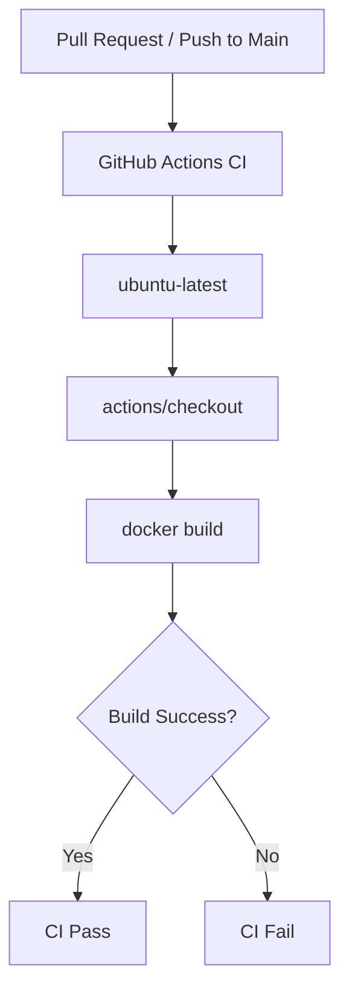
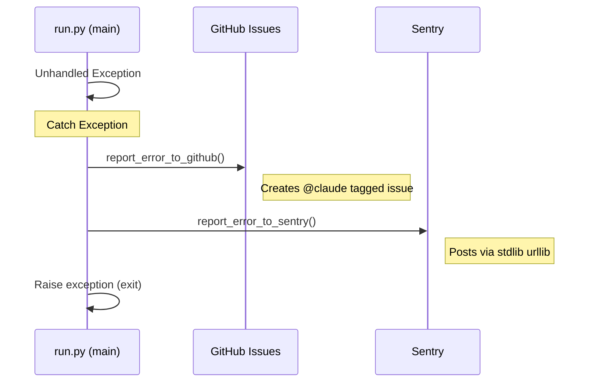

Relevant source files

The following files were used as context for generating this wiki page:

- [tests/test_pr_changes.sh](tests/test_pr_changes.sh)
- [.github/pull_request_template.md](.github/pull_request_template.md)
- [.github/workflows/ci.yml](.github/workflows/ci.yml)
- [AGENTS.md](../../../AGENTS.md)
- [CLAUDE.md](../../../CLAUDE.md)
- [src/run.py](../../../src/run.py)
- [README.md](../../../README.md)

# Testing Strategy

The testing strategy for the `docker-idempotent-update` project focuses on local validation, automated Continuous Integration (CI), and safe execution modes. It ensures that Docker image updates, backups, and reporting mechanisms function correctly across different deployment modes without compromising host stability.

The strategy encompasses automated shell scripts for configuration validation, a strict PR checklist, and a dedicated "Dry Run" mode within the core Python logic to simulate changes before execution.

Sources: [CLAUDE.md:1-25](CLAUDE.md#L1-L25), [README.md:1-20](README.md#L1-L20)

## Validation Tiers

The project utilizes a multi-tiered approach to validation, ranging from syntax checks to automated workflow triggers.

### Local Development Validation

Developers and AI agents are required to test changes locally using Docker Compose. The standard command for local testing is `docker compose run --rm docker-maintenance`, which ensures a clean environment for each test iteration.

Sources: [CLAUDE.md:21](CLAUDE.md#L21), [AGENTS.md:21](AGENTS.md#L21)

### Automated Configuration Testing
A specialized shell script, `tests/test_pr_changes.sh`, validates the integrity of the project's configuration and documentation. This script performs the following checks:
*  **YAML Syntax**: Validates issue templates, GitHub workflows, and Dependabot configurations.
*  **GitHub Workflow Logic**: Ensures the CI workflow is triggered correctly and follows least-privilege permissions.
*  **PR Template Compliance**: Verifies that the pull request template contains required sections like "Summary", "Testing", and "Checklist".
*  **Documentation Integrity**: Confirms that `AGENTS.md` and `CLAUDE.md` contain essential safety rules and technical stack information.

Sources: [tests/test_pr_changes.sh:1-218](tests/test_pr_changes.sh#L1-L218)

### CI Pipeline Logic
The GitHub Actions CI pipeline is triggered on every pull request and on pushes to the `main` branch. It specifically validates the Docker build process to ensure the container remains deployable.

The CI workflow is designed with concurrency management to cancel in-progress runs when new commits are pushed to the same branch.

Sources: [tests/test_pr_changes.sh:150-184](tests/test_pr_changes.sh#L150-L184)

## Execution Safety: Dry Run Mode

A critical component of the testing and safety strategy is the `DRY_RUN` configuration. When enabled via the `DRY_RUN=true` environment variable, the system logs intended Docker/rclone actions without executing them — it still writes `status.json` (see below) and still sends the email report as usual.

### Dry Run Behavior by Module

| Module | Action in Dry Run | Source |
| :--- | :--- | :--- |
| **Docker Update** | Logs intended `docker compose` or `socket` pulls and restarts without execution. | [src/docker_update.py:46-49](src/docker_update.py#L46-L49), [src/docker_update.py:84-86](src/docker_update.py#L84-L86) |
| **Backup** | Logs the `rclone sync` command and source/destination paths without moving data. | [src/backup.py:58-60](src/backup.py#L58-L60) |
| **Status Reporting** | Writes a `status.json` file indicating `dry_run: true`. | [src/run.py:61-68](src/run.py#L61-L68) |

Sources: [src/config.py:14](src/config.py#L14), [src/run.py:27-29](src/run.py#L27-L29)

## Error Handling and Reporting

Testing also covers the application's resilience to unhandled exceptions. The system is designed to fail gracefully by reporting errors to external platforms if configured.

These reporting mechanisms are themselves "best-effort" and use standard libraries only to avoid dependency-related failures during error reporting.

Sources: [src/run.py:75-81](src/run.py#L75-L81), [src/github_report.py:1-25](src/github_report.py#L1-L25), [src/sentry_report.py:1-15](src/sentry_report.py#L1-L15)

## Pull Request Requirements

The testing strategy is enforced through a mandatory PR checklist defined in `.github/pull_request_template.md`. Contributors must verify:
*  Tests pass locally.
*  The PR is focused and isolated.
*  No unrelated changes are included.
*  No credentials or secrets are committed.

Sources: [tests/test_pr_changes.sh:105-116](tests/test_pr_changes.sh#L105-L116), [.github/pull_request_template.md:1-20](.github/pull_request_template.md#L1-L20)

## Conclusion

The `docker-idempotent-update` testing strategy prioritizes environment safety through local Docker-based testing and a robust Dry Run mode. By combining automated configuration validation in CI with a strict manual checklist for PRs, the project ensures that daily host maintenance remains idempotent and secure.
