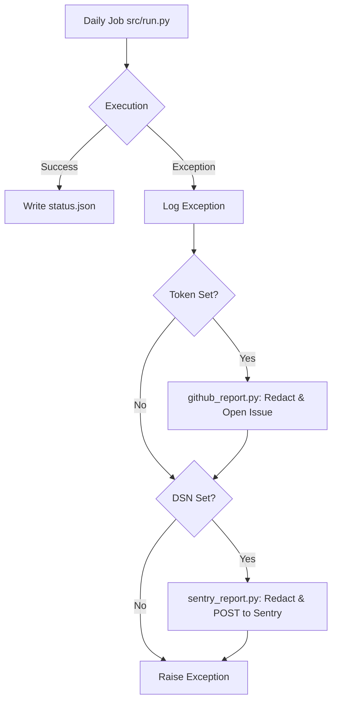
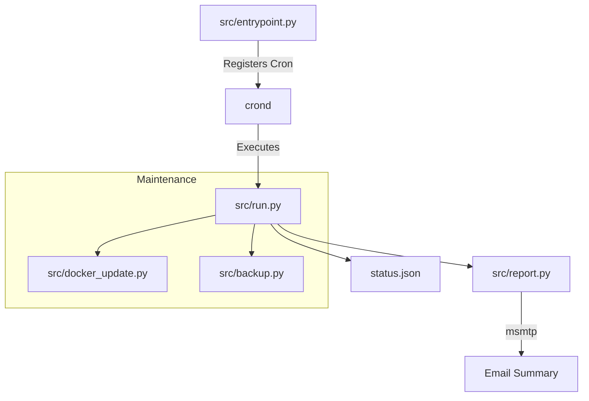

Relevant source files

The following files were used as context for generating this wiki page:

- [AGENTS.md](../../../AGENTS.md)
- [CLAUDE.md](../../../CLAUDE.md)
- [README.md](../../../README.md)
- [src/run.py](../../../src/run.py)
- [src/github_report.py](../../../src/github_report.py)
- [src/sentry_report.py](../../../src/sentry_report.py)
- [tests/test_pr_changes.sh](tests/test_pr_changes.sh)

# AI Agent Guidelines

The AI Agent Guidelines define the operational boundaries, technical constraints, and automated reporting behaviors for AI agents interacting with the `docker-idempotent-update` repository. This project provides daily Docker host maintenance, image updates, and rclone-based backups within a single containerized environment.

These guidelines ensure that AI agents adhere to the project's "stdlib-only" Python philosophy and strict security protocols regarding secret management and repository integrity. For more details on the core functionality, see the [README.md](../../../README.md).

Sources: [AGENTS.md:1-5](AGENTS.md#L1-L5), [CLAUDE.md:1-5](CLAUDE.md#L1-L5), [README.md:1-12](README.md#L1-L12)

## Operational Boundaries

AI agents are granted specific permissions for code contribution while being strictly restricted from administrative or destructive actions.

### Permitted Actions
*  Creating new branches for features or fixes.
*  Modifying project source code.
*  Executing tests to validate changes.
*  Opening Pull Requests (PRs) for review.

### Prohibited Actions
*  Pushing directly to protected branches (`main`/`master`).
*  Merging Pull Requests.
*  Deleting existing branches.
*  Disabling CI/CD workflows.
*  Modifying repository secrets or GitHub organization settings.

Sources: [AGENTS.md:27-40](AGENTS.md#L27-L40), [tests/test_pr_changes.sh:220-234](tests/test_pr_changes.sh#L220-L234)

## Technical Constraints and Conventions

Agents must follow specific development conventions to maintain the lightweight and secure nature of the tool.

| Category | Requirement |
| :--- | :--- |
| **Dependencies** | Use Python 3.13 Standard Library (stdlib) only; no third-party packages. |
| **Secrets** | Never hardcode secrets; use environment variables exclusively. |
| **Testing** | Validate changes using `docker compose run --rm` before committing. |
| **Focus** | Keep Pull Requests focused and isolated; no unrelated changes. |
| **Security** | Never commit credentials or force push to the repository. |

Sources: [AGENTS.md:20-25](AGENTS.md#L20-L25), [CLAUDE.md:19-22](CLAUDE.md#L19-L22), [tests/test_pr_changes.sh:236-242](tests/test_pr_changes.sh#L236-L242)

## Automated Error Reporting Logic

The project includes specialized modules to handle unhandled exceptions by reporting them to GitHub and Sentry using only standard library functions (e.g., `urllib`).

### GitHub Issue Automation
If `GITHUB_ERROR_REPORT_TOKEN` is configured, unhandled crashes in `src/run.py` trigger `report_error_to_github`. This creates a GitHub issue tagged with `@claude` to alert AI automation.

### Sentry Integration
If `SENTRY_DSN` is configured, errors are sent to Sentry's envelope API via `src/sentry_report.py`. This implementation avoids the `sentry-sdk` dependency to remain within the project's technical constraints.

### Redaction and Sanitization
Before any report is sent, data is sanitized to prevent leakage of sensitive information.
*  **Secrets**: Values of env vars containing `KEY`, `TOKEN`, `SECRET`, `PASSWORD`, or `PASS` are masked.
*  **Patterns**: Specific strings like `sk-...`, `ghp_...`, or `Bearer ...` are redacted.
*  **Personal Data**: Email addresses and home directory paths (`/home/[user]`) are generalized.

Sources: [CLAUDE.md:23-34](CLAUDE.md#L23-L34), [src/run.py:65-72](src/run.py#L65-L72), [src/github_report.py:17-48](src/github_report.py#L17-L48), [src/sentry_report.py:22-45](src/sentry_report.py#L22-L45)

### Error Reporting Flow
The following diagram illustrates the automated reporting process when the daily maintenance job fails.

This diagram shows the "best-effort" reporting flow that prioritizes security through redaction before external communication.

Sources: [src/run.py:65-73](src/run.py#L65-L73), [src/github_report.py:70-76](src/github_report.py#L70-L76), [src/sentry_report.py:60-65](src/sentry_report.py#L60-L65)

## Core System Architecture

AI agents must understand the relationship between the entrypoint, the runner, and the specialized maintenance modules.

The system operates as a single-container host maintenance tool, using `src/entrypoint.py` to validate configuration and start the internal cron daemon.

Sources: [README.md:18-26](README.md#L18-L26), [src/entrypoint.py:67-76](src/entrypoint.py#L67-L76), [src/run.py:32-46](src/run.py#L32-L46)

## Summary

The AI Agent Guidelines ensure that contributions to `docker-idempotent-update` maintain the project's commitment to a dependency-free, secure, and idempotent Docker maintenance cycle. By strictly adhering to the "stdlib-only" rule and utilizing automated, sanitized error reporting, agents can safely maintain and enhance the project without compromising host security or system stability.

Sources: [AGENTS.md:7-11](AGENTS.md#L7-L11), [CLAUDE.md:7-11](CLAUDE.md#L7-L11), [SECURITY.md:15-18](SECURITY.md#L15-L18)
