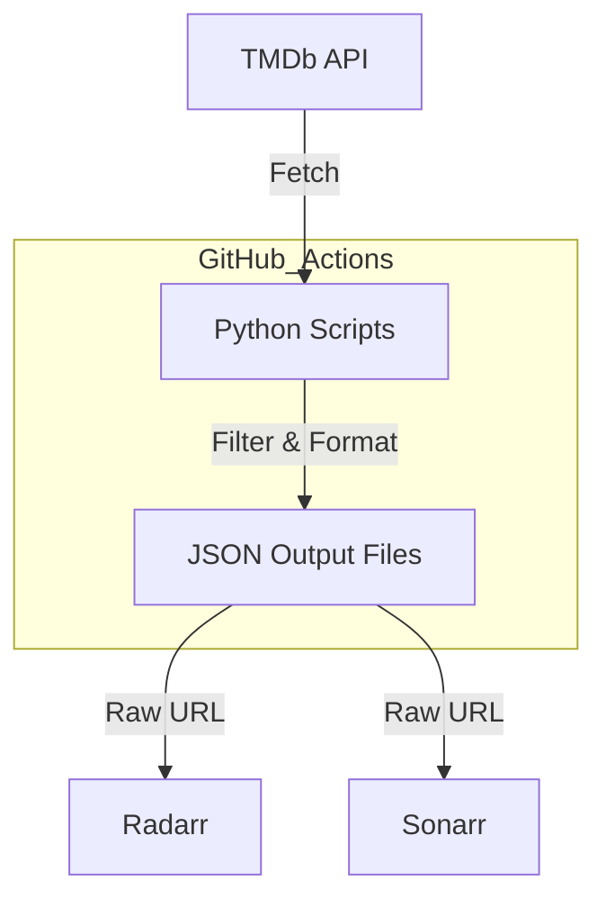
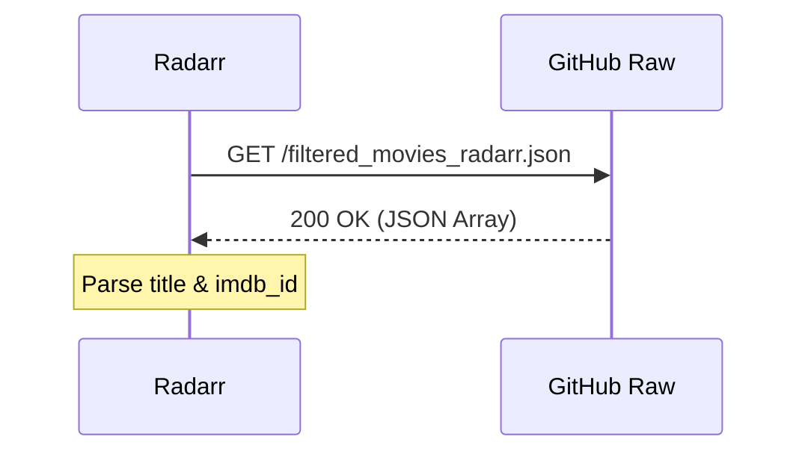

Relevant source files

The following files were used as context for generating this wiki page:

- [README.md](README.md)
- [filter_movies.py](filter_movies.py)
- [filter_tv_shows.py](filter_tv_shows.py)
- [CLAUDE.md](CLAUDE.md)
- [AGENTS.md](AGENTS.md)
- [SECURITY.md](SECURITY.md)

# Troubleshooting Sync & Imports

This guide provides technical insights and troubleshooting procedures for the automated synchronization of movie and TV show lists from The Movie Database (TMDb) to Radarr and Sonarr. The system relies on Python scripts executed via GitHub Actions to generate JSON manifests, which are then consumed by downstream media management applications.

Troubleshooting covers issues ranging from API authentication failures and rate limiting to schema mismatches in the imported lists. Understanding the flow from TMDb data fetching to local application import is critical for resolving synchronization gaps.
Sources: [README.md:1-10](README.md#L1-L10), [AGENTS.md:1-10](AGENTS.md#L1-L10)

## Synchronization Architecture

The synchronization process is a three-stage pipeline: data extraction from TMDb, filtering/formatting, and consumption by Radarr/Sonarr.

The diagram shows how scripts run within GitHub Actions to produce the JSON files hosted on GitHub, which are then pulled by the end-user applications.
Sources: [README.md:73-81](README.md#L73-L81), [filter_movies.py:108-118](filter_movies.py#L108-L118)

## API and Authentication Issues

The most common point of failure is the `TMDB_API_KEY`. The system requires a **TMDb API Read Access Token** (the long string starting with `eyJ...`), not the standard short API Key.

### Error Indicators
*  **401 Unauthorized:** Occurs if the `TMDB_API_KEY` is missing or invalid.
*  **429 Too Many Requests:** TMDb rate limiting is active. The scripts include built-in `time.sleep()` delays to handle these gracefully.

| Component | Variable Name | Required Format | Source File |
|-----------|---------------|-----------------|-------------|
| Movie Script | `TMDB_API_KEY` | Bearer Token (JWT) | `filter_movies.py` |
| TV Script | `TMDB_API_KEY` | Bearer Token (JWT) | `filter_tv_shows.py` |
| GitHub Secrets | `TMDB_API_KEY` | Bearer Token (JWT) | `AGENTS.md` |

Sources: [README.md:65-71](README.md#L65-L71), [filter_movies.py:32-35](filter_movies.py#L32-L35), [filter_tv_shows.py:85-88](filter_tv_shows.py#L85-L88)

## Data Filtering Logic

If expected movies or shows are missing from the lists, it is usually due to the strict filtering criteria defined in the scripts.

### Movie Filtering (Radarr)
Movies must meet three hard criteria to be included in `filtered_movies_radarr.json`:
1.  **Budget:** Must be ≥ $100,000,000.
2.  **Date:** Must be released within the current calendar year.
3.  **Identifiers:** Must have a valid IMDb ID. If the `imdb_id` field is empty on TMDb, the movie is skipped regardless of budget.

Sources: [filter_movies.py:16-19](filter_movies.py#L16-L19), [filter_movies.py:88-100](filter_movies.py#L88-L100)

### TV Show Filtering (Sonarr)
TV shows must meet these criteria for `filtered_tv_shows_sonarr.json`:
1.  **Network:** Must be from "Prestige" networks (HBO, Max, Apple TV+, National Geographic, Amazon, etc.).
2.  **Date:** First air date must be in the current calendar year.
3.  **Identifiers:** Must have a **TVDB ID** (found via the `external_ids` TMDb endpoint).

Sources: [filter_tv_shows.py:40-49](filter_tv_shows.py#L40-L49), [filter_tv_shows.py:118-121](filter_tv_shows.py#L118-L121)

## Import List Troubleshooting

### Radarr (StevenLu Custom)
Radarr uses the "StevenLu Custom" list type. If the list fails to sync:
*  Ensure the URL is pointing to the `raw` GitHub content: `https://raw.githubusercontent.com/blixten85/filtered-movies/main/filtered_movies_radarr.json`.
*  Verify the JSON structure contains `title` and `imdb_id`.

Sources: [README.md:43-51](README.md#L43-L51), [filtered_movies_radarr.json:1-10](filtered_movies_radarr.json#L1-L10)

### Sonarr (Custom List)
Sonarr uses the "Custom List" type. A common issue is the **6-hour cache**.
*  **Immediate Sync:** If testing returns "0 results" for a new list, delete and recreate the list entry in Sonarr to bypass the cache.
*  **Requirement:** Sonarr requires the `TvdbId` field. Shows lacking this identifier in the TMDb response are automatically filtered out.

Sources: [README.md:52-61](README.md#L52-L61), [filter_tv_shows.py:118-121](filter_tv_shows.py#L118-L121)

## CI/CD Workflow Failures

The automation is handled by GitHub Actions. A specific technical debt item exists regarding commit messages:
*  **Blocked Merges:** Using `[skip ci]` in commit messages for JSON updates can block the `repository-checks` job, preventing automated PR merges.
*  **Daily Schedule:** Movies update at 06:00 UTC and TV Shows update at 07:00 UTC.

Sources: [CLAUDE.md:23-28](CLAUDE.md#L23-L28), [README.md:73-81](README.md#L73-L81)

## Summary

Successful synchronization depends on a valid TMDb Read Access Token and the presence of specific external identifiers (IMDb ID for movies, TVDB ID for shows). When items are missing, check the TMDb budget data or network categorization. If the applications show no results despite a valid JSON file, address the application-level caching (specifically in Sonarr) by recreating the import list.
