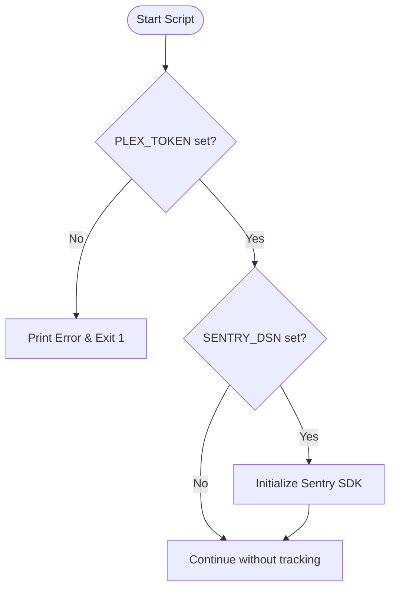
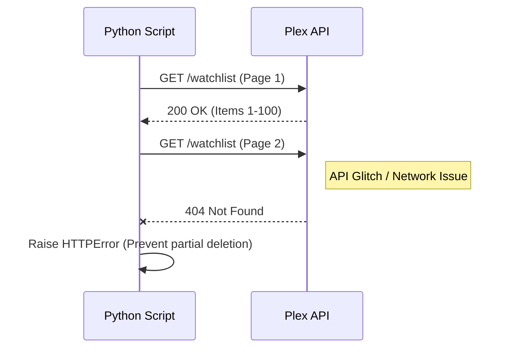

<details>
<summary>Relevant source files</summary>

The following files were used as context for generating this wiki page:

- [README.md](README.md)
- [plex_clear_watchlist.py](plex_clear_watchlist.py)
- [AGENTS.md](AGENTS.md)
- [SECURITY.md](SECURITY.md)
- [docker-compose.yml](docker-compose.yml)
- [requirements.txt](requirements.txt)
</details>

# Common Issues & Debugging

This page outlines common issues, error handling mechanisms, and debugging procedures for the `plex_clear_watchlist` tool. The application is designed as a one-shot utility to manage Plex Watchlist items via the Plex API, utilizing environmental configurations for authentication and error tracking.

Effective debugging requires verifying environment variables, understanding the API pagination logic, and monitoring logs from the Docker container or Python execution.

## Authentication and Environment Configuration

The most common issue is the absence or invalidity of the `PLEX_TOKEN`. The script requires this token to authenticate against the Plex API. If it is missing, the script will exit immediately with an error message directing the user to export the variable.

### Configuration Requirements

| Variable | Required | Description |
| :--- | :--- | :--- |
| `PLEX_TOKEN` | Yes | Personal Plex token retrieved from Account Settings. |
| `SENTRY_DSN` | No | Data Source Name for Sentry error tracking. |

Sources: [plex_clear_watchlist.py:9-15](plex_clear_watchlist.py#L9-L15), [README.md:16-18](README.md#L16-L18), [docker-compose.yml:7-8](docker-compose.yml#L7-L8)



The flow shows how the application validates configuration before proceeding to API calls. 
Sources: [plex_clear_watchlist.py:9-15](plex_clear_watchlist.py#L9-L15), [plex_clear_watchlist.py:92-100](plex_clear_watchlist.py#L92-L100)

## API Connectivity and Paginating Errors

The script fetches the watchlist using a paginated approach (100 items per page). Issues may arise during network transmission or if the Plex API returns unexpected status codes.

### 404 Error During Pagination
A specific debugging scenario handled in the code is receiving an HTTP 404 error on pages other than the first. If the script successfully retrieves some items but encounters a 404 on a subsequent page, it raises a `requests.HTTPError`. This prevents the script from assuming the list is complete and performing an accidental partial deletion.

### Timeout Handling
The script implements a global request timeout of 30 seconds to prevent hanging on unresponsive network conditions.

Sources: [plex_clear_watchlist.py:22-54](plex_clear_watchlist.py#L22-L54)



This diagram illustrates the safety mechanism implemented to handle API inconsistencies during data retrieval.
Sources: [plex_clear_watchlist.py:32-41](plex_clear_watchlist.py#L32-L41)

## Execution Logic and Deletion Failures

When deleting items, the script iterates through the collected list. If an item fails to delete, the script logs the failure to `stderr` and captures the event in Sentry (if configured).

### Key Functions
- `get_watchlist()`: Handles the logic for fetching all items with pagination support.
- `delete_from_watchlist(rating_key, title)`: Executes the `DELETE` request for a specific item identified by its `ratingKey`.
- `get_item_title(item)`: Safely extracts a display name for logging, defaulting to the `guid` or "Unknown" if the title is missing.

Sources: [plex_clear_watchlist.py:24](plex_clear_watchlist.py#L24), [plex_clear_watchlist.py:57](plex_clear_watchlist.py#L57), [plex_clear_watchlist.py:70](plex_clear_watchlist.py#L70)

### Debugging with Dry Run
To debug logic or verify which items will be impacted without making changes, users should use the `--dry-run` flag. In this mode, Sentry is disabled, and no `DELETE` requests are sent.

```bash
python3 plex_clear_watchlist.py --dry-run
```

Sources: [plex_clear_watchlist.py:76](plex_clear_watchlist.py#L76), [AGENTS.md:15](AGENTS.md#L15)

## Dependency and Security Management

Issues related to environment compatibility are minimized by the use of Docker and a strict `requirements.txt`.

- **Python Version:** The project targets Python 3.14.
- **Dependencies:** Uses `requests` for API interaction and `sentry-sdk` for error monitoring.
- **Security:** Vulnerabilities should be reported confidentially via GitHub's private reporting rather than public issues.

Sources: [AGENTS.md:7](AGENTS.md#L7), [requirements.txt:1-2](requirements.txt#L1-L2), [SECURITY.md:8-12](SECURITY.md#L8-L12)

## Summary
Debugging `plex_clear_watchlist` primarily involves verifying the `PLEX_TOKEN` and observing the standard output for HTTP status codes. The application includes specific safeguards against partial deletions caused by API glitches and provides a safe `--dry-run` mode for pre-execution verification. For persistent issues, enabling `SENTRY_DSN` provides automated exception tracking.
