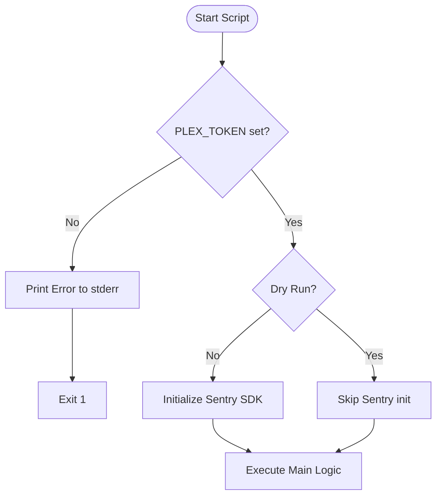
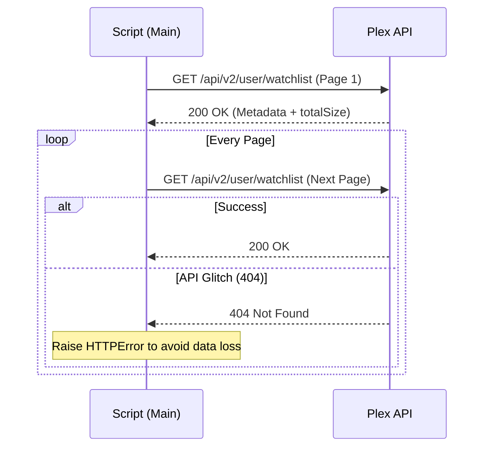

Relevant source files

The following files were used as context for generating this wiki page:

- [plex_clear_watchlist.py](plex_clear_watchlist.py)
- [README.md](README.md)
- [AGENTS.md](AGENTS.md)
- [CLAUDE.md](CLAUDE.md)
- [docker-compose.yml](docker-compose.yml)
- [SECURITY.md](SECURITY.md)

# Common Issues & Debugging

This page outlines common configuration errors, runtime failures, and debugging strategies for the `plex_clear_watchlist` utility. The tool is designed as a one-shot script to manage Plex Watchlist items via the Plex API, and most issues arise from environment configuration or API communication glitches.

Sources: [plex_clear_watchlist.py:1-5](plex_clear_watchlist.py#L1-L5), [AGENTS.md:1-5](AGENTS.md#L1-L5), [README.md:1-10](README.md#L1-L10)

## Authentication and Environment Configuration

The primary cause of failure is the absence or invalidity of the `PLEX_TOKEN`. The script requires this token to authenticate against the Plex API.

### PLEX_TOKEN Issues
The script performs an immediate check for the `PLEX_TOKEN` environment variable. If it is missing, the script exits with a status code of 1 and provides instructions on how to set it.

Sources: [plex_clear_watchlist.py:10-15](plex_clear_watchlist.py#L10-L15), [AGENTS.md:21-23](AGENTS.md#L21-L23)

| Issue | Symptom | Resolution |
| :--- | :--- | :--- |
| Missing Token | "Error: PLEX_TOKEN environment variable not set" | The script reads `os.environ` directly and does not load `.env` files itself. Direct execution: `export PLEX_TOKEN=...`. Docker Compose: a `.env` file works because Compose interpolates it into the container's environment. |
| Invalid Token | HTTP 401/403 errors during API calls | Verify the token in Plex Settings -> Account -> Security. |
| Hardcoded Secret | Security Policy violation | Always use environment variables for secrets; never commit them. |

Sources: [plex_clear_watchlist.py:10-15](plex_clear_watchlist.py#L10-L15), [README.md:12-14](README.md#L12-L14), [SECURITY.md:14-16](SECURITY.md#L14-L16)

### Environment Flow Diagram
The following diagram illustrates how the application validates the environment before execution.

Sources: [plex_clear_watchlist.py:10-15](plex_clear_watchlist.py#L10-L15), [plex_clear_watchlist.py:92-100](plex_clear_watchlist.py#L92-L100), [docker-compose.yml:7-8](docker-compose.yml#L7-L8)

## API Communication and Paging Errors

The script interacts with `https://plex.tv/api/v2/user/watchlist`. Failures in this layer are typically handled via the `requests` library and recorded in Sentry if configured.

### HTTP 404 During Pagination
A specific edge case exists where the Plex API might return a `404 Not Found` in the middle of a paginated request. The script handles this by raising an `HTTPError` to prevent "partial deletion," which would occur if the script assumed the list ended prematurely.

Sources: [plex_clear_watchlist.py:27-42](plex_clear_watchlist.py#L27-L42)

### Debugging with Dry Run
To safely debug the logic without modifying the actual Watchlist, the `--dry-run` flag should be used. This prevents any `DELETE` requests from being sent to the Plex API and disables Sentry initialization.

Sources: [plex_clear_watchlist.py:91-100](plex_clear_watchlist.py#L91-L100), [CLAUDE.md:24-25](CLAUDE.md#L24-L25)

Sources: [plex_clear_watchlist.py:25-54](plex_clear_watchlist.py#L25-L54)

## Runtime Execution Failures

Failures during the deletion process are logged to `stderr`. The script tracks successful and failed deletions and provides a summary at the end.

### Deletion Logic Components
The script processes items based on user-provided arguments:
- **Limit**: Deletes only a specific number of items (`--limit N`).
- **Keep**: Retains the N most recently added items (`--keep N`).

Sources: [plex_clear_watchlist.py:115-125](plex_clear_watchlist.py#L115-L125), [README.md:37-41](README.md#L37-L41)

### Error Tracking with Sentry
If `SENTRY_DSN` is provided, the script automatically captures:
1. `RequestException` during the initial watchlist fetch.
2. Individual item deletion failures, including the `rating_key` in the event extras for easier identification.

Sources: [plex_clear_watchlist.py:106-110](plex_clear_watchlist.py#L106-L110), [plex_clear_watchlist.py:145-154](plex_clear_watchlist.py#L145-L154), [docker-compose.yml:8](docker-compose.yml#L8)

### Summary Table: Flags and Debugging Behavior

| Flag | Impact on Debugging | Behavior |
| :--- | :--- | :--- |
| `--dry-run` | Safe Mode | Disables Sentry and skips `DELETE` requests. |
| `--limit N` | Scoped Testing | Limits the scope of the operation for verification. |
| `--keep N` | Retention Logic | Verifies that the most recent items are preserved. |

Sources: [plex_clear_watchlist.py:86-90](plex_clear_watchlist.py#L86-L90), [README.md:37-41](README.md#L37-L41)

## Connectivity and Docker Issues

When running via Docker or Docker Compose, connectivity issues can occur if the host cannot reach `plex.tv`.

1. **Timeout**: The script uses a hardcoded `REQUEST_TIMEOUT` of 30 seconds for all API calls.
2. **DNS/Network**: Ensure the container has outbound internet access to reach the Plex API.
3. **Docker Compose Forwarding**: The `docker-compose.yml` file is configured to forward `PLEX_TOKEN` and `SENTRY_DSN` from the host environment to the container.

Sources: [plex_clear_watchlist.py:21](plex_clear_watchlist.py#L21), [docker-compose.yml:6-8](docker-compose.yml#L6-L8), [AGENTS.md:7-10](AGENTS.md#L7-L10)

## Conclusion

Debugging the `plex_clear_watchlist` utility primarily involves verifying the `PLEX_TOKEN` environment variable and using the `--dry-run` flag to simulate API interactions. By leveraging Sentry integration and clear exit codes, the tool provides visibility into pagination errors and specific item deletion failures.

Sources: [plex_clear_watchlist.py:106-110](plex_clear_watchlist.py#L106-L110), [README.md:12-14](README.md#L12-L14)
