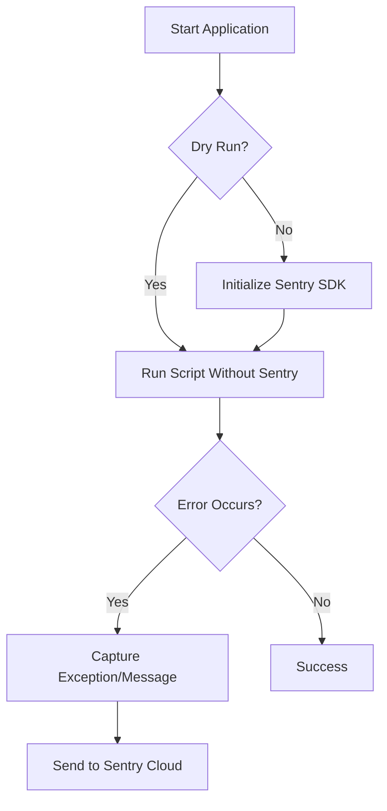
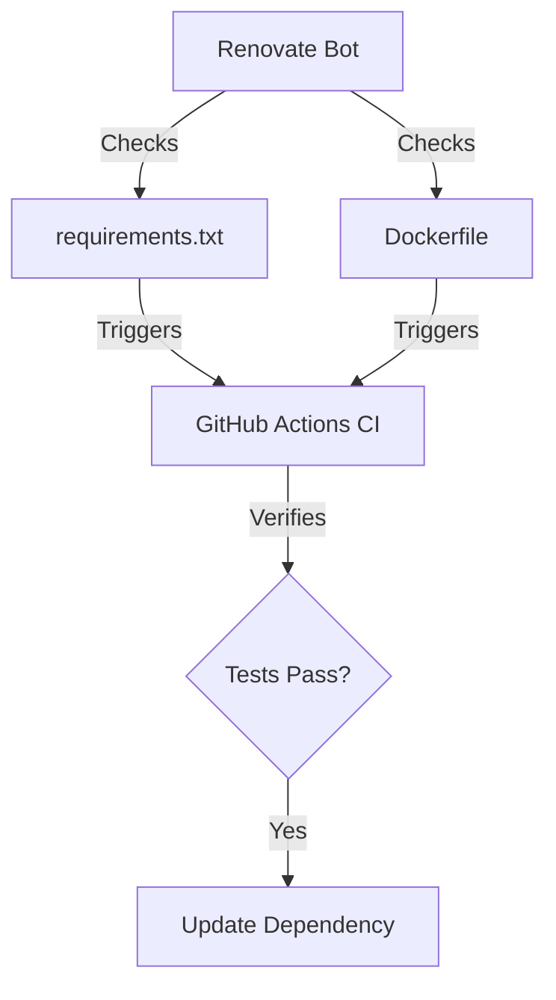

Relevant source files

The following files were used as context for generating this wiki page:

- [README.md](README.md)
- [SECURITY.md](SECURITY.md)
- [plex_clear_watchlist.py](plex_clear_watchlist.py)
- [docker-compose.yml](docker-compose.yml)
- [requirements.txt](requirements.txt)
- [AGENTS.md](AGENTS.md)

# Bug Reporting

Bug reporting in the `plex_clear_watchlist` project encompasses the identification, automated tracking, and manual submission of software defects and security vulnerabilities. The system leverages integrated error tracking via Sentry for runtime exceptions and GitHub's infrastructure for vulnerability disclosures and general issue management.

The project maintains a strict distinction between general software bugs and security-related vulnerabilities to ensure appropriate disclosure protocols are followed. General issues are managed through public interfaces, while security-sensitive bugs utilize private reporting channels.

Sources: [SECURITY.md:1-12](SECURITY.md#L1-L12), [README.md:12-15](README.md#L12-L15), [plex_clear_watchlist.py:101-109](plex_clear_watchlist.py#L101-L109)

## Automated Error Tracking

The application implements automated error tracking using the Sentry SDK. This system captures runtime exceptions during the execution of the script, particularly during interactions with the Plex API.

### Sentry Integration
Initialization is gated on `--dry-run`, not on whether `SENTRY_DSN` is set — the SDK initializes whenever the script is NOT in dry-run mode; `SENTRY_DSN` itself is optional (without one, the SDK runs disabled). The integration is configured to avoid sending Personally Identifiable Information (PII) and local variables to ensure user privacy.

*The diagram above shows the logic flow for initializing and utilizing automated error tracking.*

Sources: [plex_clear_watchlist.py:101-109](plex_clear_watchlist.py#L101-L109), [README.md:14-15](README.md#L14-L15), [requirements.txt:2](requirements.txt#L2)

### Error Capture Points
The script specifically targets two primary areas for automated bug reporting:
1.  **Watchlist Retrieval**: Failures to fetch the watchlist from Plex (except during dry runs) are captured as exceptions.
2.  **Item Deletion**: Failures to delete specific items are captured as messages with extra metadata, such as the `rating_key`.

| Component | Error Type | Metadata Captured |
| :--- | :--- | :--- |
| `get_watchlist` | `RequestException` | Full-stack trace |
| `delete_from_watchlist` | `capture_message` | `rating_key`, Fingerprint: `watchlist-delete-failure` |

Sources: [plex_clear_watchlist.py:115-118](plex_clear_watchlist.py#L115-L118), [plex_clear_watchlist.py:157-165](plex_clear_watchlist.py#L157-L165)

## Security Vulnerability Reporting

The project defines specific protocols for reporting security-related bugs to prevent public exposure of sensitive vulnerabilities before a patch is available.

### Private Reporting Channel
Users who discover security vulnerabilities are instructed **not** to open public issues. Instead, they must use GitHub's private reporting feature.

| Feature | Protocol |
| :--- | :--- |
| Channel | [GitHub Private Reporting](https://github.com/blixten85/plex_clear_watchlist/security/advisories/new) |
| Response Time | Within 48 hours |
| Remediation | Patch release as soon as possible |

Sources: [SECURITY.md:7-14](SECURITY.md#L7-L14)

## Environment and Dependency Management

Bugs related to environment configuration or outdated dependencies are managed through standardized configuration files and automated update tools.

### Dependency Tracking
The project uses `renovate` to keep dependencies updated, which helps in preemptively addressing bugs caused by vulnerable or outdated packages.

*This flow represents the automated process for maintaining dependency health to reduce bug surface area.*

Sources: [renovate.json:1-6](renovate.json#L1-L6), [README.md:3-6](README.md#L3-L6), [SECURITY.md:19](SECURITY.md#L19)

### Configuration Reporting
When reporting issues, the following configuration elements from `docker-compose.yml` and the environment are often relevant:
- `PLEX_TOKEN`: Required for authentication; its absence triggers an immediate error report to `stderr`.
- `SENTRY_DSN`: Optional; enables the reporting mechanisms described above.
- Container Image: `ghcr.io/blixten85/plex-clear-watchlist:latest`.

Sources: [plex_clear_watchlist.py:10-14](plex_clear_watchlist.py#L10-L14), [docker-compose.yml:1-8](docker-compose.yml#L1-L8)

## Summary
Bug reporting in this project is a multi-layered system combining manual security disclosures via GitHub, automated runtime error capturing via Sentry, and proactive dependency management via Renovate. This ensures that both functional defects and security risks are addressed through appropriate, high-visibility, or high-security channels.
