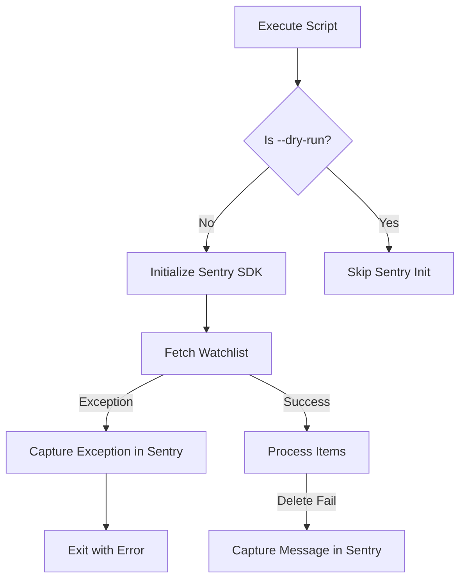

Relevant source files

The following files were used as context for generating this wiki page:

- [SECURITY.md](SECURITY.md)
- [plex_clear_watchlist.py](plex_clear_watchlist.py)
- [README.md](README.md)
- [AGENTS.md](AGENTS.md)
- [docker-compose.yml](docker-compose.yml)
- [.github/ISSUE_TEMPLATE/bug-reports.md](.github/ISSUE_TEMPLATE/bug-reports.md)

# Bug Reporting

Bug reporting in the `plex_clear_watchlist` project is a structured process designed to identify, document, and resolve software defects and security vulnerabilities. The project utilizes GitHub's infrastructure for public issue tracking while maintaining a distinct, confidential path for security-related concerns to protect user data and system integrity.

The system encompasses automated error tracking via Sentry, environment-based configuration for debugging, and specific protocols for contributors and AI agents to ensure that bug fixes do not introduce regressions.

## Vulnerability Reporting and Security

Security-related bugs are handled with a high degree of confidentiality. Users are explicitly instructed not to open public issues for security vulnerabilities. Instead, the project leverages GitHub's private reporting feature to ensure that sensitive flaws are addressed before they can be exploited.

### Security Protocols
*  **Confidentiality**: All security vulnerabilities must be reported via the private [GitHub Security Advisory](https://github.com/blixten85/plex_clear_watchlist/security/advisories/new) tool.
*  **Response Time**: The project aims for a response within 48 hours for confirmed security issues.
*  **Secret Management**: To prevent accidental credential leaks (a common source of "bugs"), the project strictly forbids hardcoding `PLEX_TOKEN` and requires the use of environment variables.

Sources: [SECURITY.md:10-18](SECURITY.md#L10-L18), [AGENTS.md:18](AGENTS.md#L18)

## Automated Error Tracking

The application integrates `sentry_sdk` to capture and report runtime exceptions and failures automatically. This provides developers with real-time telemetry on bugs occurring in production environments.

### Error Capture Logic
Automated reporting is conditional and configurable:
1.  **Sentry DSN**: Tracking is only enabled if the `SENTRY_DSN` environment variable is provided.
2.  **Dry Run Exclusion**: Error tracking is disabled during `--dry-run` operations to prevent development noise from affecting production logs.
3.  **Specific Failures**: The system captures `requests.RequestException` during watchlist retrieval and logs specific messages for individual item deletion failures.

Sources: [plex_clear_watchlist.py:90-98](plex_clear_watchlist.py#L90-L98), [plex_clear_watchlist.py:104-108](plex_clear_watchlist.py#L104-L108), [plex_clear_watchlist.py:145-153](plex_clear_watchlist.py#L145-L153)

## Technical Bug Reporting Requirements

When reporting a standard bug (non-security), the project requires specific technical context to facilitate reproduction and resolution.

### Required Context for Reports
| Category | Data Points | Source |
| :--- | :--- | :--- |
| **Environment** | Docker version, Python version (3.14), OS | [AGENTS.md:7](AGENTS.md#L7), [docker-compose.yml:3](docker-compose.yml#L3) |
| **Execution** | Command used (e.g., `--limit`, `--keep`), Log output | [README.md:20-23](README.md#L20-L23), [plex_clear_watchlist.py:82-88](plex_clear_watchlist.py#L82-L88) |
| **API State** | HTTP status codes (e.g., 404 during pagination), API response data | [plex_clear_watchlist.py:38-51](plex_clear_watchlist.py#L38-L51) |

### Pagination Edge Cases
A critical bug-prevention logic exists within the `get_watchlist` function. If the Plex API returns a `404` status code during active pagination (after the first page), the script raises an `HTTPError` rather than returning a partial list. This prevents the "bug" of incomplete deletions where a user might think their entire list was cleared when only a segment was processed.

Sources: [plex_clear_watchlist.py:38-48](plex_clear_watchlist.py#L38-L48)

## Contributor and Agent Guidelines

For developers or AI agents fixing bugs, the project enforces strict operational constraints to maintain stability.

*  **Testing**: All tests must pass before a bug fix is accepted.
*  **Focus**: Pull Requests (PRs) must remain focused on the specific bug and never include unrelated changes.
*  **Side Effects**: Fixes involving the `--dry-run` flag must ensure the flag remains safe to use without side effects.
*  **Version Support**: Bug fixes are prioritized for the `latest` version.

Sources: [AGENTS.md:21-42](AGENTS.md#L21-L42), [SECURITY.md:6](SECURITY.md#L6)

## Summary
Bug reporting in `plex_clear_watchlist` is divided between public GitHub issues for functional defects and private advisories for security vulnerabilities. The process is supported by automated Sentry integration and strict environment-based configuration to ensure that errors are captured accurately and credentials remain protected during the debugging and resolution phases.
