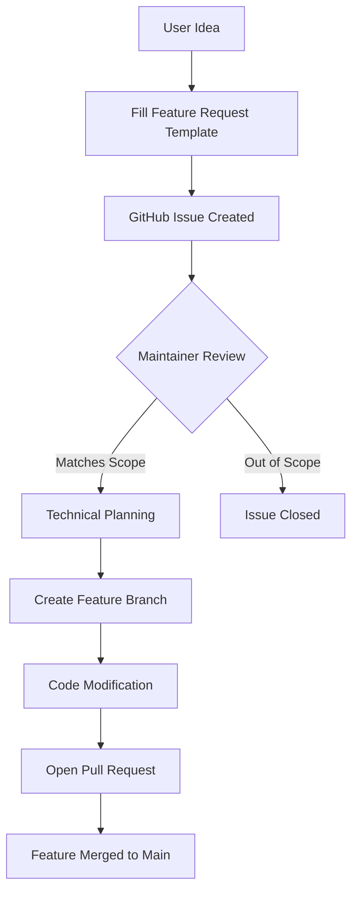
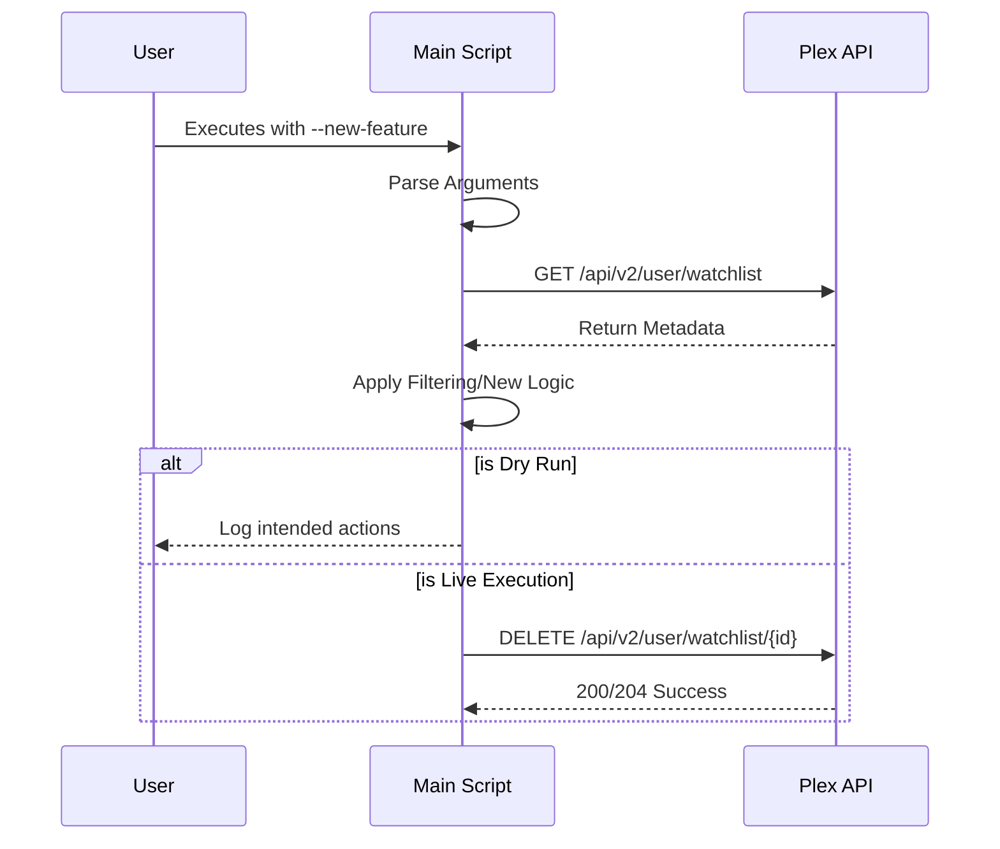

<details>
<summary>Relevant source files</summary>

The following files were used as context for generating this wiki page:

- [.github/ISSUE_TEMPLATE/feature-requests.md](.github/ISSUE_TEMPLATE/feature-requests.md)
- [plex_clear_watchlist.py](plex_clear_watchlist.py)
- [README.md](README.md)
- [AGENTS.md](AGENTS.md)
- [CLAUDE.md](CLAUDE.md)
- [SECURITY.md](SECURITY.md)
</details>

# Feature Requests

The Feature Request system for `plex_clear_watchlist` provides a structured pipeline for users and contributors to suggest enhancements to the automation tool. The project is designed as a single-purpose utility for managing Plex Watchlists via the Plex API, and the feature request process ensures that new capabilities align with this focused scope.

Feature requests are primarily handled through GitHub's issue tracking system using a dedicated template. This ensures that every proposal includes a clear description, rationale, and potential implementation path, allowing maintainers to evaluate how the request impacts the existing Python-based logic and Docker deployment model.

Sources: [.github/ISSUE_TEMPLATE/feature-requests.md](.github/ISSUE_TEMPLATE/feature-requests.md), [AGENTS.md:15-17](AGENTS.md#L15-L17)

## Request Submission Lifecycle

Users submitting feature requests are expected to follow a specific format that categorizes the suggestion. This structure helps the maintainers determine if the request fits within the project's technical stack (Python 3.14, Docker, Plex API) and architectural conventions, such as the requirement that the script remains single-purpose.

The following flowchart illustrates the conceptual flow of a feature request from initial idea to potential implementation:



The flow ensures that requests are vetted against project conventions, such as the ban on hardcoding credentials and the requirement for `--dry-run` safety.
Sources: [.github/ISSUE_TEMPLATE/feature-requests.md](.github/ISSUE_TEMPLATE/feature-requests.md), [AGENTS.md:19-38](AGENTS.md#L19-L38)

## Technical Scope for New Features

Feature requests are evaluated based on their interaction with the core components of the application. New features typically involve modifying the argument parsing logic or the API interaction functions.

### Core Components for Enhancement
| Component | File Path | Responsibilities |
| :--- | :--- | :--- |
| Argument Parser | `plex_clear_watchlist.py` | Handles CLI flags like `--limit`, `--keep`, and `--dry-run`. |
| Watchlist Client | `plex_clear_watchlist.py` | Manages paginated GET requests to `https://plex.tv/api/v2/user/watchlist`. |
| Deletion Logic | `plex_clear_watchlist.py` | Executes DELETE requests using item `ratingKey` values. |
| Container Config | `docker-compose.yml` | Manages environment variables and image tagging. |

Sources: [plex_clear_watchlist.py:12-25](plex_clear_watchlist.py#L12-L25), [plex_clear_watchlist.py:84-88](plex_clear_watchlist.py#L84-L88), [docker-compose.yml:1-8](docker-compose.yml#L1-L8)

### Integration with Existing Logic
Most feature requests involve expanding the filtering or execution logic. For example, the current implementation supports limiting deletions or keeping a specific number of recent items. Any new feature must maintain the safety provided by the `dry_run` flag.



The sequence demonstrates how feature requests must integrate into the existing fetch-filter-delete cycle.
Sources: [plex_clear_watchlist.py:91-155](plex_clear_watchlist.py#L91-L155), [CLAUDE.md:21-25](CLAUDE.md#L21-L25)

## Development Guidelines for Features

When a feature request is accepted, development must adhere to strict project conventions. These include technical requirements for error handling and security.

*  **Credential Security**: Features must never allow hardcoded credentials; `PLEX_TOKEN` must remain an environment variable.
*  **Error Tracking**: If a feature introduces new failure points, it should utilize the existing Sentry integration via `sentry_sdk.capture_exception`.
*  **API Stability**: The project uses a specific `REQUEST_TIMEOUT` of 30 seconds and handles 404 errors during pagination to prevent partial deletions.

```python
# Example of existing pagination safety that must be maintained in new features
if response.status_code == 404:
    if page == 1:
        return items
    raise requests.HTTPError(
        f"Plex API returnerade 404 på sida {page} efter att {len(items)} "
        "item(er) redan samlats in - avbryter istället för att riskera "
        "en ofullständig radering.",
        response=response,
    )
```

Sources: [plex_clear_watchlist.py:34-45](plex_clear_watchlist.py#L34-L45), [AGENTS.md:19-21](AGENTS.md#L19-L21), [SECURITY.md:14-17](SECURITY.md#L14-L17)

## Conclusion
The Feature Request process is designed to evolve the `plex_clear_watchlist` tool while maintaining its identity as a lightweight, secure, and single-purpose utility. By requiring specific templates and adhering to established Python and Docker patterns, the project ensures that all enhancements are robust and safe for user watchlist management.
