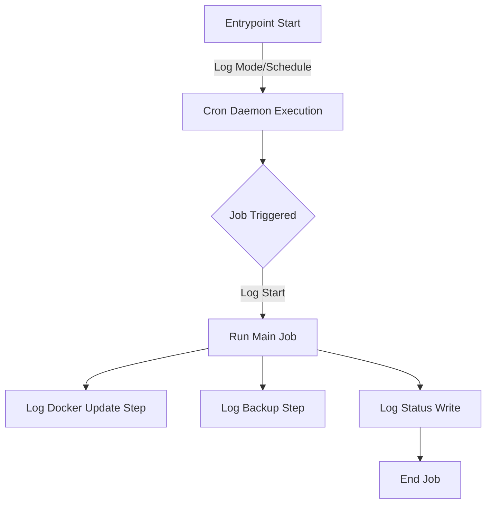

<details>
<summary>Relevant source files</summary>

The following files were used as context for generating this wiki page:

- [README.md](README.md)
- [src/run.py](src/run.py)
- [src/github_report.py](src/github_report.py)
- [src/sentry_report.py](src/sentry_report.py)
- [src/report.py](src/report.py)
- [src/entrypoint.py](src/entrypoint.py)
- [CLAUDE.md](CLAUDE.md)
</details>

# Troubleshooting & Logs

Troubleshooting in the `docker-idempotent-update` project is centered around a multi-layered reporting system that captures operational states and handles unhandled exceptions. The system utilizes standard output logging, a persistent state JSON file, email notifications for routine outcomes, and automated external reporting (GitHub Issues and Sentry) for critical failures.

The scope of this system covers the entire lifecycle of the daily maintenance job, from environment validation in the entrypoint to the final status write-back. Sources: [src/run.py:1-74](src/run.py#L1-L74), [CLAUDE.md:18-30](CLAUDE.md#L18-L30)

## Logging Architecture

The application uses the standard Python `logging` module to provide real-time feedback. Logs are directed to `sys.stdout` and formatted to include a timestamp and message. This is essential for monitoring the internal cron daemon and the execution of `run.py`. Sources: [src/run.py:14-19](src/run.py#L14-L19), [src/entrypoint.py:8-13](src/entrypoint.py#L8-L13)

### Log Generation Flow

The following diagram illustrates how logs are generated during a standard execution cycle.



A flowchart showing the logging sequence from container start through the daily job execution. Sources: [src/entrypoint.py:65-66](src/entrypoint.py#L65-L66), [src/run.py:35-49](src/run.py#L35-L49)

## Automated Error Reporting

When an unhandled exception occurs in the main execution loop, the system attempts to report the crash to external services. This is a "best-effort" mechanism designed to avoid crashing the caller while ensuring visibility into production failures. Sources: [src/run.py:67-74](src/run.py#L67-L74), [CLAUDE.md:25-30](CLAUDE.md#L25-L30)

### GitHub Issue Reporting
If `GITHUB_ERROR_REPORT_TOKEN` is configured, the system opens a GitHub issue tagged with `@claude`. It includes a redacted traceback and a unique fingerprint to prevent duplicate issues for the same error. Sources: [src/github_report.py:76-135](src/github_report.py#L76-L135)

### Sentry Integration
If `SENTRY_DSN` is set, the system sends the exception and stack trace directly to Sentry using the envelope API. This implementation is strictly `stdlib-only`, utilizing `urllib` instead of the `sentry-sdk`. Sources: [src/sentry_report.py:46-118](src/sentry_report.py#L46-L118)

### Redaction Logic
To maintain security, all reports undergo a redaction process before being sent externally.

| Redaction Target | Pattern/Logic |
| :--- | :--- |
| Environment Variables | Any key containing KEY, TOKEN, SECRET, PASSWORD, or PASS |
| Common Keys | Patterns like `sk-...`, `ghp_...`, `Bearer ...`, `AKIA...` |
| Personal Info | Email addresses and home directory paths (`/home/[user]`) |

Sources: [src/github_report.py:34-52](src/github_report.py#L34-L52), [src/sentry_report.py:23-38](src/sentry_report.py#L23-L38)

## Status and Reporting Files

The system persists its results in several locations to assist in manual troubleshooting.

### status.json
After every run, a summary is written to `/config/status.json`. This file contains the results of the update and backup steps, even if no email was sent.

```json
{
  "timestamp": "2023-10-27T03:00:00Z",
  "mode": "both",
  "dry_run": false,
  "containers_updated": ["nginx", "db"],
  "backup_failures": [],
  "docker_changes": "> nginx ...\n> db ..."
}
```

Sources: [src/run.py:53-64](src/run.py#L53-L64), [README.md:38](README.md#L38)

### Email Summaries
Emails are sent via `msmtp` only when changes occur or failures are detected. The subject line dynamically updates based on the outcome (e.g., using a whale emoji for updates or a warning emoji for failures). Sources: [src/report.py:11-35](src/report.py#L11-L35)

## Common Configuration Issues

Troubleshooting often involves validating the environment setup during the entrypoint phase.

| Component | Error Condition | Action |
| :--- | :--- | :--- |
| Docker Socket | `/var/run/docker.sock` missing | Ensure host socket is mounted |
| rclone | `/config/rclone.conf` missing | Run `docker exec -it ... rclone config` |
| Backup Config | `/config/backup.conf` missing | System auto-creates from template; edit as needed |
| Mail | `EMAIL_TO` set but `/config/msmtprc` missing | System auto-creates template; configure SMTP |

Sources: [src/entrypoint.py:27-51](src/entrypoint.py#L27-L51), [README.md:50-70](README.md#L50-L70)

## Summary
The "Troubleshooting & Logs" module ensures operational transparency through multi-channel reporting. By combining local status persistence (`status.json`), standard output logging, and automated external error reporting with strict data redaction, the system allows for both proactive monitoring and reactive debugging of the daily maintenance tasks. Sources: [src/run.py](src/run.py), [CLAUDE.md](CLAUDE.md)
