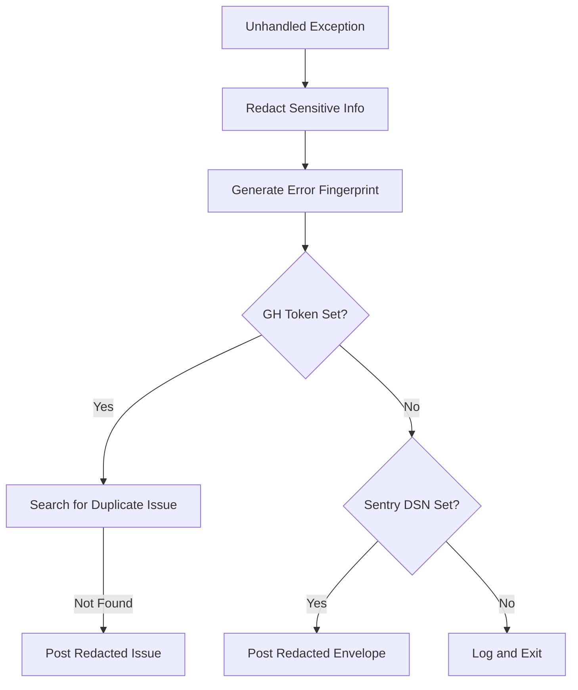

Relevant source files

The following files were used as context for generating this wiki page:

- [SECURITY.md](SECURITY.md)
- [AGENTS.md](AGENTS.md)
- [CLAUDE.md](CLAUDE.md)
- [src/github_report.py](src/github_report.py)
- [src/sentry_report.py](src/sentry_report.py)
- [tests/test_pr_changes.sh](tests/test_pr_changes.sh)
- [src/entrypoint.py](src/entrypoint.py)

# Security Guidelines

The `docker-idempotent-update` project enforces a strict security posture to protect Docker host environments and sensitive credentials used for backups and notifications. As a tool that interacts with the Docker socket and external cloud storage, maintaining a secure configuration and preventing credential leakage is paramount.

These guidelines cover vulnerability reporting, credential management, automated redaction of sensitive data during error reporting, and operational restrictions for AI agents and developers.

## Vulnerability Reporting

The project maintains a private channel for security disclosures to prevent zero-day exploitation.

*  **Public Issues:** Do not open public issues for security vulnerabilities.
*  **Private Reporting:** Use [GitHub's private reporting feature](https://github.com/blixten85/docker-idempotent-update/security/advisories/new).
*  **Response SLA:** A response is typically provided within 48 hours.

Sources: [SECURITY.md:8-13](SECURITY.md#L8-L13)

## Credential Management and Environment Security

The core security principle of the project is the absolute separation of code and configuration. All secrets must be managed through environment variables or specific configuration files mounted at runtime.

### Best Practices
*  **No Hardcoding:** Secrets must never be hardcoded in the source code.
*  **Environment Variables:** Always use environment variables for sensitive data.
*  **Version Control Safety:** Never commit `.env` files, credentials, or secrets to version control.
*  **Least Privilege:** CI workflows run with `contents: read` permissions.

Sources: [SECURITY.md:17-19](SECURITY.md#L17-L19), [AGENTS.md:21](AGENTS.md#L21), [tests/test_pr_changes.sh:222](tests/test_pr_changes.sh#L222)

### Configuration Isolation
The system uses dedicated configuration files located in `/config/` within the container. These files are generated from templates if they do not exist, ensuring that sensitive values like mail server credentials (`msmtprc`) or rclone remotes (`rclone.conf`) remain outside the container image.

Sources: [src/entrypoint.py:46-59](src/entrypoint.py#L46-L59), [README.md:113-118](README.md#L113-L118)

## Automated Data Redaction

To facilitate debugging without compromising security, the project implements automated redaction in its `github_report.py` and `sentry_report.py` modules. When an unhandled exception occurs, the system attempts to report the error to GitHub or Sentry while filtering out sensitive information.

### Redaction Logic
The `_redact()` function identifies and replaces sensitive patterns in exception messages, tracebacks, and context data.

| Pattern Category | Markers/Regex | Redaction Label |
| :--- | :--- | :--- |
| Secret Env Vars | KEY, TOKEN, SECRET, PASSWORD, PASS | `[REDACTED]` |
| API Keys | `sk-...`, `ghp_...`, `gho_...`, `AKIA...`, `Bearer ...` | `[REDACTED]` |
| Email Addresses | Standard email regex | `[EMAIL REDACTED]` |
| Local Paths | `/home/<username>/...` | `/home/[user]` |

Sources: [src/github_report.py:27-44](src/github_report.py#L27-L44), [src/sentry_report.py:23-40](src/sentry_report.py#L23-L40)

### Error Reporting Flow
The error reporting mechanism is "best-effort" and designed never to crash the main application if the reporting service is unavailable or misconfigured.

This diagram illustrates how exceptions are processed through redaction and fingerprinting before being dispatched to external services.
Sources: [src/github_report.py:65-117](src/github_report.py#L65-L117), [src/sentry_report.py:56-118](src/sentry_report.py#L56-L118)

## AI Agent and Developer Restrictions

The `AGENTS.md` file defines strict operational boundaries for AI agents (and by extension, developers) to prevent accidental security breaches or unauthorized changes to the repository infrastructure.

### Forbidden Actions
*  Pushing directly to `main` or `master` branches.
*  Merging Pull Requests.
*  Modifying GitHub secrets or organization settings.
*  Disabling CI/CD workflows.
*  Deleting branches or force-pushing.

### Mandatory Requirements
*  **No Credentials:** Never commit credentials or unrelated changes.
*  **Isolation:** Keep PRs focused and isolated.
*  **Validation:** All tests must pass, and changes should be tested with `docker compose run --rm`.

Sources: [AGENTS.md:27-46](AGENTS.md#L27-L46), [CLAUDE.md:20-22](CLAUDE.md#L20-L22)

## Dependency Management

The project utilizes automated tools to maintain the security of its dependencies.
*  **Dependabot:** Enabled to monitor and update Python and GitHub Action dependencies.
*  **Standard Library Only:** The project convention restricts Python code to the standard library to minimize the attack surface introduced by third-party packages.

Sources: [SECURITY.md:19](SECURITY.md#L19), [AGENTS.md:22](AGENTS.md#L22), [tests/test_pr_changes.sh:163-181](tests/test_pr_changes.sh#L163-L181)

## Conclusion

Security in `docker-idempotent-update` is achieved through a combination of strict credential isolation, automated redaction of crash reports, and a "stdlib-only" development philosophy. By centralizing secrets in environment variables and enforcing rigorous PR checks, the project ensures that maintenance tasks do not introduce new vulnerabilities to the host system.
